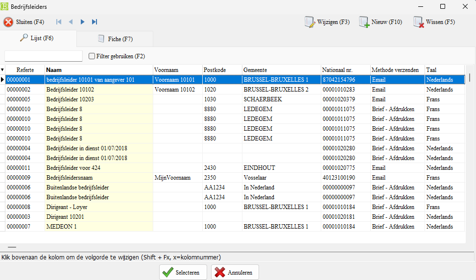

# 1. Inleiding

Met deze toepassing kan u

- Dubbel aangemaakte bedrijfsleiders verwijderen via een eigen gemaakt Excel bestand.
- Het manueel verwijderen van dubbel aangemaakte bedrijfsleiders

> [!WARNING]
> Bedrijfsleiders waar fiches aan verbonden zijn, kunnen / mogen niet verwijderd worden.

# 2. Waar kan ik de optie vinden in de menu?
U kan deze optie vinden onder het menu: Start - **Opruiming gegevens**

# 3. Uitleg over het scherm

* Soort: Hier kan je de opties bedrijfsleiders kiezen om te verwijderen

* Toon enkel fouten: Als u deze optie aanvinkt, dan krijg u enkel de foutieve fiches te zien in de lijst met te verwijderen bedrijfsleiders

* Selecteer fiche: Hiermee kan u manueel de bedrijfsleider selecteren om te verwijderen. Bv. als u geen Excel lijst heeft.

* Laad fiches: Hiermee kan u een Excel bestand of een TXT bestand met de te verwijderen bedrijfsleiders inladen in Belcofin.

* De knop Linksboven: Hiermee kan u de selectie van bedrijfsleiders op het scherm verwijderen.

* Verwijder fiches: Dit is de knop om de fiches te verwijderen

* Sluiten: Hiermee sluit u het venster.

# 4. Er zijn twee opties om de bedrijfsleiders te verwijderen

## 4.1 Manuele selectie in Belcofin

Klik op de knop "Slecteeer fiche". U komt op het volgende scherm terecht:

Hier kan u een bedrijfsleider selecteren (niet in bulk) die u wilt verwijderen uit uw database.

Selecteer de bedrijfsleider die u wilt gaan verwijderen.

Als u deze bedrijfsleider wilt verwijderen, klikt u op "Verwijder fiches".

Als u deze rode melding krijgt, dan is er nog een link met een Fiche in het verleden bij deze bedrijfsleider.

## 4.2 De bedrijfsleiders verwijderen via een excel lijst 

### 4.2.1 Hoe een lijst van bedrijfsleiders uit Belcofin halen?

Open Belcofin en ga in het menu naar **bedrijfsleiders** en klik op het pijltje

Je komt dan in het venster van de bedrijfsleiders terecht.

Klik hier op het pijltje naar beneden.

Hier krijgt u verschillende opties om uit te kiezen.

Kies hier hoe u de lijst wilt exporteren: Excel (XLS) of een TXT bestand.

Als u voor een Excel bestand kiest, kan u de bedrijfsleiders makkelijker verwijderen uit de lijst.

### 3.2.2

