# 1. Inleiding

Met deze toepassing kan u

- Dubbel aangemaakte bedrijfsleiders verwijderen via een eigen gemaakt Excel bestand.
- Het manueel verwijderen van dubbel aangemaakte bedrijfsleiders

> ⚠ **OPGEPAST**:
> Bedrijfsleiders waar fiches aan verbonden zijn, kunnen / mogen NIET verwijderd worden.

# 2. Waar kan ik de optie vinden in de menu?
U kan deze optie vinden onder het menu: Start - **Opruiming gegevens**

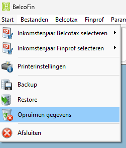

# 3. Uitleg over het scherm

❗OPGEPAST: Neem ALTIJD een backup, voor u dit gaat uitvoeren❗

⚠ dit is iets heel belangrijk ⚠

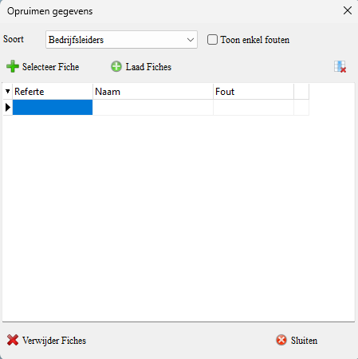

* Soort: Hier kan je de opties bedrijfsleiders kiezen om te verwijderen

* Toon enkel fouten: Als u deze optie aanvinkt, dan krijg u enkel de foutieve fiches te zien in de lijst met te verwijderen bedrijfsleiders

* Selecteer fiche: Hiermee kan u manueel de bedrijfsleider selecteren om te verwijderen. Bv. als u geen Excel lijst heeft.

* Laad fiches: Hiermee kan u een Excel bestand of een TXT bestand met de te verwijderen bedrijfsleiders inladen in Belcofin.

* De knop Linksboven: Hiermee kan u de selectie van bedrijfsleiders op het scherm verwijderen.

* Verwijder fiches: Dit is de knop om de fiches te verwijderen

* Sluiten: Hiermee sluit u het venster.

# 4. Er zijn twee opties om de bedrijfsleiders te verwijderen

## 4.1 Manuele selectie in Belcofin

Klik op de knop **Selecteer fiche**.

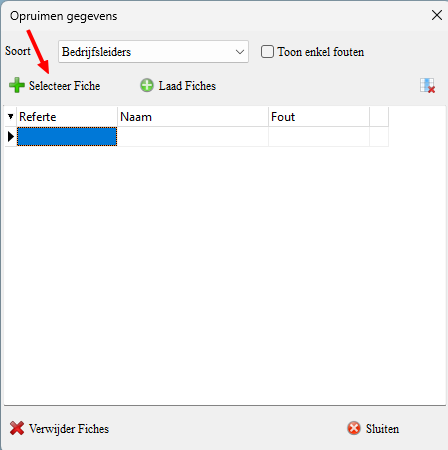

U komt op het volgende scherm terecht: Hier kan u een bedrijfsleider selecteren (niet in bulk) die u wilt verwijderen uit uw database.

Selecteer de bedrijfsleider die u wilt gaan verwijderen.

Als u deze bedrijfsleider wilt verwijderen, klikt u op "Verwijder fiches".

Als u deze rode melding krijgt, dan is er nog een link met een Fiche in het verleden bij deze bedrijfsleider.

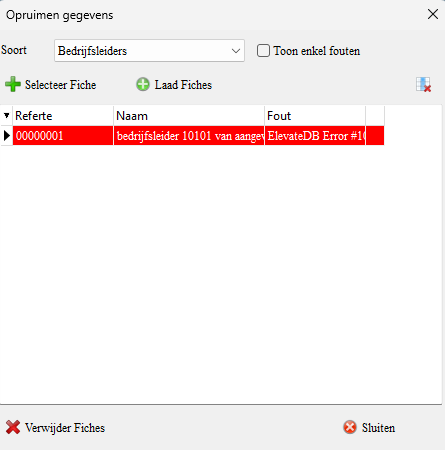

## 4.2 De bedrijfsleiders verwijderen via een excel lijst 

### 4.2.1 Hoe een lijst van bedrijfsleiders uit Belcofin halen?

Open Belcofin en ga in het menu naar **bedrijfsleiders**.

Je komt dan in het venster van de bedrijfsleiders terecht.

Klik hier op het pijltje naar beneden.

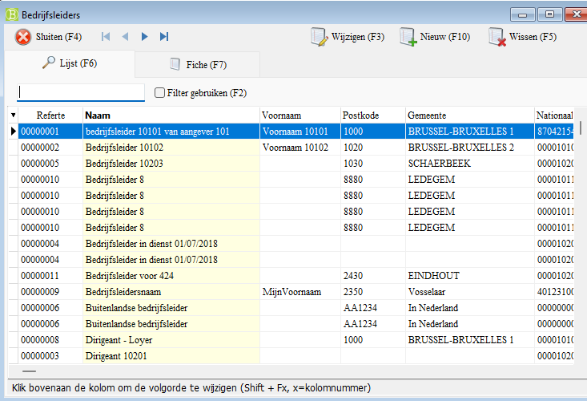

Hier krijgt u verschillende opties om uit te kiezen.

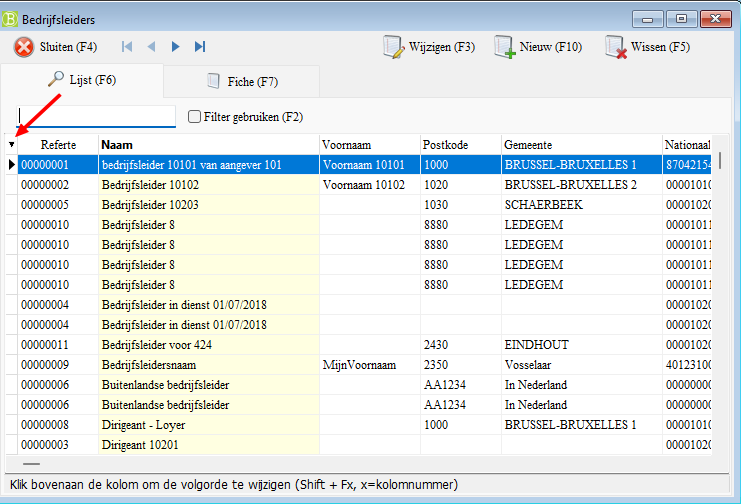

Kies hier hoe u de lijst wilt exporteren: Excel (XLS) of een TXT bestand.

Als u voor een Excel bestand kiest, kan u de bedrijfsleiders makkelijker verwijderen uit de lijst.

Sla nu het bestand op als een Excel bestand.
(later zullen we het Excel bestand dan omzetten naar een TXT bestandje)

Als je dat nu zou doen, dan staat er te veel informatie in het .TXT bestand en gaat u te veel moeten verwijderen.

### 4.2.2 Excel bestand omzetten naar een .TXT bestand.

U heeft uw excel lijst met bedrijfsleiders gemaakt en is klaar. Nu gaan we deze omzetten naar een TXT bestand.

Open uw Excel bestand en ga naar Bestand - Opslaan Als...

Kies een naam voor uw TXT bestand (of behoud de naam van het Excel bestand).

Bij opslaan als kiest u voor een **Tekst (Tab als scheidingsteken) (*.txt)**

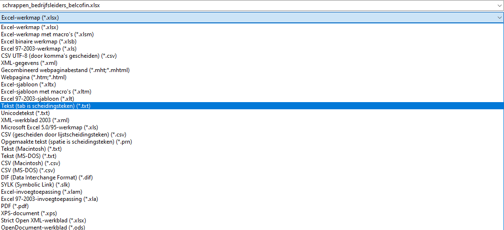

Sla het bestand dan op en sluit uw Excel.

### 4.2.3 Verwijderen van de bedrijfsleiders

Open Belcofin, ga naar start - **Opruiming gegevens**

Klik op **laad fiches**

Ga naar de map waar u het .txt bestand hebt opgeslagen en selecteer dat bestand om te openen.

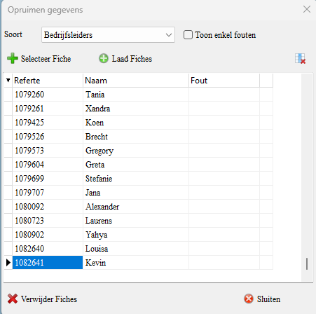

U krijgt nu een lijst te zien met de geselecteerde bedrijfsleiders.

> [!WARNING]
> Maak altijd een backup van uw database voor u dit doet!

Klik op verwijder fiches (het programma gaat nu de fiches van de dubbele bedrijfsleiders verwijderen)

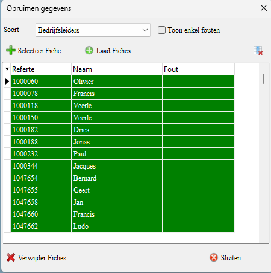

#### 4.2.3.1 Toon enkel de fouten

Nu gaan we kijken welke fiches er niet verwijderd zijn.

Zet het vinkje aan bij **Toon enkel fouten**

Dit wil zeggen dat er fiches zijn ingediend geweest op deze bedrijfsleider.

U kan dit controleren bij de lijst van de fiches 281.20

Sluit het venster en schrijf eventueel de refertes ergens op.
(of neem een screenshot met Windows logo + SHIFT + S)

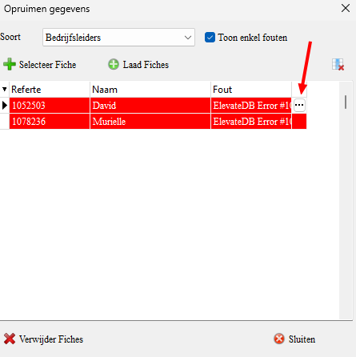

Klik in het menu op **fiches 281.20**

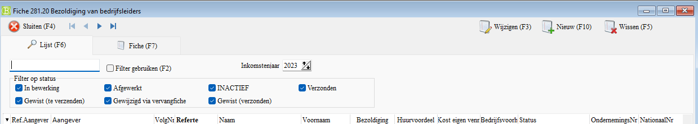

U krijgt nu het venster te zien van de fiches 281.20

Vul in de zoekbalk de referte van de bedrijfsleider in.

Klik op de kolom **referte** om te sorteren op referte.

Klik dan op **filter gebruiken** of gebruik **F2**

Via de kolom **status** kan je zien dat er een fiche bestaat en dat er een fiche is ingediend.

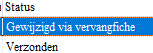

Deze bedrijfsleiders kan u dus **niet** verwijderen uit de database.
