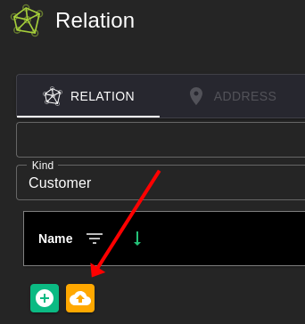
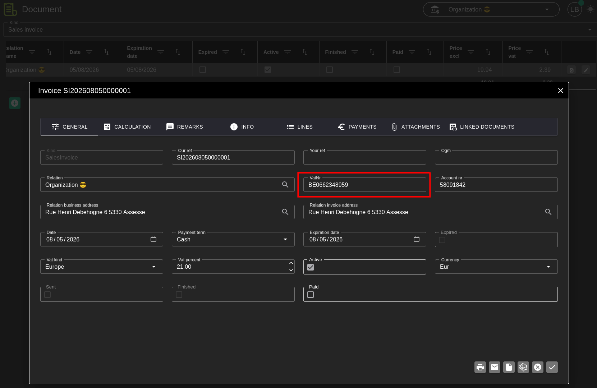

# Testing Documents

This manual describes how you can create a test organization and test documents in the **DEV** environment.

## 1. Preparation

- Set the **VAT number** of the organization to a registered company in the Scrada test environment.
- Preferably use **0662348959** (if it is still available). That way you immediately have a test VAT number for both Scrada and the FOD application.
- The **Plan Type** of the organization may not be **Free**; choose a higher plan.

   

NOTE 💡: Many of the Test Scenarios use the Processor, the Report and the Mcp Server. These need to be running in the DEV environment.

## 2. Creating test data (Seeding)

- Seed Relation Test Data

   

- Seed Catalog Test Data

   

## 3. Creating a test document

Create a document (**SalesInvoice**) with yourself as the customer and add some document lines.

## 4. Next step

You can now use these test documents to test the following matters

- [Testing SFTP and Email Inbound](../Common/README.md)
- [Testing Scrada Inbound](../Scrada/README.md)
