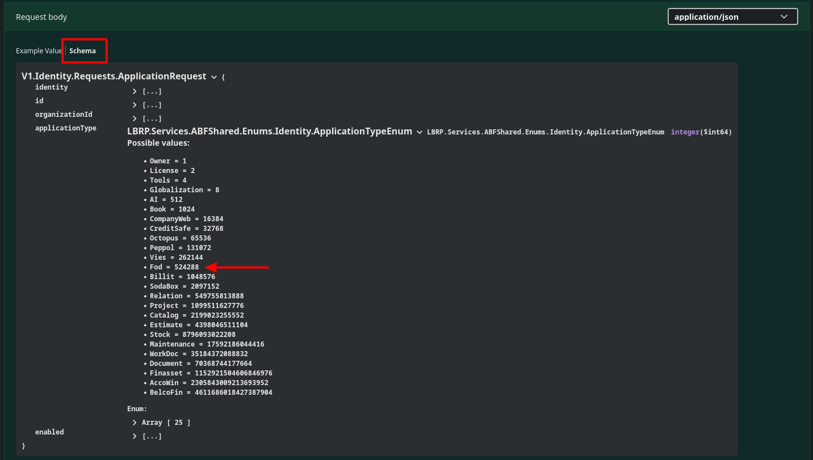

# Identity Flow

## 1. Users

### 1.1 Registration

 [/identity/register](https://abfapi.dev.corpgroup.site/swagger/index.html#/%F0%9F%97%9D%EF%B8%8Fidentity/post_identity_register)

- The `Request` for registering a new **user** (***User***) immediately ensures that an **organization** (***Organization***) is also created, of which this new user is the administrator (***member***).
- The `Response` returns a `Token` with which you can call other, secured, endpoints.<br/>
  Enter this `Token` in the **Authorization** `header` of a **request**.

### 1.2 Signing in

 [/identity/login](https://abfapi.dev.corpgroup.site/swagger/index.html#/%F0%9F%97%9D%EF%B8%8Fidentity/post_identity_login)

- If you have already registered a **user** and **organization**, you can log in with the login details to obtain a `Token`.
- You can immediately pass a known `Identity` value of an **organization** in the **Organization** `header` of this **request**.
- **NOTE**: When switching between **organizations**, you must always request a new `Token` (*= sign in*).

### 1.3 Refreshing a Token

 [/identity/refresh](https://abfapi.dev.corpgroup.site/swagger/index.html#/%F0%9F%97%9D%EF%B8%8Fidentity/post_identity_refresh)

- You can refresh a `Token` in 2 ways:
   - By **signing in** again
   - By calling this `Refresh` endpoint with a previously obtained `Token` and `RefreshToken`.


## 2. Organizations

### 2.1 List

 [/owner/organization/member](https://abfapi.dev.corpgroup.site/swagger/index.html#/%F0%9F%98%8Eowner/get_owner_organization_member)

- After the **Authorization** `header` of a **request** has been filled with a `Token`, you can retrieve a list of all **organizations** of which a **user** is a **member**.
- To call other secured endpoints that are **organization** dependent, you must fill in the `Identity` value in the **Organization** `header` of a **request**.
- **TIP**: You can optionally store the `Identity` value of an **organization** in your software.

### 2.2 Modifying

 [/owner/organization](https://abfapi.dev.corpgroup.site/swagger/index.html#/%F0%9F%98%8Eowner/put_owner_organization)

- You can modify the details of an **organization** by calling this endpoint.

## 3. Applications

### 3.1 List

 [/owner/application/organization](https://abfapi.dev.corpgroup.site/swagger/index.html#/%F0%9F%98%8Eowner/get_owner_application_organization)

- After the **Organization** `header` of a **request** has been filled with the `Identity` value of an **organization**, you can retrieve a list of all **applications** accessible to a **member** of an **organization**.
- The `Enabled` flag in the `Response` shows whether the **application** is active.

### 3.2 Activating

 [/owner/application/enable](https://abfapi.dev.corpgroup.site/swagger/index.html#/%F0%9F%98%8Eowner/post_owner_application_enable)

- You can activate an **application** by calling this endpoint.
- The following `Request` will activate the **FOD** application:

   ```json
   {
     "applicationType": 524288,
     "enabled": false  # contains the current value of the application
   }
   ```

- Press **Schema** at a **request body** to see the possible values of the **application type**:

   
