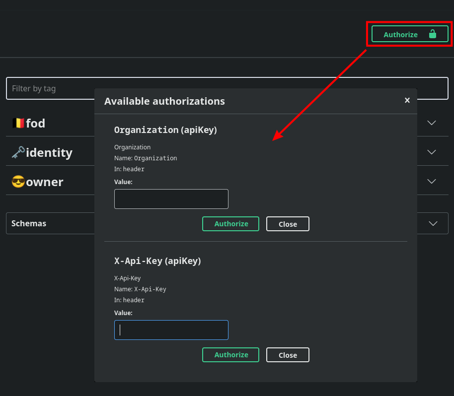
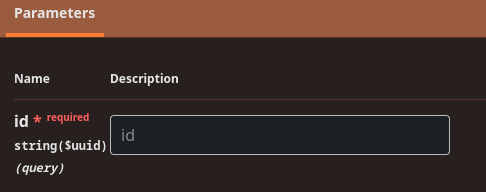

# Developer Manuals

## 1. Environments

All tests must be performed in the **DEV** environment.
- [https://abfapi.**DEV**.corpgroup.site](https://abfapi.dev.corpgroup.site/swagger)

The **PRD** environment is the production environment and should not be used for testing or implementation.
- [https://abfapi.corpgroup.site](https://abfapi.corpgroup.site/health)

## 2. OpenAPI Documentation

[https://abfapi.dev.corpgroup.site/swagger](https://abfapi.dev.corpgroup.site/swagger)

## 3. Request Headers

The following header **MUST** be present in a `Request`:

```
X-Api-Key: to be obtained through LBRP
```

The following headers **MAY** be present in a `Request`:

```
X-Legacy:  to be obtained through LBRP
X-Version: 1.0 # If not present, default 1.0
```

The following header **MUST** be present in an authenticated `Request`:

```
Authorization: Bearer <AccessToken>
```

The following header **MUST** be present in an authenticated `Request` at organization level:

```
Organization:  <Organization Guid>
```

You can fill in these `header` values in **Swagger** by clicking the **Authorize 🔒** button:



## 4. Requests/Responses

### 4.1 General Fields

Most **JSON contracts** always have the following fields:

- `identity`:     **Primary** database key as `Guid`.
- `id`:           <br/>Extra key value as `Integer`.<br/>*❗Currently not used ❗*<br/><br/>
- `lastModified`: Time of last **modification**.
- `created`:      Time of **addition**.
- `createdBy`:    User who created the record.

**NOTE**: If an `id` must be passed as a parameter, this is **NOT** the value of the `id` field, but of the `identity` field:



### 4.2 General Response

If the `Response` does not contain an `entity` but the `status code` is **200** (***OK***), then we usually return a `GeneralSuccessResponse`, whether or not with some messages:

```json
{
  "messages": [
    "OK"
  ]
}
```

If the `Response` has the `status code` **400** (***Bad Request***), then we usually return a `GeneralFailResponse`, whether or not with some messages:

```json
{
  "errors": [
    "Validation failed",
    "Email is required"
  ],
  "statusCode": 400
}
```

If the `Response` is a result of a `bulk operation`, then we usually return a `GeneralCombinedResponse`.<br/>
This contains a list of both possible `GeneralSuccessResponse` and `GeneralFailResponse`.

```json
{
  "failures": [
    {
      "errors": [
        "Validation failed",
        "Email is required"
      ],
      "statusCode": 400
    },
    {
      "errors": [
        "Unauthorized access"
      ],
      "statusCode": 401
    }
  ],
  "successes": [
    {
      "messages": [
        "OK"
      ]
    },
    {
      "messages": [
        "User created successfully"
      ]
    }
  ]
}
```

If the `Response` is a list of `entities`, then you get a `PagedResponse` back per page.

```json
{
  "data": [
    {
      "id": 1,
      "name": "Item 1"
    },
    {
      "id": 2,
      "name": "Item 2"
    }
  ],
  "pageNumber": 1,
  "pageSize": 20,
  "sortBy": "",
  "filterBy": "",
  "count": 2,
  "hasNextPage": false,
  "hasPreviousPage": false
}
```

## 5. API Parts

- [Identity Flow](Identity/README.md)
- [FOD](Fod/README.md)

## 6. Testing

- [Testing documents](Documents/README.md)
- [Testing SFTP and email inbound](Common/README.md)
- [Testing Scrada inbound](Scrada/README.md)

## 7. Code Examples

- [Code Examples](Code/README.md)
