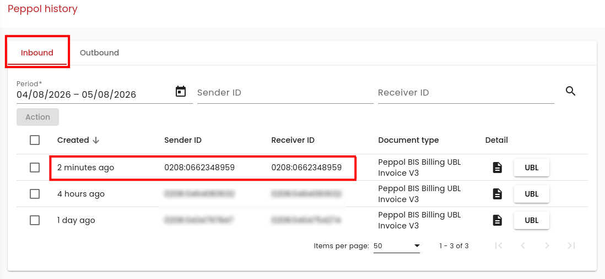

# Testing Scrada inbound

This manual describes how you can test the processing of incoming documents via **Scrada/Peppol**.

## 1. Preparation

- It is useful if you first create some test documents. See [Testing documents](../Documents/README.md).
- Be sure to activate the **Peppol application**.

## 2. Sending to Scrada/Peppol

Press the button in a document to send it directly to Scrada:

## 3. Starting the Processor

- Start a **ScradaOutboundService** job.

   

- Wait for processing by [Scrada](https://mytest.scrada.be).

   The **Outbound** processing takes about ten minutes.

   

    The processing by Peppol for **Inbound** also takes some time. As soon as the document has been forwarded through the Peppol network (to yourself):

   

- Start a **ScradaInboundService** job.

   

## 4. Checking the result

If everything has been processed correctly, you will now find a record in the **Peppol Inbound** grid:

**Peppol → Inbound Documents**

