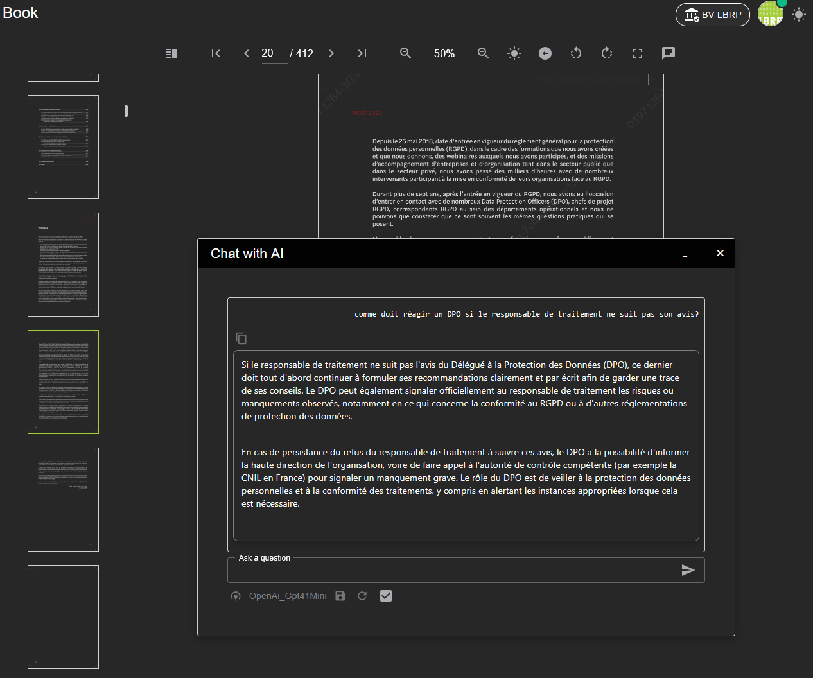
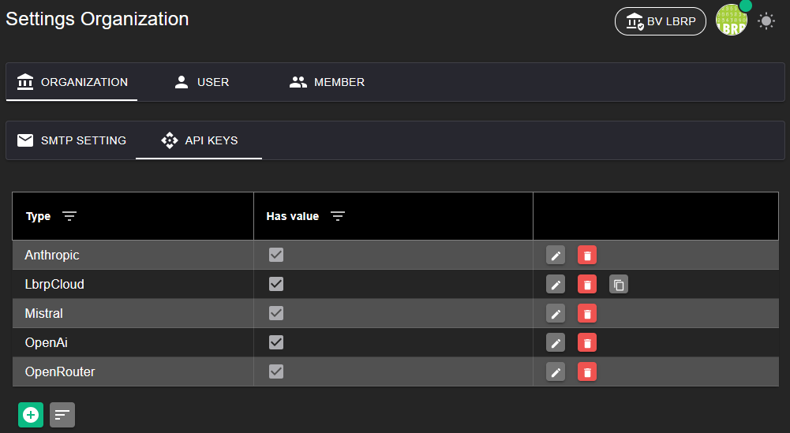

# LBRP Cloud - Books - AI

While reading a book, you can ask questions about its content to an AI model. This allows you to quickly get extra explanations or summaries, or to look up specific information within the book.

To be able to use the AI models, you need an API key. 

- For using OpenAI models: create an API key via [OpenAI API Keys](https://platform.openai.com/api-keys).
- For using Anthropic models: create an API key via [Anthropic Console](https://console.anthropic.com/settings/keys).

Enter these [API key(s)](../../Identity/Menu/README.md) in the settings of the organization, user or member to activate the AI functionality.

