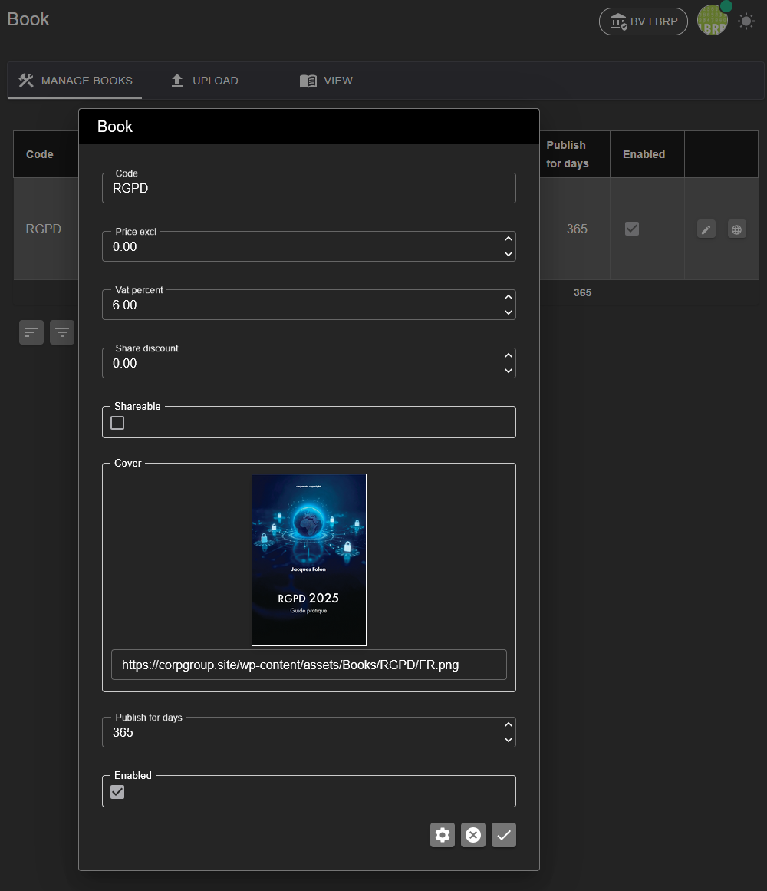
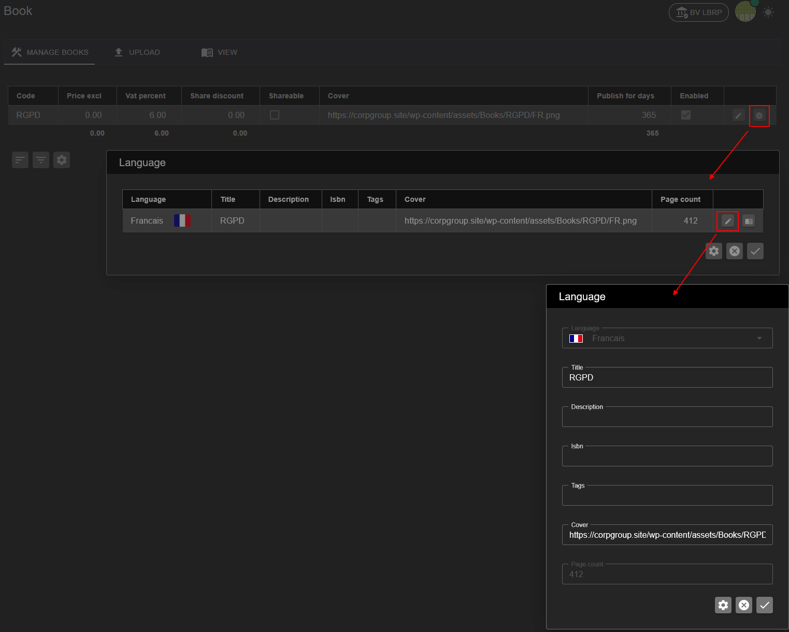
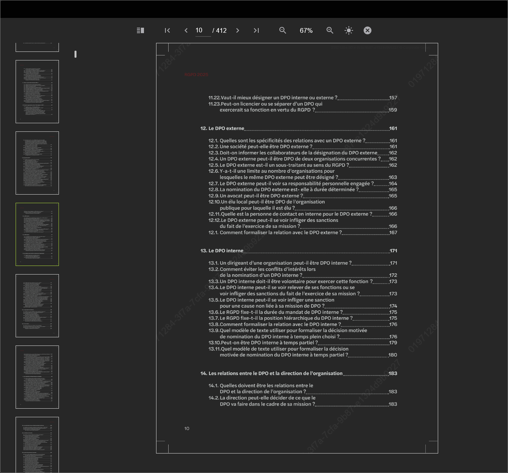

# LBRP Cloud - Books - Manage

In the "Manage" section, administrators can manage existing e-books. 

- You see an overview of all books, where you can modify the metadata (such as title, price, cover, and so on).

- Per book you can manage the available languages.

- You can also open the book to view or read its content.

Use this page to keep books up to date and make them available to users.
