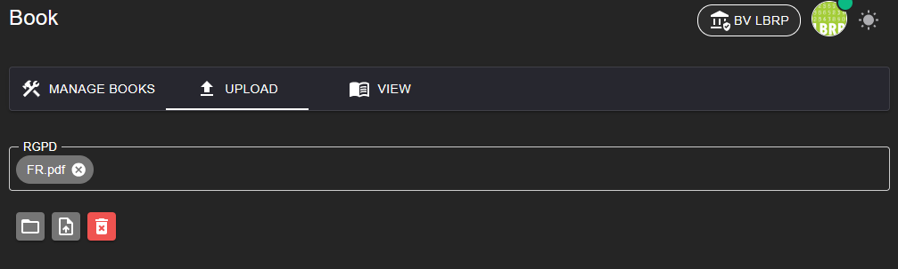

# LBRP Cloud - Books - Upload

On this page, administrators can add new e-books to the Books App. After uploading, the books are prepared so that they can later be managed and made available to users.

