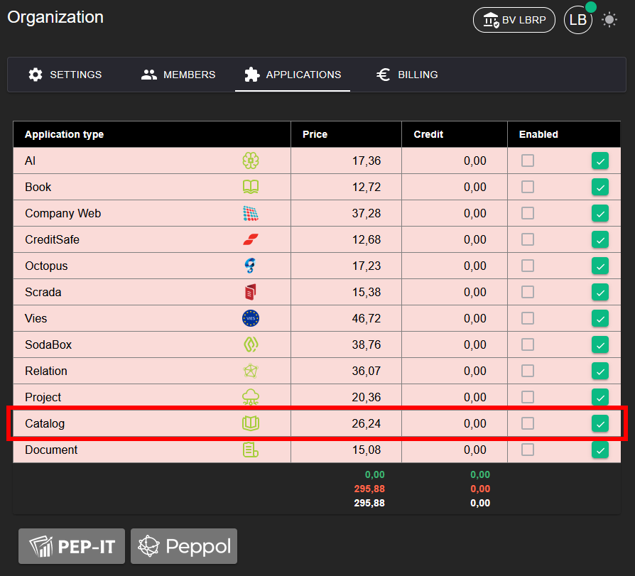
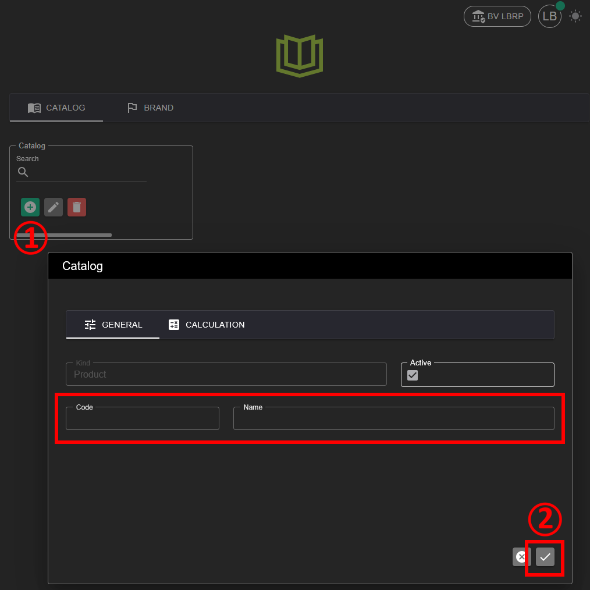
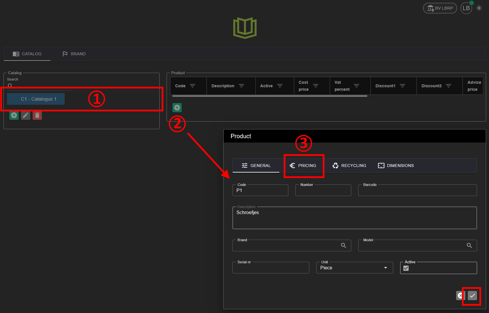
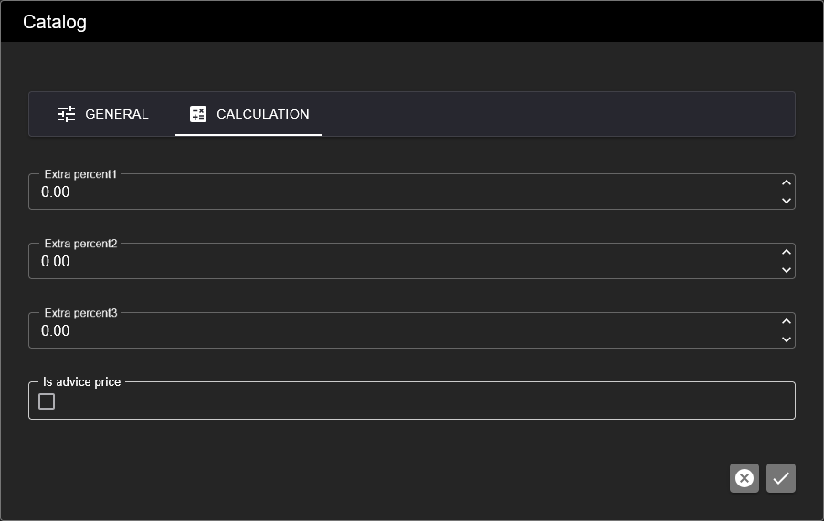
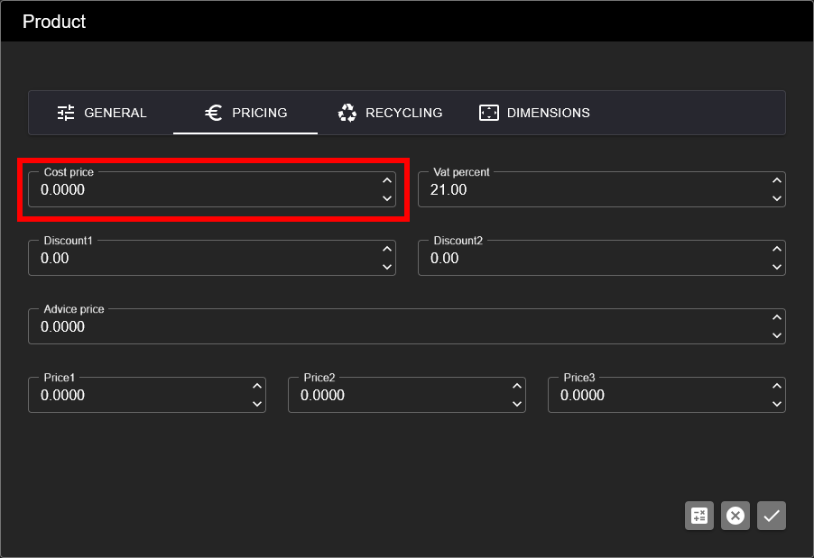

# Catalog

With the Catalog application you can create one or more catalogs to manage products or services.

## 1. Activating the Application

To be able to use the **CATALOG** application, it must first be activated.

**Steps:**
1. Go to **Organization → [Applications](../Identity/Applications/README.md)**.
2. Activate the **Catalog** application for your organization.
3. After activation, catalog management is available in the menu.

## 2. Creating a Catalog

**Steps:**
1. Open the **Catalog** application.
2. Click the green **+** button to create a new catalog.
3. Give the catalog a name and optionally a description.
4. Save the catalog.

## 3. Adding Products to a Catalog

You can link various products or services to a catalog.

**Steps:**
1. Open the desired catalog.
2. Click **Add product**.
3. Fill in the product details, such as:
   - Name
   - Description
   - Price
   - VAT percentage
4. Save the product.

The products are now available within the catalog.

## 4. Calculation

### 4.1 Catalog Profit Margins

Per catalog, 3 profit margins can be entered in percentages

### 4.2 Price Calculation Products

