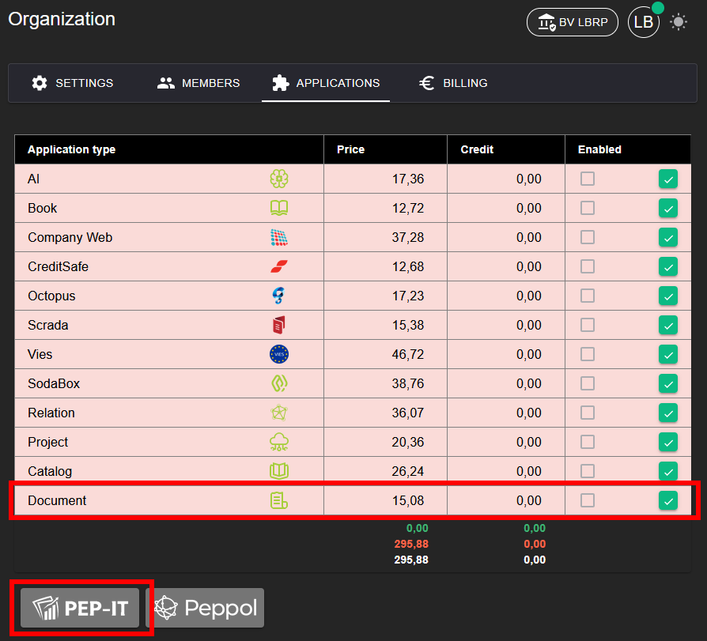
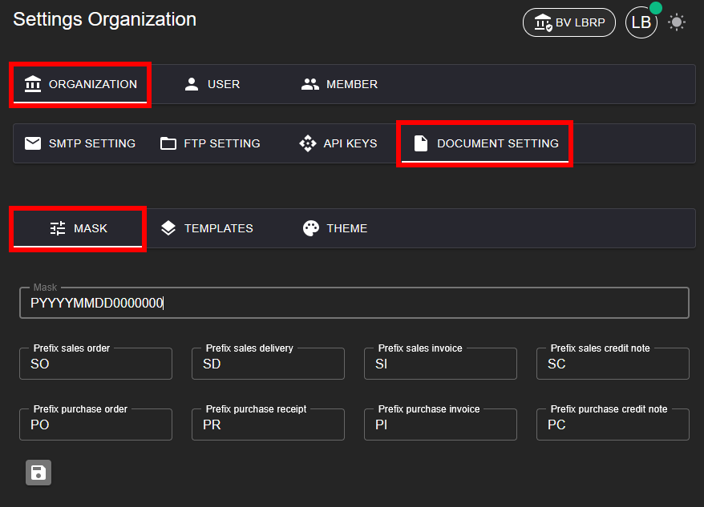
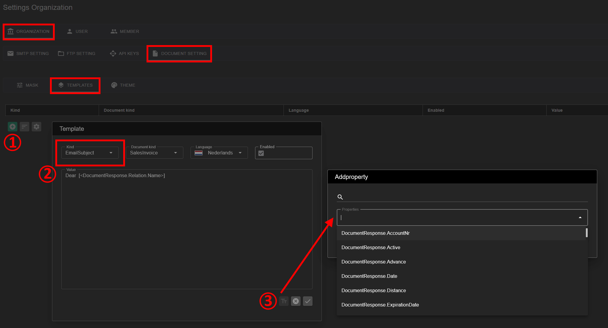
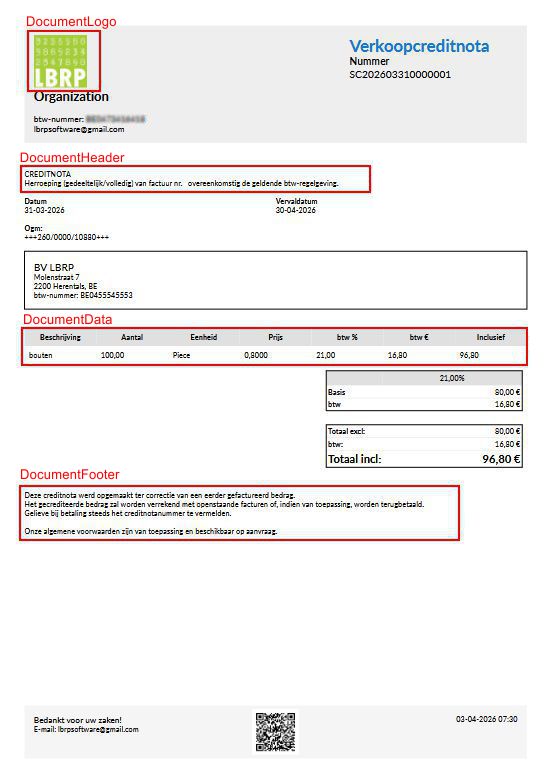
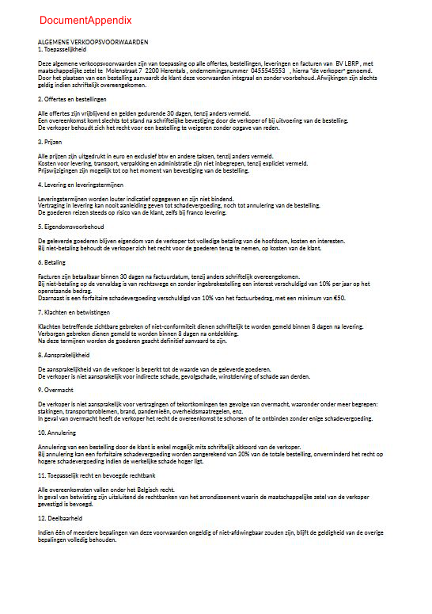
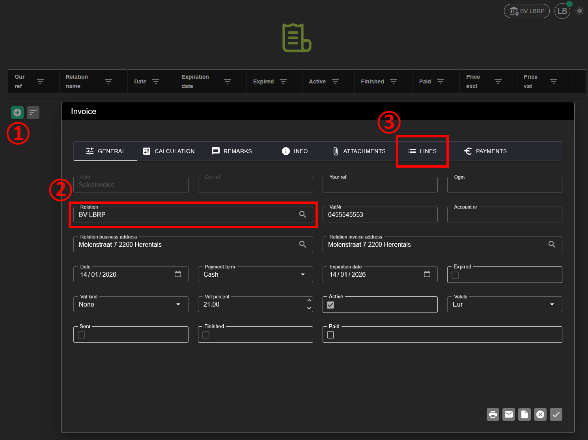
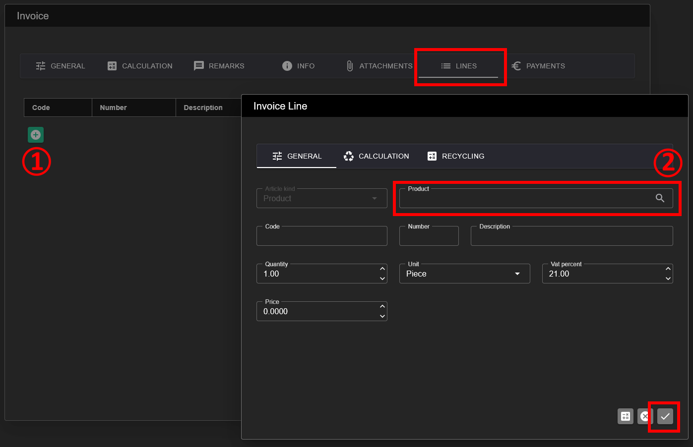
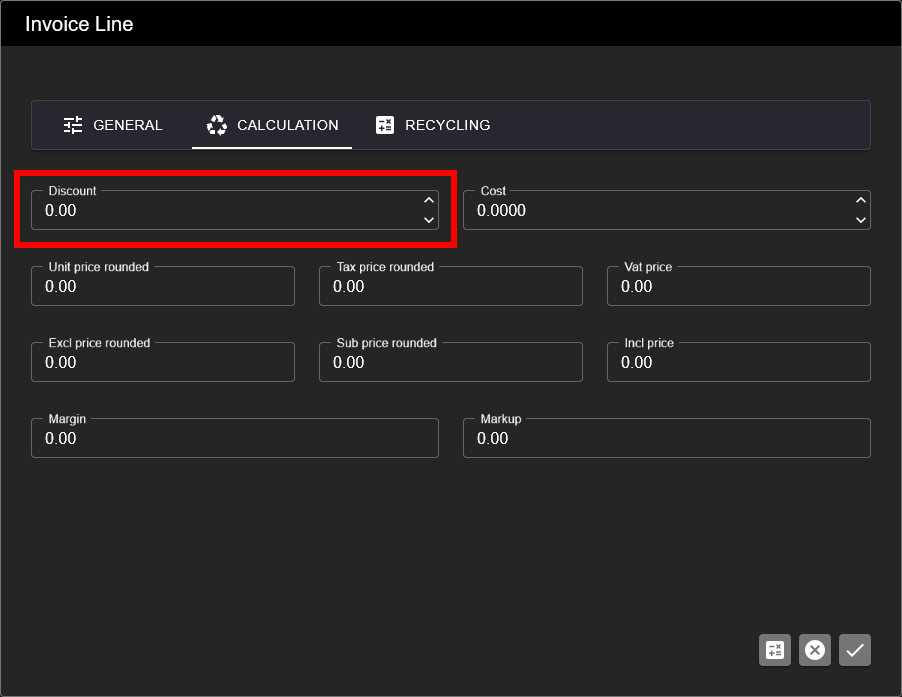

# Document

## 1. Activating the Application

To be able to use the **Document** application, it must first be activated.

**Steps:**
1. Go to **Organization → [Applications](../Identity/Applications/README.md)**.
2. Activate the **Document** application for your organization.
3. After activation, Document management is available in the menu.

⚠️ The **Document** application is usually used in combination with other applications.

We recommend also activating the following applications:
- **Relation** (customers and suppliers)
- **Catalog** (products and services)

These applications can be activated in one action via the **PEP-IT** button.

## 2. Preparation

Before you create documents, a one-time configuration is required via the [Organization](../Identity/Menu/README.md) settings.

## 2.1 Numbering Mask

Before you create your first document, you set up the **numbering mask**.

**General format (example):**
`PYYYYMMDD0000000`

- P = Prefix per document type (e.g. **SI**, **PI**, **CR**)
- Y = Year (YY, YYY, YYYY)
- M = Month (M, MM)
- D = Day (D, DD)
- 0 = Numbering (Length)

**Examples of numbering masks:**

- `SIYYYYMMDD0001` → *Sales Invoice* with date and sequential number
- `PIYYYY0001` → *Purchase Invoice* with year and sequential number
- `QYYYYMM0001` → *Quotation* with year/month
- `CRYYYY000001` → *Credit Note* with year
- `SI0000001` → Continuous numbering without date

## 2.2 Report Templates

With **Report Templates** you can customize the layout and content of documents and emails.

**Steps:**
1. Click **+ Add** to create a new template.
2. Choose the template type:
   - DocumentLogo: Logo on printout
   - DocumentHeader: Extra Header text on printout
   - DocumentData: Custom Products grid fields
   - DocumentFooter: Extra Footer text on printout
   - DocumentAppendix: Extra full page after report

   - EmailSubject: the subject for the email
   - EmailBody: the body for the email

   - Reminder 1: Reminder Text number 1
   - Reminder 2: Reminder Text number 2
   - Reminder 3: Reminder Text number 3
   - Reminder 4: Reminder Text number 4

3. Add available fields from the document.
4. Example

## 2.3 Own Relation ‼️

Add an **own relation** with the same VAT number as your organization.
The details of this relation (such as bank information) are automatically used on documents. See also [Relation](../Relation/README.md)

## 3. Adding a Document

After the preparation you can create documents (e.g. quotations, invoices, credit notes).

## 3.1 Choosing a Relation

1. Choose an existing relation.
2. If necessary, you can also add a new relation here. See also [Relation](../Relation/README.md)

## 3.2 Adding Lines

Add document lines based on products or services from the catalog.

More information:
[Catalog](../Catalog/README.md)

## 4. Printing, Emailing, Peppol

A document can be sent or shared in various ways.

## 4.1 Printing

Print document as PDF.

## 4.2 Emailing

Send document via email using email templates.

## 4.3 Sending via Peppol/Scrada

Send document electronically via the Peppol network. See also [Scrada Outbound](../Scrada/README.md)

## 5. Calculation

