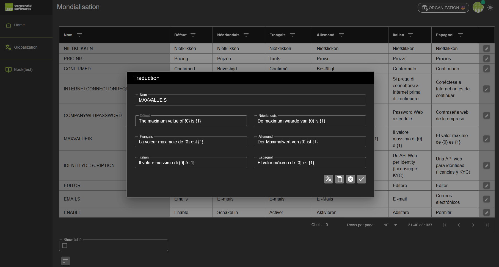

# Globalization

The **Globalization** part of the platform allows you to translate and manage all texts of the user interface in six supported languages:

- English (default language)
- Dutch
- French
- German
- Italian
- Spanish

## 1. Permissions and Access

- **Translations can only be managed within the management organization**.  
  Only users who are members of this organization get access to the translation module.
  
- **LBRP** has the ability to add members to this management organization, so that they can also perform translations.

- The **management organization must be activated** before translations can be modified.

## 2. Access to Globalization

1. Go to **Globalization** via the menu.
2. You see an overview table with all texts used on the platform.  
   - The first column shows the **name of the text item**.
   - The other columns show the translations per language.

## 3. Editing texts

1. Click the **Edit** button (✏️) next to the desired row.
2. A popup appears in which you can view and modify the translations for all languages.  
   - The "name" of the text item cannot be modified.
   - The texts in the different languages can be freely updated.

### 3.1. Buttons in the popup

- **Translate automatically**  
  Automatically fills empty translation fields via Google Translate, based on the English default text.

- **Clone**  
  Copies the English default text to all empty translation fields.

- **Cancel**  
  Closes the popup without saving changes.

- **OK**  
  Saves the changes and closes the popup.

## 4. Extra functionality

- **Show only modified texts**  
  At the bottom of the table you can activate this checkbox to only show texts that have already been modified.  
  Useful for review or further translation work.

## 5. Management and updates

- With every update of the web application, changed texts in the user interface are adopted.
- After every application update, the status of edited or verified translations is reset, so that changes can be reviewed again.
