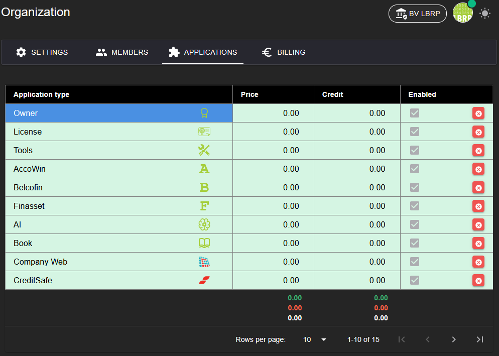

# LBRP Cloud - Identity - Applications

## 1. Application Management

On the **Applications** tab you can easily manage the use of applications within the organization:

1. **Enabling and disabling applications**
   - Manage which applications are activated for the organization.
   - Activated applications become available to the members, depending on their permissions.

2. **Price per plan**
   - Each application has a specific price, depending on the chosen plan of the organization (**Free**, **Basic**, **Team** or **Enterprise**).
   - When enabling an application, the price is added to the subscription.

This overview ensures that you, as an organization, have control over the available functionality and associated costs.

