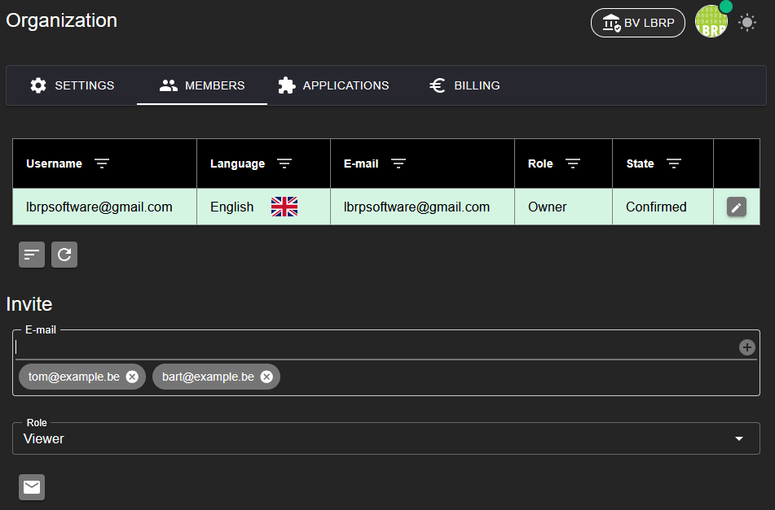
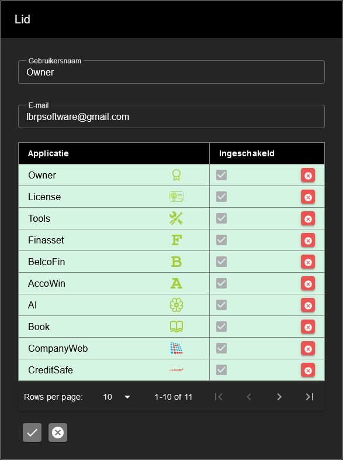

# LBRP Cloud - Identity - Members

## 1. Member Management

On the **Members** tab of an **Organization** you can do the following:

1. **Overview of members**
   - View a list of all current members of the organization, including their role and status.

2. **Inviting members**
   - Invite new members by entering their **email address** and the desired role.
   - The invitee receives an email with an invitation link.
   - If the invitee is not yet a user, they can **set a password** while accepting the invitation.

3. **Confirmation by administrator**
   - After the invitation has been accepted, the invitee gets the status **Pending**.
   - An **administrator** must manually confirm the member to grant access to the organization.

This process provides control and security when managing members within the organization.

## 2. Roles and permissions

Within an organization, each member can be assigned a specific role. Each role determines which actions a user may perform:

1. **Administrator**
   - Full access, including user management and assigning roles.

2. **Manager**
   - Access to certain functionalities, depending on the assigned responsibilities within the organization.

3. **Editor**
   - Can add, modify and delete data within the organization.

4. **Viewer**
   - Read-only access; can view data but cannot change anything.

5. **Customer**
   - Limited access; can only view and manage their own data.

With this role structure, an organization can easily determine who has which responsibilities.

## 3. Access to applications

By default, every member within an organization has access to all activated applications. If necessary, access to specific applications can be adjusted per member:

1. **Default access**
   - Every member automatically gets access to all available applications in the organization.

2. **Managing access**
   - As an administrator, you can revoke access to a specific application per user, depending on the needs and responsibilities of the member.

This offers flexibility in managing permissions and ensures that members only have access to relevant applications.

