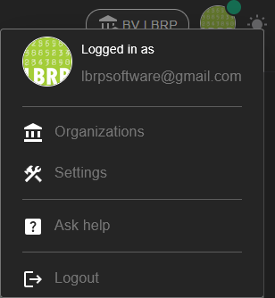
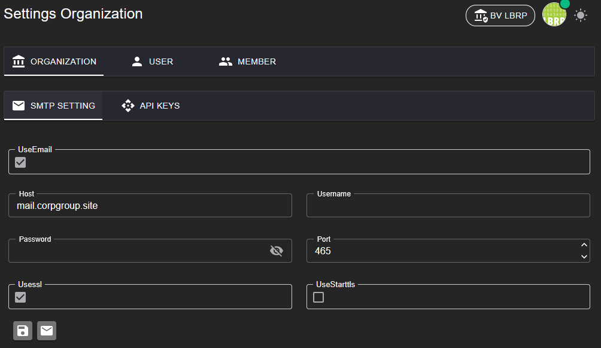
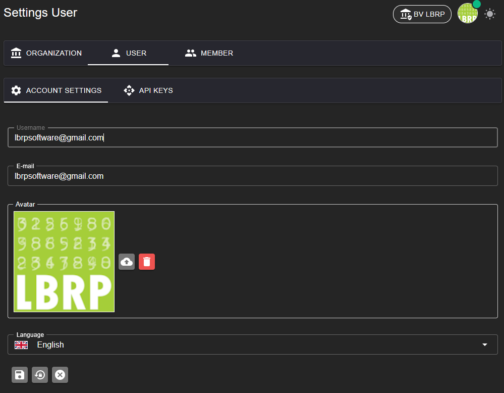
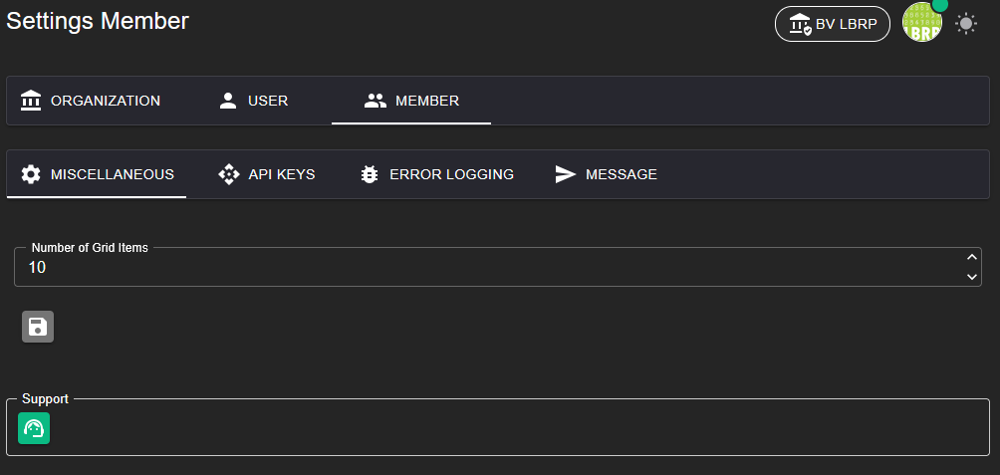

# LBRP Cloud - Identity - Menu

## 1. Main menu

The main menu provides quick access to the most important parts of the system:

---

### 1.1 Logged-in user

View the details of the currently logged-in user.

### 1.2 Organizations

Link to an overview of all organizations of which you are a member.

### 1.3 Settings

In the **Settings** menu you can manage various configurations. This screen is divided into three sections:

#### 1.3.1 Organization settings

- Set up the SMTP server to be able to send emails from the system.
- Configurable settings:
   - SMTP server address
   - Port number
   - Username
   - Password
   - Security type (e.g. SSL/TLS)

- Add 3rd-party API keys here to use services such as AI. These API keys are accessible to all members of the organization.
- Here you can also generate your own LbrpCloud API key to use in other software.

#### 1.3.2 User settings

- Manage your personal account:
   - User details
   - Change avatar
   - Reset password
   - Set language

- Add 3rd-party API keys here to use services such as AI. These API keys are only accessible to the user in all organizations of which the user is a member.

#### 1.3.3 Member settings

- Request support
- Add 3rd-party API keys here to use services such as AI. These API keys are only accessible to the user of the current organization.
- Manage error messages

### 1.4 Helpdesk

Link to our helpdesk for support.

### 1.5 Logout

Securely log out of the system.
