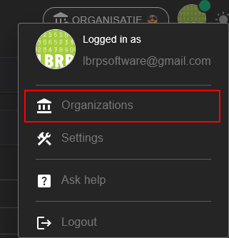
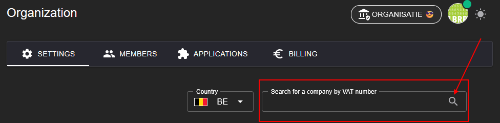
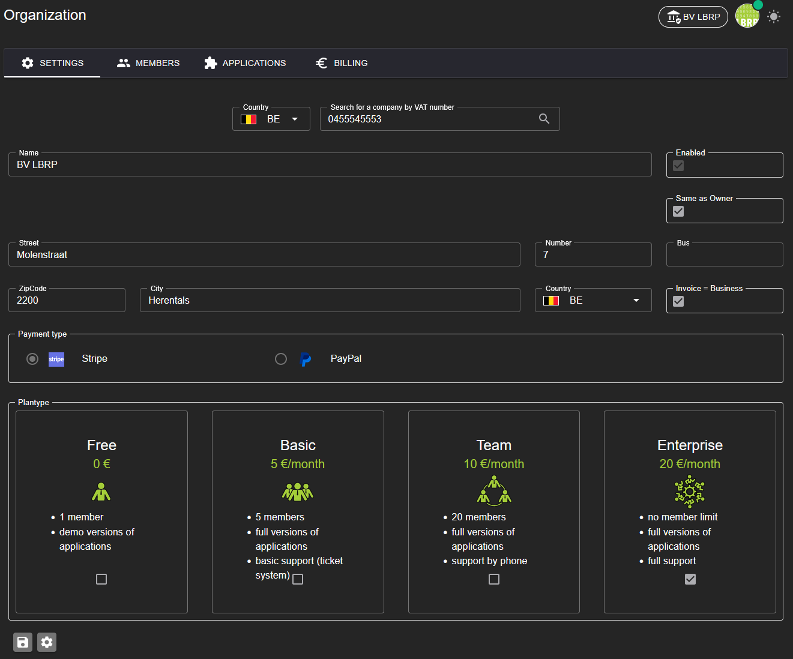

# LBRP Cloud - Identity - Organizations

## 1. Organization and User Management

Our system works on the basis of organizations. When a user creates an account, their own organization is automatically created, of which he/she is a member. Within this organization, various actions can be performed:

1. [**Adding applications**](../Applications/README.md)
   - As the owner of an organization, you can add applications. These applications are available within your organization and can be activated individually.

2. [**Inviting users**](../Members/README.md)
   - You can invite other users to become a member of your organization. Invited users get access to the applications and data within your organization, tailored to their role and permissions.

3. [**Invoicing**](../Invoices/README.md)
   - You will find an overview of the invoices for the use of the various applications in your organization.

This gives the system full control and flexibility for collaboration within the organization.

## 2. Organization Settings

In the [details](https://abfweb.corpgroup.site/owner/organization) of an organization, you can manage the following settings:

1. **Select a plan**
   - Choose a suitable subscription for the organization:
     - **Free**: Basic functionalities for free.
     - **Basic**: Extended options for individual users.
     - **Team**: Designed for teams with shared access.
     - **Enterprise**: For large organizations with advanced needs.

2. **Set up payment method**
   - Choose between **Stripe** or **PayPal** for secure payments.

3. **Fill in organization details**
   - Add important details of the organization, such as the **address** or other relevant information.
   - The easiest way to retrieve all data automatically is to enter the **VAT number** in the designated text field.

      

   - The "Same as Owner" checkbox ensures that the organization's email traffic goes through the same address as the email address you signed up with. You can change this by unchecking this box.
   - The "Invoice - Business" checkbox tells the system that your invoicing address is the same as your registered office address. You can let this differ by unchecking this box and filling in the necessary details.

This ensures that the organization is fully and correctly set up for use.

