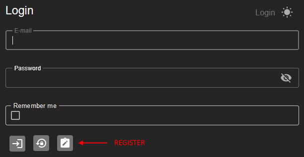
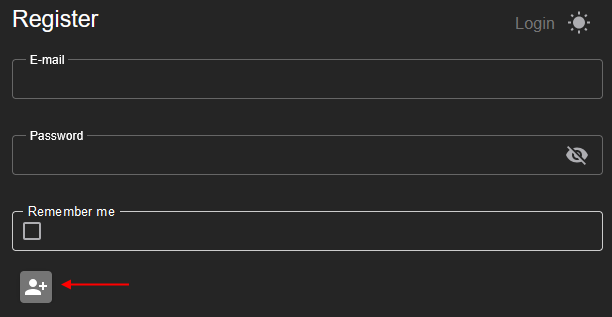

# LBRP Cloud - Identity - Users

## 1. Signing in

To access the application, you can log in via the **Login** button on the [home page](https://abfweb.corpgroup.site/identity/login).

1. Click **Login**.  
2. Enter your username and password.  
3. Optional: Check the **Remember me** checkbox if you don't want to log in again every time.  
   - **Checked**: You stay logged in, even after closing the software.  
   - **Unchecked**: You stay logged in for only one day.

After entering your details, click the **Log in** button to access your account.

## 2. Registering

Besides logging in, you can also register for a new account on the **Login screen**. 

1. Click the **Register** button.  
2. Enter a **username** and a **password**.  
3. Confirm your password by entering it again.  
4. Click **Register** to create your account.

After successful registration, you can log in immediately with your new account details.

## 3. Forgot Password

If you have forgotten your password, you can easily reset it via the **Forgot password** button on the login screen.

1. Click **Forgot password**.  
2. Enter your registered **email address**.  
3. Click the **OK** button.  

You will receive an email with a link to reset your password. Follow the instructions in the email to create a new password.
