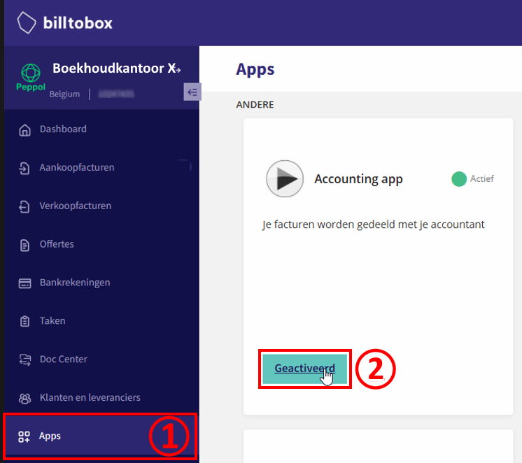
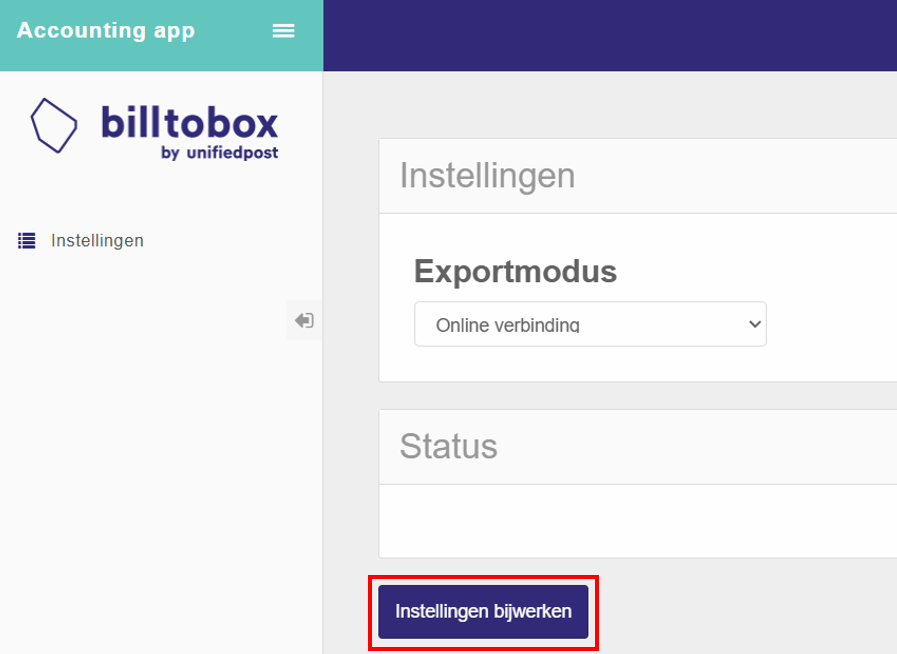
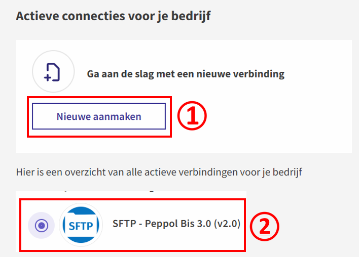
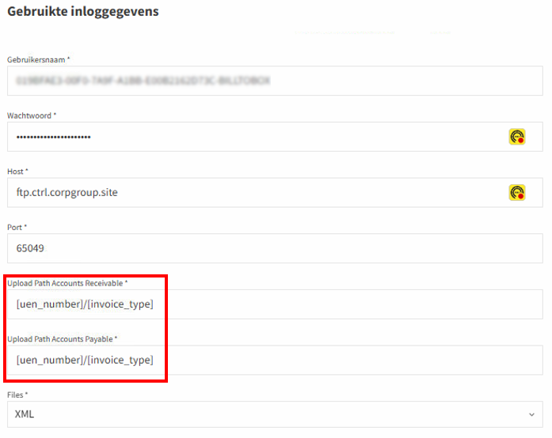
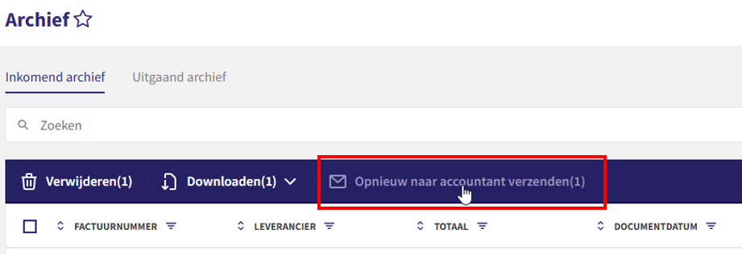
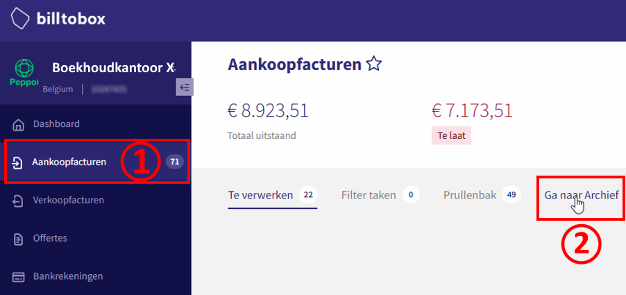

# Data Exchange - Bill-to-Box

## Back to [Main menu](../../README.md) | [Providers Overview](../README.md#providers)

Follow these steps to connect BillToBox with AccoWin SFTP.

## 1. Going to Apps/Setup
1. Log in to BillToBox.
2. Go to **Apps** or **Settings**.

## 2. Configuring FTP/SFTP Setup
1. Click **Setup** or **FTP/Peppol integration**.
2. Fill in the credentials from AccoWin:
   - Host: [your SFTP host]
   - Port: 22
   - User: [SFTP user]
   - Password: [SFTP password]
3. Set the root folder to the **VAT number of the company**.

**💡 NOTE: Root folder = VAT number (e.g. BE123456789). Subfolders for UBL/CODA etc.**

## 3. Sending Documents
1. Select documents → **Send** to SFTP.
2. Or configure automatic sync.

## 4. Checking the Archive
- View sent files in **Archive**.

**💡 Wait ~1 hour after sending. Download in AccoWin via the UBL menu.**

---
*See [Other providers](../../README.md#providers)*
