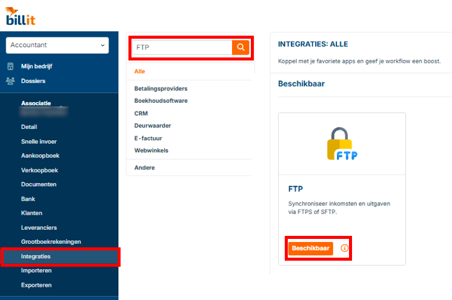
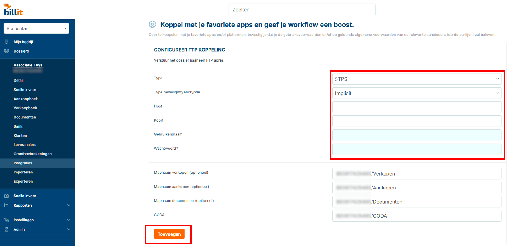
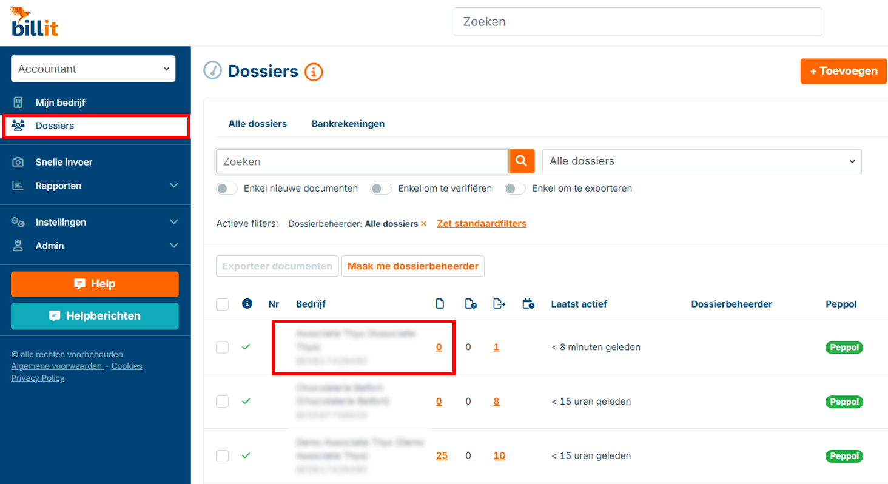

# Data Exchange - Billit

## Back to [Main menu](../../README.md) | [Providers Overview](../README.md#providers)

Follow these steps to connect Bilit with AccoWin SFTP.

## 1. Going to Integrations
1. Log in to Bilit.
2. Go to **Integrations** (or Settings > Connections).

## 2. Creating an FTP Integration
1. Click **New FTP connection** or **Add SFTP**.
2. Fill in the credentials from AccoWin:
   - Host: [your SFTP host]
   - Port: 22
   - User: [SFTP user]
   - Password: [SFTP password]
3. Set the root folder to the **VAT number of the company**.

**💡 NOTE: Root folder = VAT number (e.g. BE123456789). Subfolders for sales/purchases go underneath.**

## 3. Linking to a Dossier
1. Go to **Dossiers**.
2. Select dossier → Link FTP integration.

## 4. Sending Documents
- Documents in Bilit → **Send to SFTP** or automatic sync.
- Wait ~1 hour → Download in AccoWin (**UBL > Import UBL from Cloud**).

**💡 Test with 1 invoice. Check VAT match if no files appear.**

---
*See [Other providers](../../README.md#providers)*
