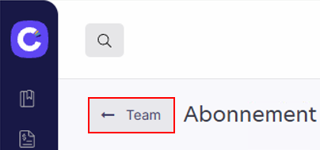
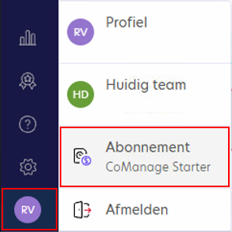
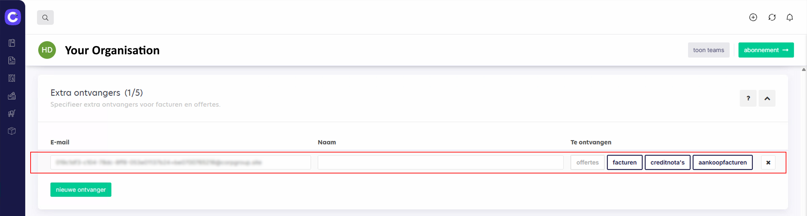

# Data Exchange - CoManage

## Back to [Main menu](../../README.md) | [Providers Overview](../README.md#providers)

Follow these steps to connect CoManage with AccoWin SFTP.

## 1. Going to Team/Subscription
1. Log in to CoManage.
2. Go to **Team** or **Subscription**.

## 2. Configuring Receiver/SFTP
1. Click **Add receiver** or **Integration**.
2. Fill in the credentials from AccoWin:
   - Host: [your SFTP host]
   - Port: 22
   - User: [SFTP user]
   - Password: [SFTP password]
3. Set the root folder to the **VAT number of the company**.

**💡 NOTE: Root folder = VAT number (e.g. BE123456789). Subfolders for documents go underneath.**

## 3. Sending Documents
- Configure automatic sync or **Send** manually.
- Wait ~1 hour → Download in AccoWin (**UBL > Import UBL from Cloud**).

**💡 Test the integration with a sample file. Check VAT if empty.**

---
*See [Other providers](../../README.md#providers)*
