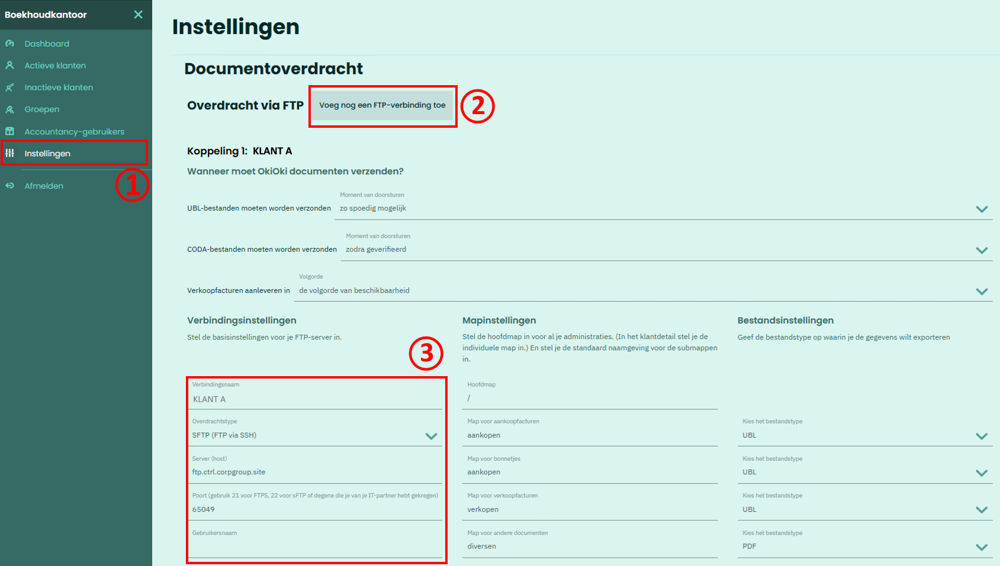
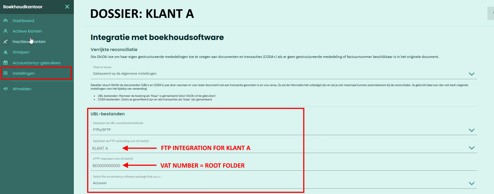
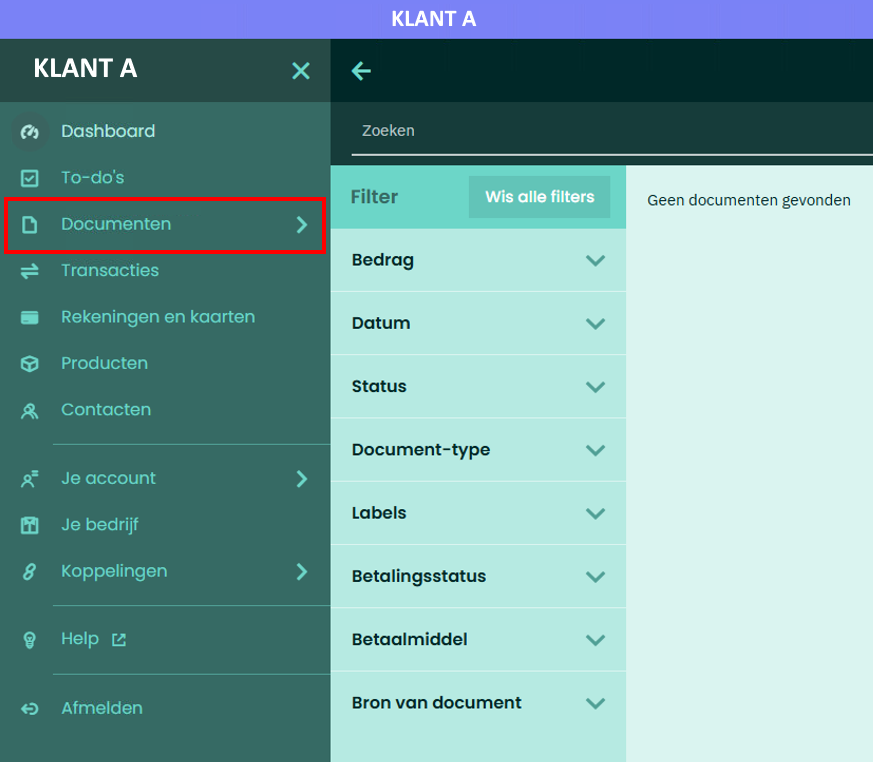
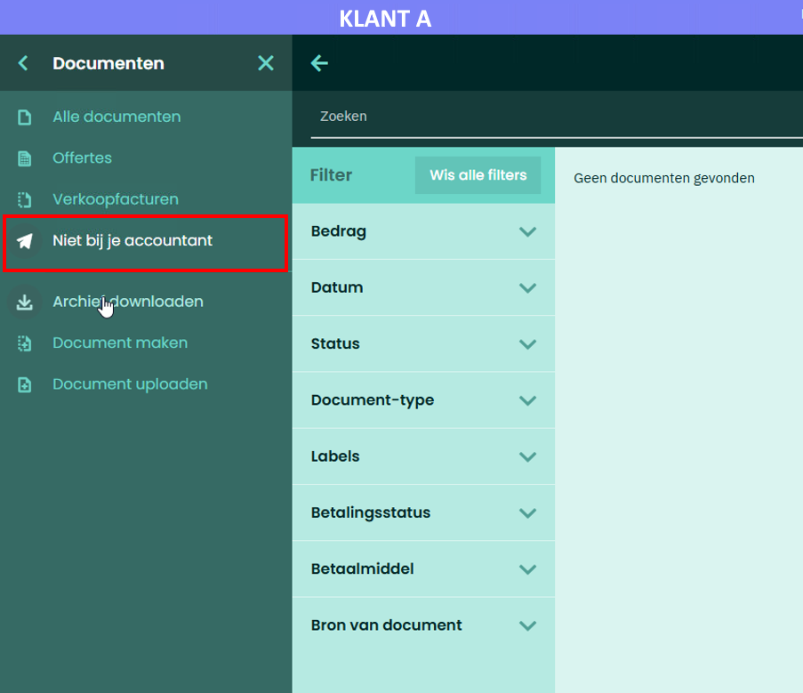

# Data Exchange - OkiOki

## Back to [Main menu](../../README.md) | [Providers Overview](../README.md#providers)

In **OkiOki** you first create FTP connections, which you then select per **Company**.

## 1. Setting up the FTP Integration
1. Go to **General Settings** of your accounting firm.
2. Click **Add FTP connection**.
   - General (all companies): Enter a free name.
   - Specific company: Name or VAT number.

3. Fill in the **credentials** from AccoWin:
   - Host, port, user, password.

## 2. Linking the FTP Integration to a Dossier
1. Go to **Settings** of a Dossier.
2. Select the FTP integration.

**💡 NOTE: In '**sFTP folder name for Company**', enter the **VAT number**. Subfolders (Sales, Purchases, CODA) go underneath.**

## 3. Sending Documents to SFTP
1. Go to company → **Documents**.
2. Click **Not with your accountant**.

3. Click **Send to SFTP server** at the top right.

**💡 NOTE: Documents are collected and put into the database ~1x per hour. Then downloadable in AccoWin.**

**Test: Send 1 document → Check the AccoWin UBL menu after 1 hour.**

---
*See [Other providers](../README.md#providers)*
