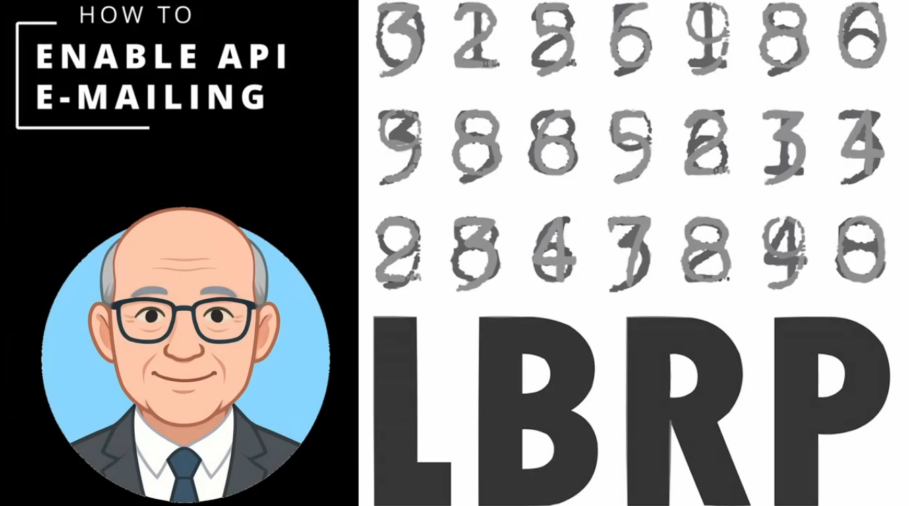
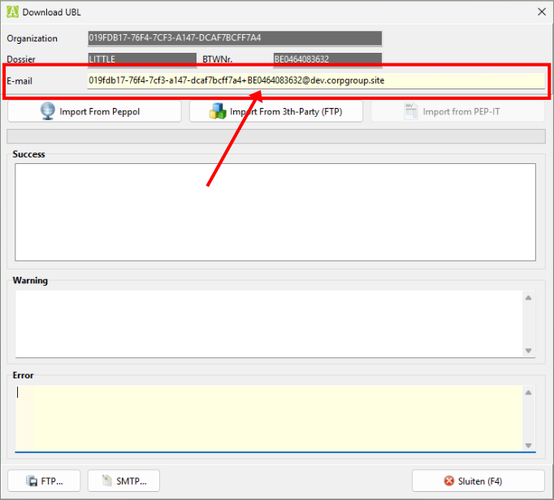

# Synchronization from other software packages

## What is this?

With our **Email synchronization** you automate the receipt of UBL files, PDF files and CODA data from popular third-party accounting packages such as **Billit**, **BillToBox**, **CoManage**, **OkiOki** and many others.

Files are sent by the various providers to our cloud platform, after which they can be downloaded directly into an **AccoWin** dossier.

**Advantages:**

- No more manual downloading or uploading between different packages
- Secure and automated sync via Email.
- Suitable for accounting firms and self-employed persons.

## How does it work (in short)?

1. AccoWin Setup: Activate a special Email address in AccoWin to send the files to.

   <a href="https://youtu.be/7Y2F0i6g_tY" target="_blank">
     
   </a>

2. [Provider Setup](README.md#providers): Share the Email address with your customer and configure the connection in the provider's accounting package.

   

3. The accounting package sends files to our cloud platform using the configured Email connection.
   This can be automatic or manual depending on the capabilities of the provider.
   
4. The files can be downloaded in AccoWin via the menu **UBL > Import UBL from Cloud** or **CODA > Import CODA from Cloud**

**💡 For accounting firms**: Share the special Email address, per dossier, with your customers.  
**💡 For self-employed persons**: Use the Email address of your dossier to send files directly.

### The special Email address

The Email address on which the synchronization arrives is that of the **accountant's organization**. To know for which customer (dossier) an incoming file is intended, a **+tag** followed by the **customer's VAT number** is added to the address.

**Example:**

```
019fdb17-76f4-7cf3-a147-dcaf7bcff7a4+BE0464083632@dev.corpgroup.site
```

Here, `019fdb17-76f4-7cf3-a147-dcaf7bcff7a4` is the unique part of the organization and `+BE0464083632` is the tag with the customer's VAT number. This way, incoming files are automatically linked to the correct dossier.


## Considerations for synchronization via Email

Some considerations should be taken into account when synchronizing via Email:

- Only 1 email account needs to be created in Accowin.
  _Adding the VAT number to the name of this Email account is sufficient to identify the sender's dossier._
- No login details need to be shared with your customer.
- Sending via Email has to be done manually with some providers.
- Changes to the content or structure of the sent Email by a provider can cause temporary errors when processing on our side.
- Downloading files in Accowin, for all dossiers, can only be done in your own dossier.
  The VAT number, which was used as an addition to the name of the Email account, ensures that incoming files are moved to the correct dossier.

## Providers

Here is a short guide on how to set up your Provider with the Email address.
(*TODO)

- [Billit](Billit/README.md)
- [Bill-To-Box](BillToBox/README.md)
- [Blox](Blox/README.md)
- [Breex](Breex/README.md)
- [ClearFact](ClearFact/README.md)
- [CodaBox](CodaBox/README.md)
- [CodaClean](CodaClean/README.md)
- [CoManage](CoManage/README.md)
- [Dexxter](Dexxter/README.md)
- [Doccle](Doccle/README.md)
- [Eenvoudig Factureren](EenvoudigFactureren/README.md)
- [MyFact](MyFact/README.md)
- [Odoo](Odoo/README.md)
- [OkiOki](OkiOki/README.md)
- [Onfact](Onfact/README.md)
- [Optedo](Optedo/README.md)
- [Qweon](Qweon/README.md)
- [Salieri](Salieri/README.md)
- [Scrada](Scrada/README.md)
- [Team Leader](TeamLeader/README.md)
- [Yuki](Yuki/README.md)
- [Zen Factuur](ZenFactuur/README.md)
