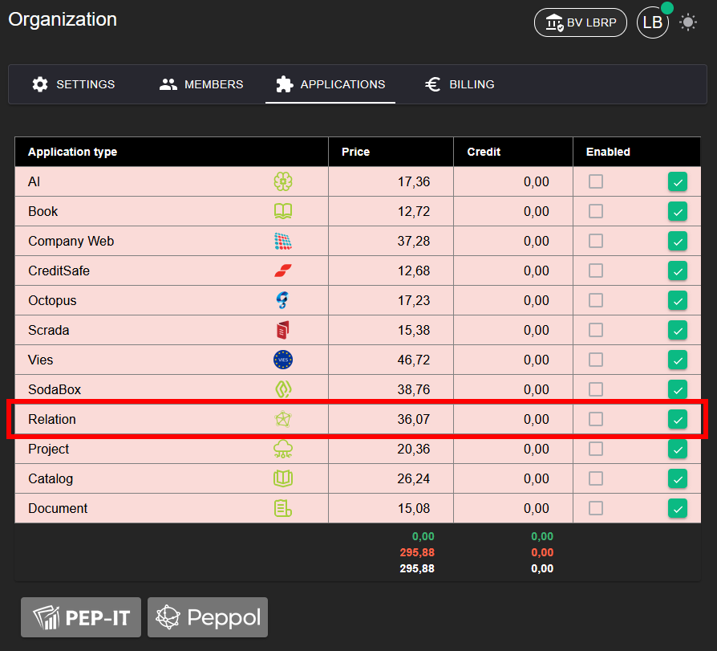
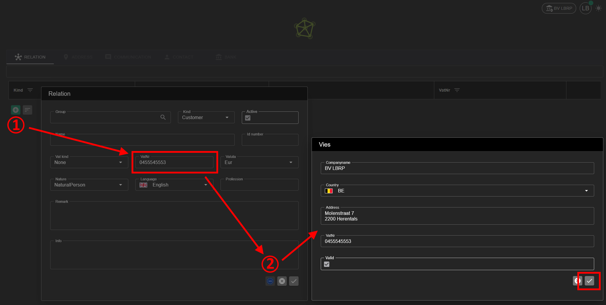

# Relation

With the Relation application you can manage customers, suppliers or other contacts.

## 1. Activating the Application

To be able to use the **Relation** application, it must first be activated.

**Steps:**
1. Go to **Organization → [Applications](../Identity/Applications/README.md)**.
2. Activate the **Relation** application for your organization.
3. After activation, Relation management is available in the menu.

## 2. Adding a Relation

**Steps:**
1. Click the green **+** button to add a new relation.
2. Fill in the basic details manually, or have them filled in automatically if the **Vies** application is active.
3. Save the relation and select it to further complete additional details.

If **Vies** is active, the name, country and address are automatically retrieved based on the VAT number.
More information about this can be found in the [Vies](../Vies/README.md) manual:

### 2.1 Address

On the **Address** tab you can manage addresses for the relation.

Possible addresses:
- Business address
- Optional: different invoicing and delivery address

### 2.2 Communication

On the **Communication** tab you can add communication channels:
- Email
- Mobile
- Fax
- Website

### 2.3 Contact

On the **Contact** tab you can add contact persons for the relation:

For each contact person you can register the following details:
- Name
- Language
- Remarks

### 2.4 Bank details

On the **Bank** tab you can add bank details for the relation:

Details to register:
- Bank name
- Account number
- IBAN
- BIC
