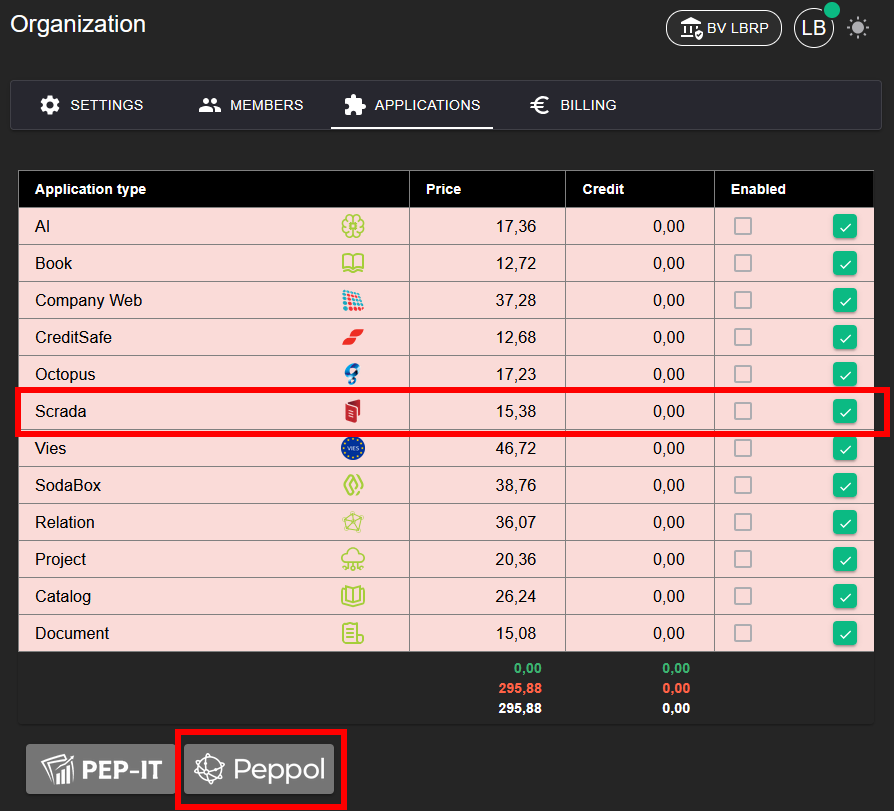
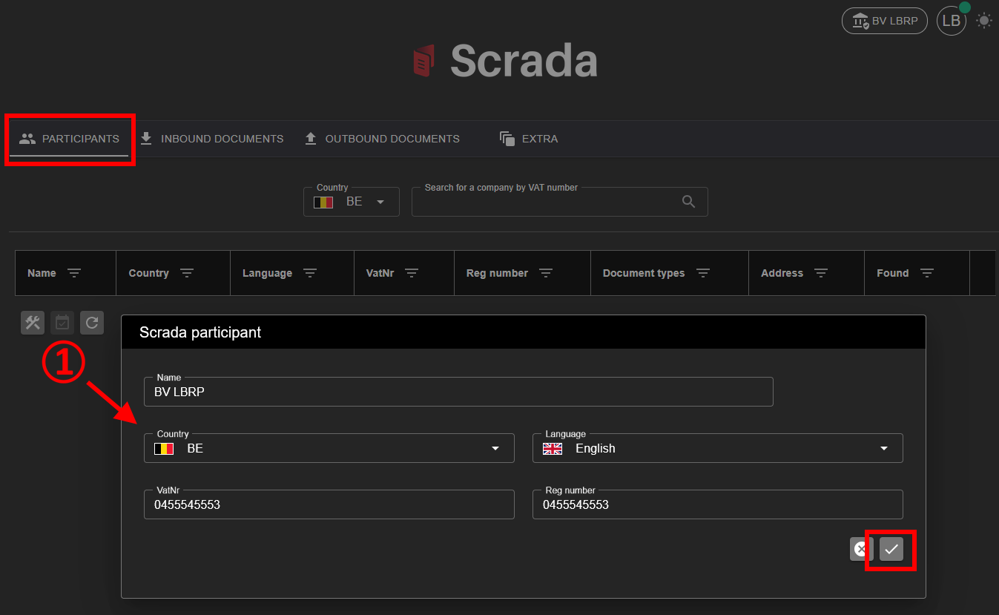

# Peppol (Scrada)

## 1. Activating the Application

To be able to use the **Peppol** application, it must first be activated.

**Steps:**
1. Go to **Organization → [Applications](../Identity/Applications/README.md)**.
2. Activate the **Peppol** application for your organization.
3. After activation, the Peppol functionality is available in the menu.

## 1. Participants

## 1.1. Searching by VAT number

## 1.2. Registering your own Organization

## 2. Inbound

## 3. Outbound

## 4. Extra

## 4.1. Sent Emails

## 4.2. Inbound via SFTP (3rd-Party)

See also [Sftp Integration](../Provider/Scrada/README.md)

## 4.3. Convert (UBL <-> PDF)
