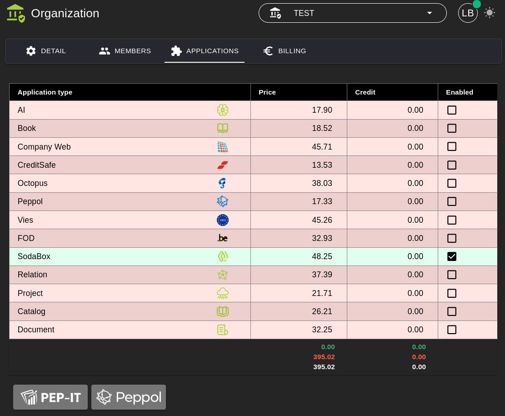
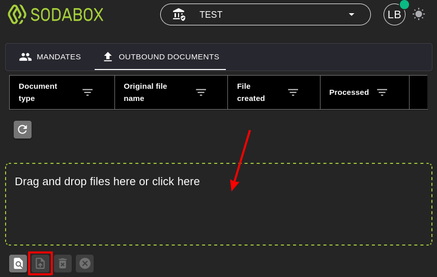

# SodaBox

## 1. Activating the application

To be able to use the **SodaBox** application, it must first be activated.

**Steps:**
1. Go to **Organization → [Applications](../Identity/Applications/README.md)**.
2. Activate the **SodaBox** application for your organization.
3. After activation, the SodaBox functionality is available in the menu.

## 2. SodaBox

With the **SodaBox** application you can send payroll bookings in the **SODA format*** to [**CodaBox**](https://codabox.com/producten/soda/) or [**CodaClean**](https://www.codaclean.io/) to make them available to all kinds of accounting software.

***The SODA format is a standardized electronic format that automatically delivers payroll bookings from social secretariats (BelcoFin) digitally into your accounting software (AccoWin).***

### 2.1 Mandates

As an accountant, you can only send payroll bookings on behalf of your customers when you have requested a **mandate** for this with **CodaBox** or **CodaClean**. In addition, the following conditions must be met:

1) The customer must be known in our system as a **user** and **organization** and have an **account**. 
This is **free of charge** as long as the customer does not activate any other applications. 
*Using our software is not necessary, but an account and organization must exist.*

2) The **mandate** must then be activated for the relevant **organization** in our **SodaBox** application. 
*This can only be arranged by LBRP.*

### 2.2 Sending

On the **Outbound** tab you can send **XML files** in the **SODA format**.

## 3. BelcoFin

The **SodaBox** application is fully integrated into our **BelcoFin** desktop application, which automates the above actions.

Read the [SodaBox](../../../Desktop/UserManuals/BelcoFin/SodaBox/README.md) section in the part of this manual about our [Desktop Applications](../../../Desktop/UserManuals/README.md).
