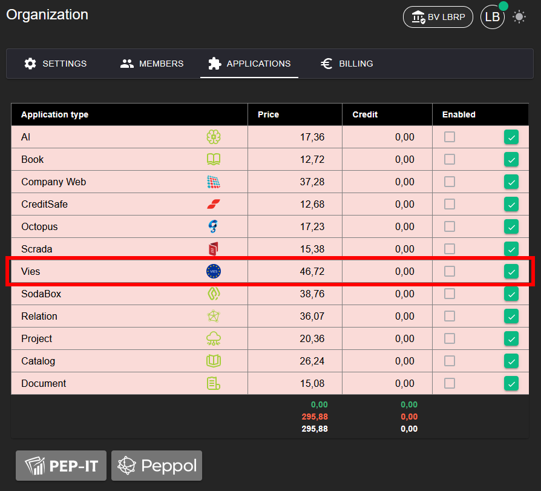
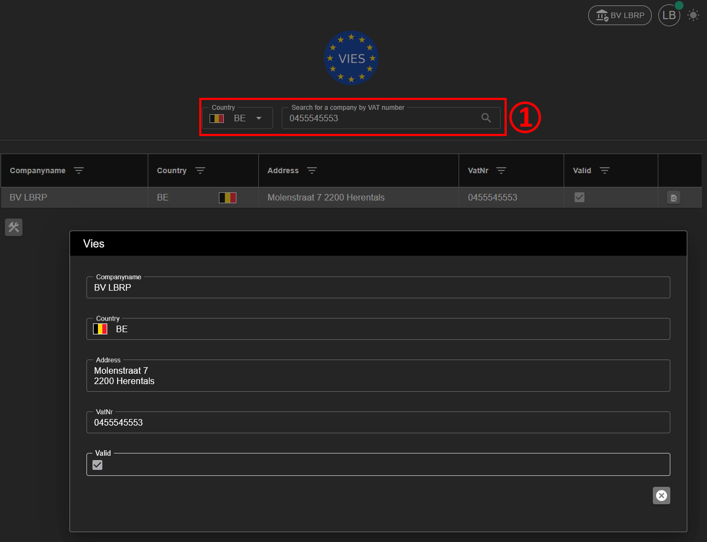

# Vies

## 1. Activating the Application

To be able to use the **VIES** application, it must first be activated.

**Steps:**
1. Go to **Organization → [Applications](../Identity/Applications/README.md)**.
2. Activate the **Vies** application for your organization.
3. After activation, the Vies functionality is available in the menu.

## 2. Searching

With the Vies application you can look up companies based on their **VAT number**.

**Steps:**
1. Open the **Vies** application.
2. Enter the VAT number (including country code).
3. Start the search 🔍

**Result:**
- If the company is found, the following details are automatically retrieved:
  - Name
  - Country
  - Address
- The status **Valid** indicates that the VAT number is valid.
- The status **Invalid** indicates that the VAT number was not found or is invalid.

## 3. Integration

The Vies functionality is integrated into other applications. This allows company data to be automatically retrieved based on the VAT number.

**Examples of integration:**
- When creating or editing a **Relation**, the name, country and address can be automatically filled in via Vies.
- Within **Organizations**, the VAT number can be validated and the associated details retrieved.

Consult the following manuals for more information:
- [Relation](../Relation/README.md)
- [Organization](../Identity/Organizations/README.md) -> Fill in organization details
