# Desktop - BelcoFin - Clean Up Data

## 1. Introduction

With this application you can

- Remove duplicate managers via a self-made Excel file.
- Manually remove duplicate managers

> ⚠ **CAUTION**:
> Managers to whom slips are linked, can / may NOT be removed.

## 2. Where can I find the option in the menu?
You can find this option under the menu: Start - **Clean up data**

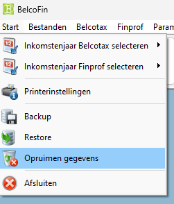

## 3. Explanation about the screen

❗CAUTION: ALWAYS take a backup before you perform this❗

⚠ this is something very important ⚠

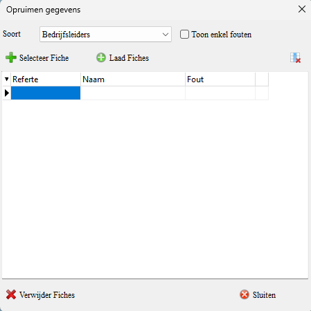

* Type: Here you can choose the managers options to remove

* Show only errors: If you check this option, you will only see the incorrect slips in the list of managers to be removed

* Select slip: With this you can manually select the manager to remove. E.g. if you do not have an Excel list.

* Load slips: With this you can load an Excel file or a TXT file with the managers to be removed into Belcofin.

* The button Top left: With this you can remove the selection of managers on the screen.

* Remove slips: This is the button to remove the slips

* Close: With this you close the window.

## 4. There are two options to remove the managers

### 4.1 Manual selection in Belcofin

Click the **Select slip** button.

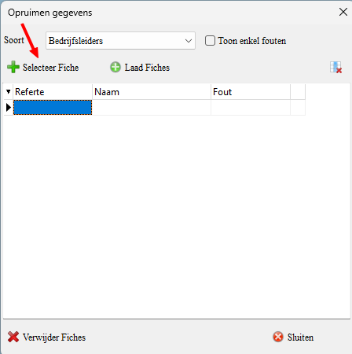

You will arrive at the following screen: Here you can select a manager (not in bulk) that you want to remove from your database.

Select the manager you want to remove.

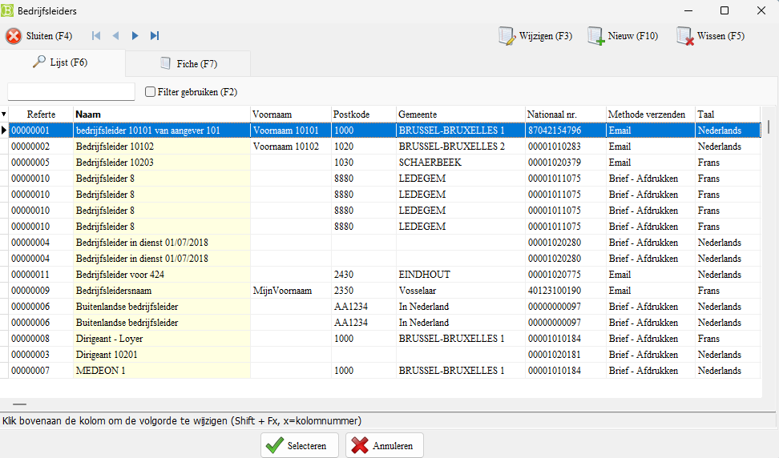

If you want to remove this manager, click "Remove slips".

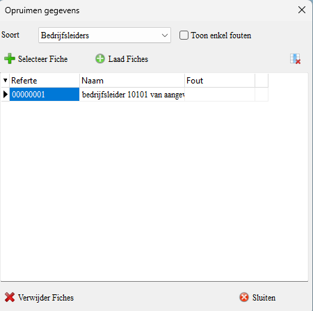

If you get this red message, there is still a link with a Slip in the past for this manager.

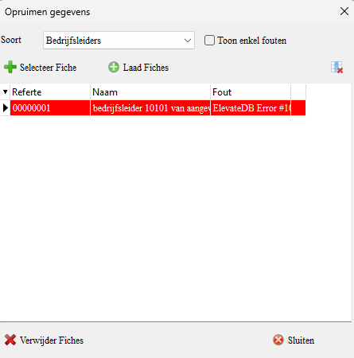

### 4.2 Removing the managers via an excel list 

#### 4.2.1 How to get a list of managers out of Belcofin?

Open Belcofin and go in the menu to **managers**.

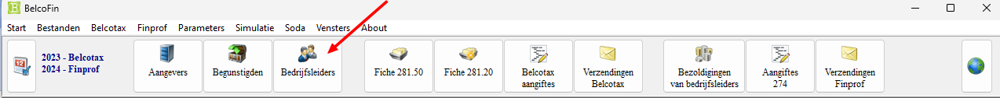

You will then arrive in the managers window.

Click here on the downward arrow.

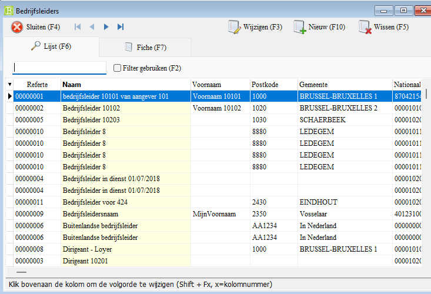

Here you get different options to choose from.

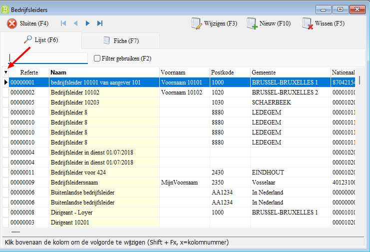

Choose here how you want to export the list: Excel (XLS) or a TXT file.

If you choose an Excel file, you can remove the managers from the list more easily.

Now save the file as an Excel file.
(later we will convert the Excel file to a TXT file)

If you would do that now, there is too much information in the .TXT file and you will have to remove too much.

#### 4.2.2 Converting Excel file to a .TXT file.

You have made your excel list with managers and it is ready. Now we are going to convert it to a TXT file.

Open your Excel file and go to File - Save As...

Choose a name for your TXT file (or keep the name of the Excel file).

At save as you choose **Text (Tab delimited) (*.txt)**

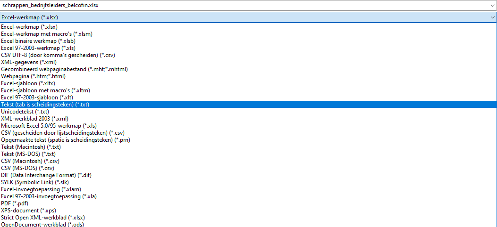

Then save the file and close your Excel.

#### 4.2.3 Removing the managers

Open Belcofin, go to start - **Clean up data**

Click **load slips**

Go to the folder where you saved the .txt file and select that file to open.

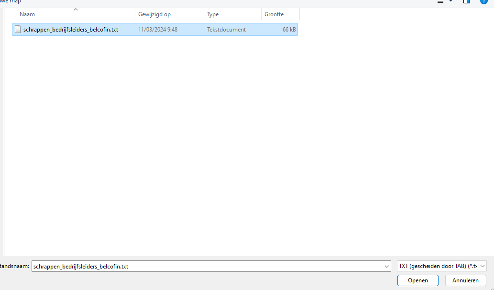

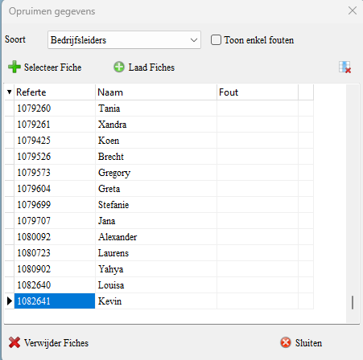

You will now see a list with the selected managers.

> [!WARNING]
> Always make a backup of your database before you do this!

Click remove slips (the program will now remove the slips of the duplicate managers)

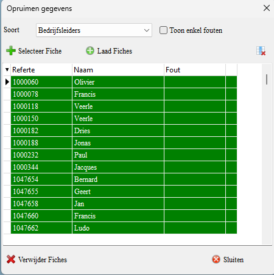

##### 4.2.3.1 Show only the errors

Now we are going to look at which slips were not removed.

Turn on the checkbox at **Show only errors**

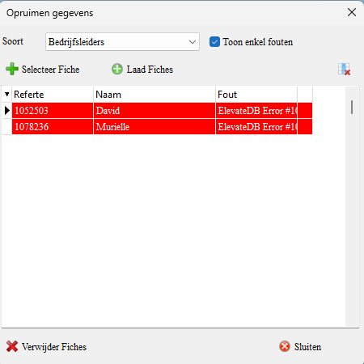

This means that slips have been submitted for this manager.

You can check this in the list of slips 281.20

Close the window and possibly write down the references somewhere.
(or take a screenshot with Windows logo + SHIFT + S)

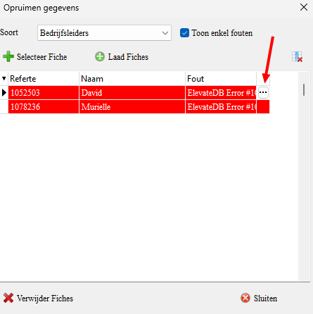

Click in the menu on **slips 281.20**

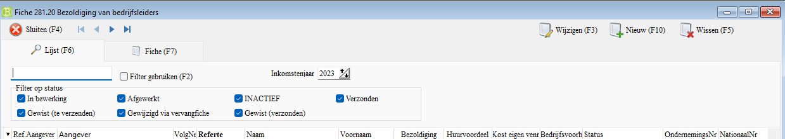

You will now see the slips 281.20 window.

Fill in the reference of the manager in the search bar.

Click on the **reference** column to sort by reference.

Then click **use filter** or use **F2**

Via the **status** column you can see that a slip exists and that a slip has been submitted.

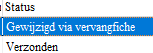

So you **cannot** remove these managers from the database.
