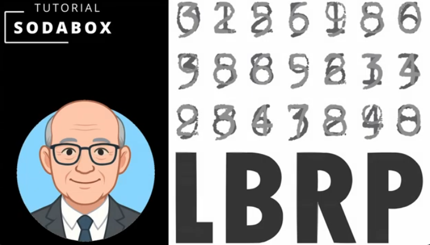
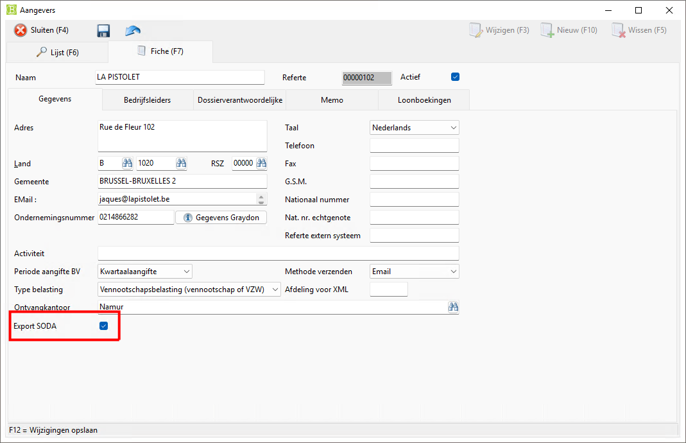
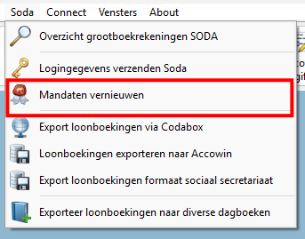
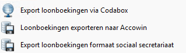
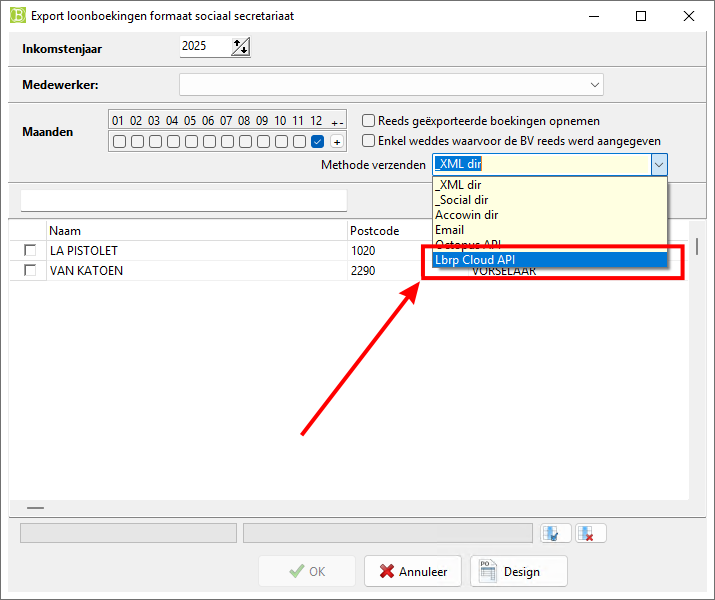

# Desktop - BelcoFin - SodaBox

## 1. Introduction

With the **SodaBox** application you can send wage bookings in the **SODA format** to [**CodaBox**](https://codabox.com/producten/soda/) or [**CodaClean**](https://www.codaclean.io/) from **BelcoFin**.

For this you need a connection with our online platform. 
Watch the following video to configure this connection:

- **YouTube Tutorial** (*no longer up-to-date, read **NOTE** further on*)

   

- **See also** ➡️ [Cloud Connection from BelcoFin](../Cloud/README.md)

### 1.1 Activating mandates

As an accountant you can only send wage bookings on behalf of your customers when you have requested a **mandate** for this with **CodaBox** or **CodaClean**. In addition, the following conditions must be in order:

#### 1.1.1 Account of your customer (*Declarants/Managers*) on our Cloud Platform

The customer must be known as a **user** and **organization** in our online platform and have an **account**.  
This can be configured entirely from **BelcoFin**.

**NOTE ❗❗❗** 
*In the above video, a step is missing to register a declarant in the cloud.*  
*Before the declarant can be synchronized, the checkbox **Export SODA** must be turned on.*

#### 1.1.2 Activating SodaBox for the account of your customer

The obtained **mandate** must be activated by us (LBRP) for the relevant **organization** in our **SodaBox** application. 
*This can only be arranged by LBRP.*

### 1.2 Updating mandates in BelcoFin

After the **SodaBox** activation for your customer has been arranged by us, you can synchronize the current situation for all declarants in **BelcoFin** with our Cloud Platform via the menu **Soda** ➡️ **Refresh mandates**.

**SUPPORT** 
*Feel free to let us know if there are **SodaBox** activations missing.*  
*The migration to our new Cloud Platform was urgent and complex, and the automation of this **flow** is not yet fully optimized.*

## 2. Sending Soda files

Via the menu **Soda** you can send Soda files to **CodaBox** or **CodaClean**:

- **CodaBox**: Exports wage bookings via ***CodaBox***  
- **CodaClean**: Exports wage bookings in the format of the ***Social Secretariat***

## 3. Cloud Platform

The **SodaBox** application can also be used and consulted via our **Cloud Platform**.

Read the section [SodaBox](../../../../Cloud/UserManuals/SodaBox/README.md) in the manual about our [Cloud Platform](../../../../Cloud/UserManuals/README.md).
