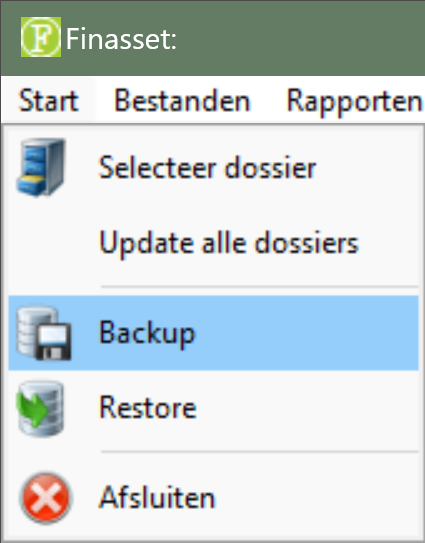
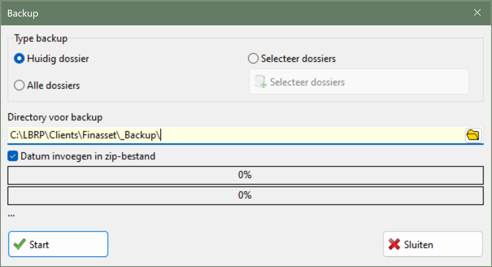
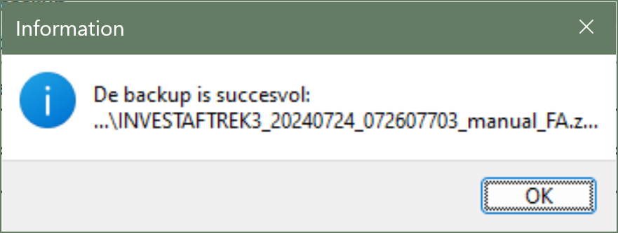
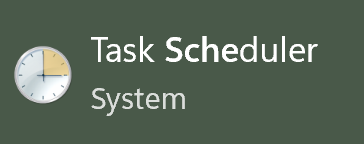
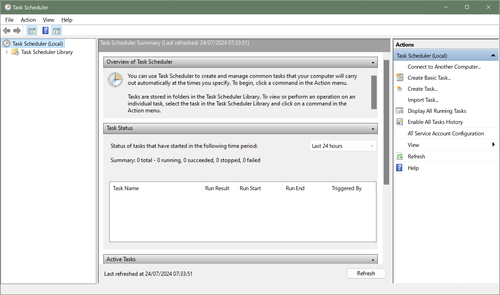
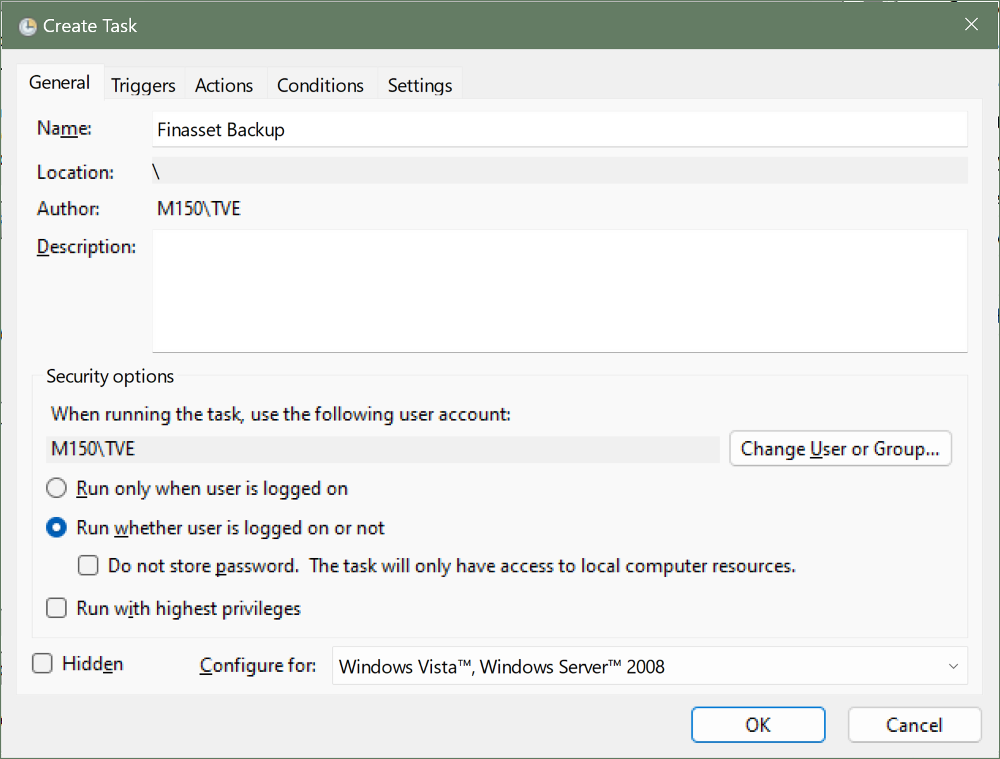
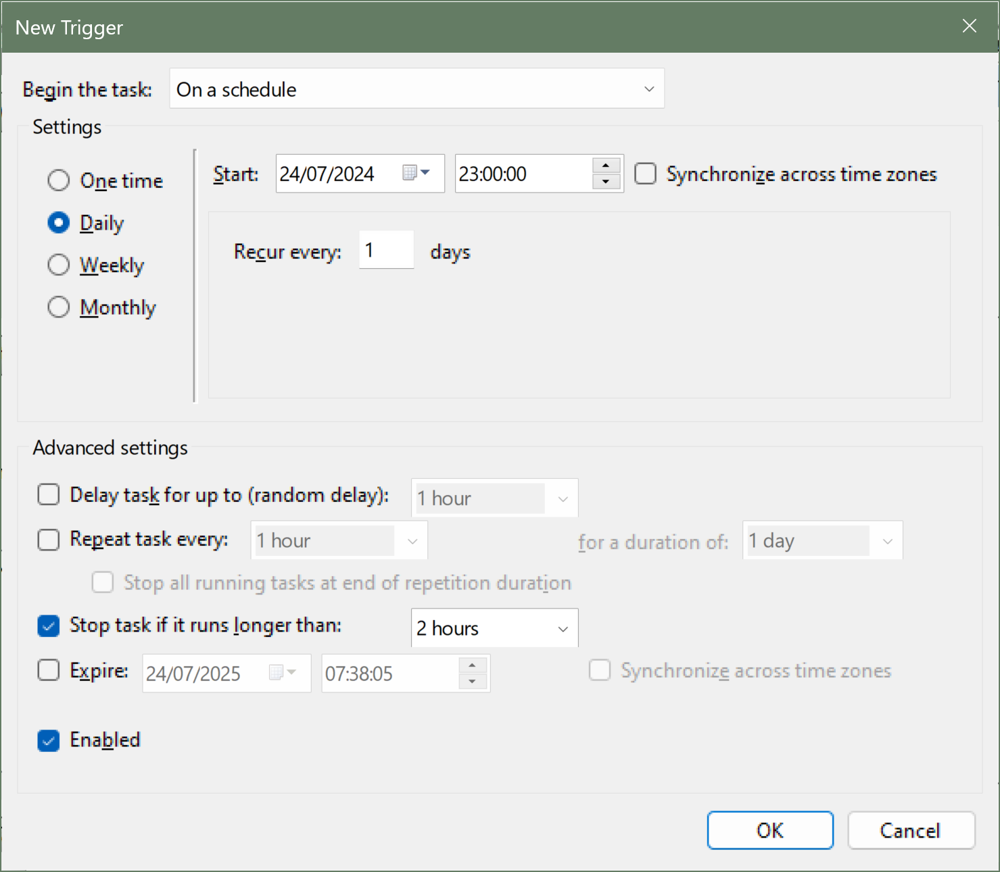
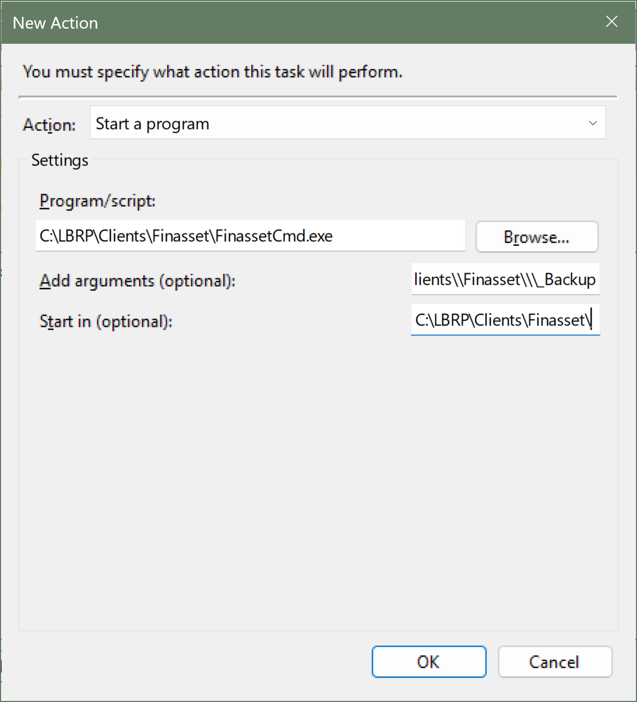

# Desktop - Finasset - Backup Database

## 1. Introduction

There are three ways to make backups of Finasset:

- Manually via the graphical user interface

- Manually via command line parameters

- Automatic backup via the Task Scheduler

It is recommended to choose automatic backup so that your Finasset data is always backed up.

## 2. Manual Backup via Graphical User Interface

Follow the steps below to manually make a backup via the graphical user interface:

1. **Start** Finasset.

2. Menu ▶️ Start ▶️ **Backup**.

   

3. Select the **location** where the backup should be saved.

4. If you check the option **Insert date in zip file**, the current date and time are added to the file name of the backup. Otherwise, the name of the backup will be the name of the Finasset database, which is usually 'Finasset'.

   

5. Click **Start**
6. The message Backup created at the bottom of the screen is shown if everything went well

   

## 3. Manual Backup via Command Line Parameters

Use `FinassetCmd.exe`, which you can find in the Finasset Client directory, to make backups using command line parameters.

Possible command line parameters are:

<table>
  <thead>
    <tr>
      <th>Name</th>
      <th>Description</th>
      <th>Required</th>
    </tr>
  </thead>
  <tbody>
    <tr>
      <td>/host:<host name></td>
      <td>The name of the Finasset server</td>
      <td>✅1️⃣</td>
    </tr>
    <tr>
      <td>/ipaddress:<ip address></td>
      <td>IP address of the Finasset server.</td>
      <td>✅1️⃣</td>
    </tr>
    <tr>
      <td>/port:<port number></td>
      <td>Port of the server. If not provided, the default<br/> port number is used.</td>
      <td></td>
    </tr>
    <tr>
      <td>/db:<database name></td>
      <td>Name of the database. If not provided, the<br/> default Finasset database is used.</td>
      <td></td>
    </tr>
    <tr>
      <td>/language:<language></td>
      <td>The language of the error messages:
        <ul>
          <li>N: Dutch</li>
          <li>F: French</li>
        </ul>
      </td>
      <td></td>
    </tr>
    <tr>
      <td>/BackupPath:<path></td>
      <td>The path where the backup is saved</td>
      <td>✅</td>
    </tr>
    <tr>
      <td>/BackupIncludeDate</td>
      <td>If this parameter is used, the current<br/> date and time are added to the name of the backup<br/> file.</td>
      <td></td>
    </tr>
    <tr>
      <td>/logfile: <file name></td>
      <td>The location and name of the file containing the logging<br/> information of the backup. If this parameter<br/> is not used, no log file is<br/> created.</td>
      <td></td>
    </tr>
    <tr>
      <td>/loginfo</td>
      <td>If this parameter is added, then in addition<br/> to the errors, extra logging information is also shown and/or<br/> written to the log file.</td>
      <td></td>
    </tr>
    <tr>
      <td>/overwritelog</td>
      <td>If this parameter is used, the log<br/> file is overwritten each time the program is<br/> executed. If the parameter is not used, the<br/> logging is always added to the existing<br/> log file.</td>
      <td></td>
    </tr>
  </tbody>
</table>

1️⃣ *Either the name of the server or the IP address is required. If both are provided, the host name is used.*

<strong><ins>Example</ins></strong>:

```
FinassetCmd.exe /host:localhost /db:Finasset /BackupXml /BackupPdf /BackupPath:C:\\LBRP\\Clients\\Finasset\\\_Backup
```

## 4. Automatic Backup via Task Scheduler

### 4.1 Introduction

**Important remarks** before you start configuring the automatic backup:

1. The automatic backup is preferably configured on the server and not on a workstation.
2. The Finasset Client must be installed on the server.
3. If you set the backup at a time when the computer is not running, no backups will be made. That is why it is recommended to set up automatic backups on a server, because these are usually never turned off.

### 4.1 Task Scheduler





1. Click **Create Task** and give your task a name

   

2. Create a **Trigger** (*for example every day*).

   

3. Create an **Action** and choose `FinassetCmd.exe` with the necessary parameters.

   

   An example of the value of Run can be: 
   ```bash
   C:\\LBRP\\Clients\\Finasset\\FinassetCmd.exe /host:localhost /db:Finasset /BackupPath:C:\\LBRP\\Clients\\Finasset\\\_Backup
   ```   

4. Click **OK**

## 5. Restore backup

A backup can be restored as follows:

1. Start Finasset

2. Go to Menu ▶️ **Start** ▶️ **Restore**.

3. Select the backup file.

4. Click the **Start Restore** button


⚠️ Either the name of the server or the IP address is required. If both are provided, the host name is used.
