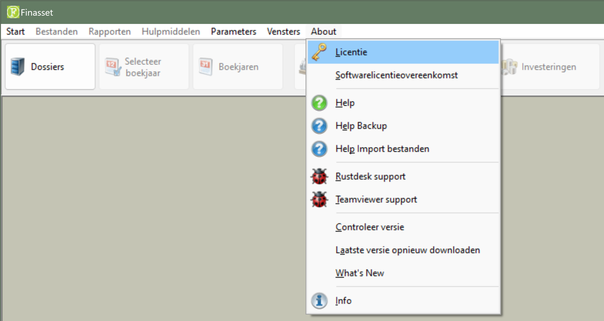
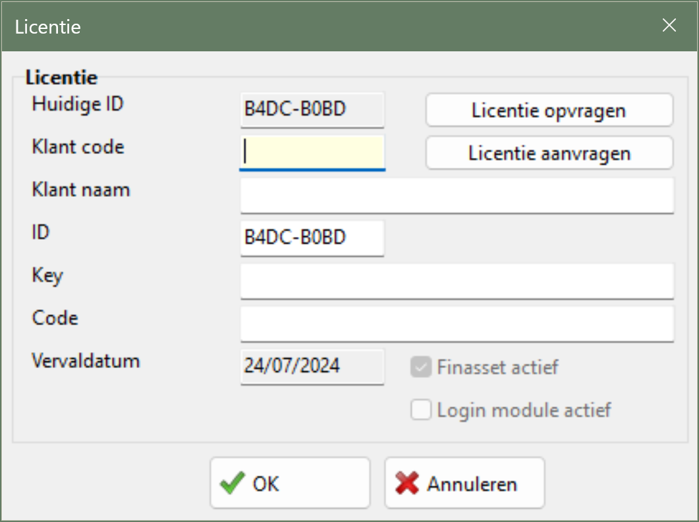
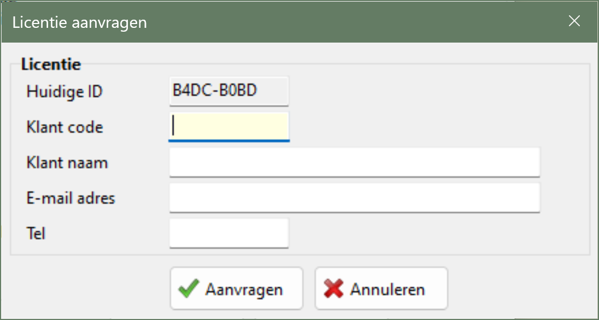
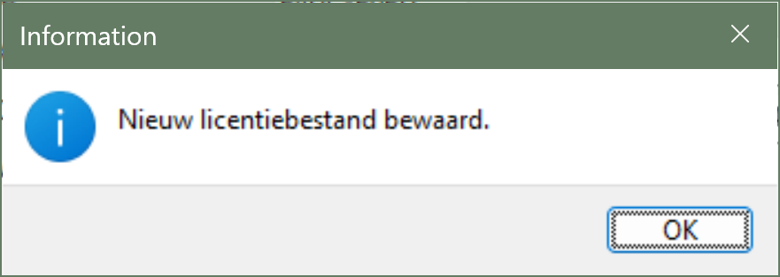

# Desktop - Finasset - License

## 1. Requesting a License

Follow the steps below to request a license:

1. Start Finasset.

2. Go to Menu ▶️ About ▶️ License.

   

3. Click the **Request License** button.

   

4. Fill in the required details. The **customer code** can be found on the invoice. After filling in, click **Request**.

   

5. If the request is successful, the message **License has been requested** appears.

   

License requests are processed manually, so it may take some time before you receive your license. The email you receive from us describes how you can **retrieve** the license.

<strong><ins>Note</ins></strong>:

Finasset must have access to the internet to request and retrieve a license.
