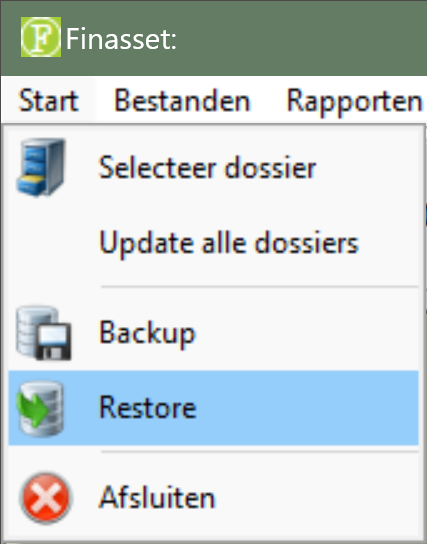
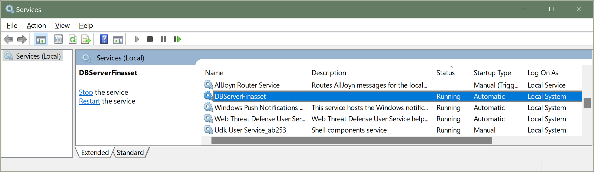

# Desktop - Finasset - Migrate

## 1. Moving Finasset to a New Server

Finasset can be moved to a new server in two ways:

1. Using backup and restore (*recommended method*)

2. By copying files

### 1.1 Moving with Backup and Restore

Follow the steps below to move Finasset with backup and restore:

1. Take a [**backup**](../BackupDatabase/README.md): menu ➡️ start ➡️ back-up.

2. Place the backup file on a **memory stick** to transfer it to the new server. 😂 ***that's how it used to be...***

3. Download [**FinassetSetup.exe**](https://kutt.ctrl.corpgroup.site/finasset-latest-setup) on the new server.

4. Run the [**installation**](../Installation/README.md) on the new server.

5. **Restore** the backup file on the new server.

   

### 1.2 Moving by Copying Files

This method is discouraged because data can become damaged. Only use this method if the backup and restore method is not possible.

Step-by-step plan:

1. [**Download**](https://kutt.ctrl.corpgroup.site/finasset-latest-setup) and [**install**](../Installation/README.md) `FinassetSetup.exe` on the new server. 💡 *Install Finasset in the same location as on the old server*.

2. Stop the **LBRP Database Server** service on the new server:

   - Open the Windows **Control Panel**.

   - Double-click **Administrative Tools**.

   - Double-click **Services**.

   - Right-click the **LBRP Database Server** service and choose **Stop**.

      

3. Copy the folder from the old server to the location on the new server.
4. Restart the new server.
5. When starting Finasset, the old data should be visible again.

## 2. Moving Finasset from Server to NAS

Finasset can run on a server but also on a NAS. The disadvantage of working on a NAS is that Finasset works more slowly and that only one person can modify the data at a time.

Follow these steps to move Finasset from server to NAS:

1. Take a backup of Finasset on the server (start Finasset, menu ➡️ start ➡️ back-up).

2. Place the backup file on a memory stick.

3. Uninstall Finasset from the server and the clients if they will use Finasset from the NAS in the future.

4. Download [FinassetSetup.exe](https://kutt.ctrl.corpgroup.site/finasset-latest-setup) from our website.

5. During the installation, choose **Local (*without server, max 1 user*)** and select the location and folder on the NAS drive where Finasset should be placed.

6. Start Finasset after the installation and choose the option **Do not use a server - Local - Maximum 1 user** and follow the wizard.

7. After the installation, you can select the backup file via menu ➡️ **restore** and **restore** it. This will restore the backup on the NAS.
