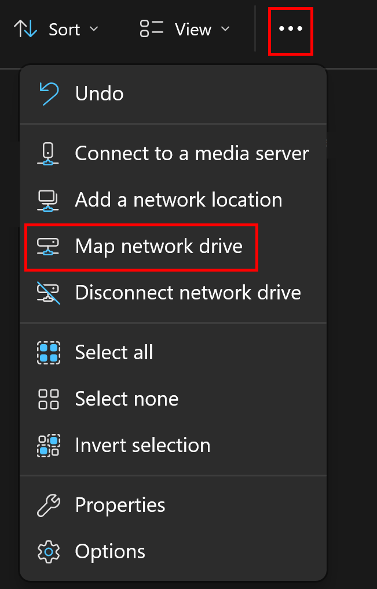
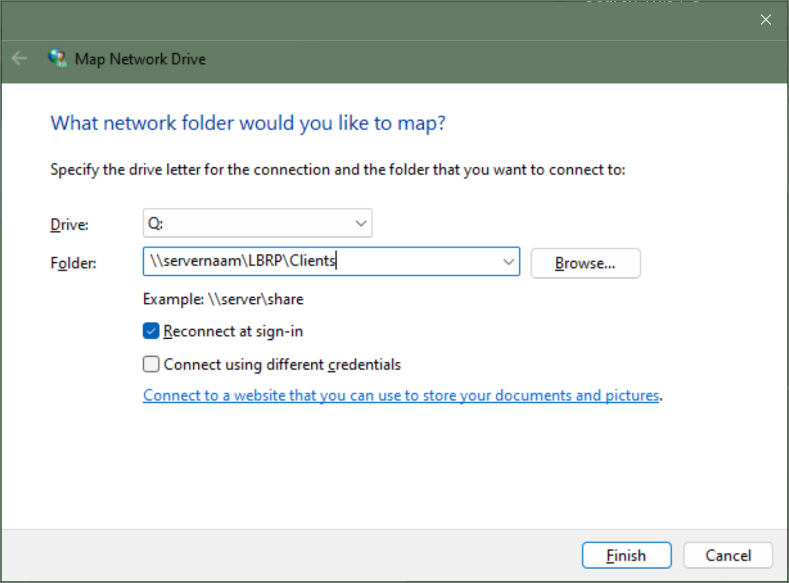

# Desktop - Finasset - Share Application

## 1. Sharing the Finasset Client Folder on the Server

If you want to use Finasset on multiple computers (*workstations*), a folder on the file server must be shared so that all computers can start the Finasset client. If you have already installed the Finasset client in an existing shared folder, you do not need to create a new shared folder and can proceed to step 2.

The Finasset client must be in a shared folder on the file server. If this is not yet the case, share the folder `C:\LBRP\Clients` (*or the folder where you installed the Finasset client*) on the file server, so that other users have access to this folder.

[<strong><ins>Map a network drive in Windows</ins></strong>](https://support.microsoft.com/en-us/windows/map-a-network-drive-in-windows-29ce55d1-34e3-a7e2-4801-131475f9557d)

<strong><ins>Note</ins></strong>:

No separate client installation is needed on a workstation that wants to use Finasset. Just follow the procedures below to use Finasset on other workstations.

## 2. Mapping a Network Drive on the Workstation

If the server folder where the Finasset client is located is already mapped on the client, you do not need to perform this procedure and can proceed to step 3.

<ins>Procedure to map a network drive on a workstation/client:</ins>:

1. Open **Windows Explorer**.

2. Menu ➡️ Tools ➡️ **Map network drive**.

   

3. Choose an unused letter at **Drive**.

4. At **Folder**, fill in `\\servername\sharedfolder`, where:

    - **servername** is the name of the server.
    - **sharedfolder** is the name of your shared folder.
       - For example: `\\servername\LBRP\Clients` and you must turn on the checkbox **Reconnect at sign-in**.

   

<strong><ins>Note</ins></strong>:

Use the same shared **Drive** letter on all clients.

# 3. Shortcut to the Finasset Client

To add a shortcut to the Finasset client on your desktop, follow these steps:

1. Open **Windows Explorer**.

2. Open the folder `Q:\Finasset\`

3. Right-click on the file `Finasset.exe`.

4. Choose **Copy to** ➡️ **Desktop** (*create shortcut*).
