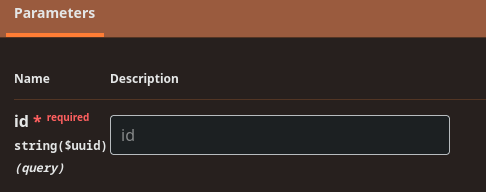

# Manuels des développeurs

## 1. Environnements

Tous les tests doivent être effectués dans l'environnement **DEV**.
- [https://abfapi.**DEV**.corpgroup.site](https://abfapi.dev.corpgroup.site/swagger)

L'environnement **PRD** est l'environnement de production et ne doit pas être utilisé pour les tests ou l'implémentation.
- [https://abfapi.corpgroup.site](https://abfapi.corpgroup.site/health)

## 2. Documentation OpenAPI

[https://abfapi.dev.corpgroup.site/swagger](https://abfapi.dev.corpgroup.site/swagger)

## 3. En-têtes de requête

L'en-tête suivant **DOIT** être présent dans une `Requête` :

```
API-Key: à obtenir auprès de LBRP
```

Les en-têtes suivants **PEUVENT** être présents dans une `Requête` :

```
X-Legacy: à obtenir auprès de LBRP
X-Version: 1.0 # Si absent, la valeur par défaut est 1.0
```

L'en-tête suivant **DOIT** être présent dans une `Requête` authentifiée :

```
Authorization: Bearer <AccessToken>
```

L'en-tête suivant **DOIT** être présent dans une `Requête` authentifiée au niveau de l'organisation :

```
Organization: <Organization Guid>
```

Vous pouvez saisir ces valeurs d'en-tête dans **Swagger** en cliquant sur le bouton **Authorize 🔒** :


## 4. Requêtes/Réponses

### 4.1 Champs généraux

La plupart des **contrats JSON** ont toujours les champs suivants :

- `identity`: Clé de base de données **primaire** en tant que `Guid`.
- `id`: <br/>Valeur de clé supplémentaire en tant qu'`Integer`.<br/>*❗Actuellement non utilisé ❗*<br/><br/>
- `lastModified`: Heure de la dernière **modification**.
- `created`: Heure de la **création**.
- `createdBy`: Utilisateur qui a créé l'enregistrement.

**ATTENTION** : Si un `id` doit être fourni en tant que paramètre, ce n'est **PAS** la valeur du champ `id`, mais celle du champ `identity` :



### 4.2 Réponse générale

Si la `Réponse` ne contient pas d'entité mais que le `code de statut` est **200** (***OK***), nous renvoyons généralement une `GeneralSuccessResponse`, avec ou sans messages :

```json
{
  "messages": [
    "OK"
  ]
}
```

Si la `Réponse` a un `code de statut` de **400** (***Bad Request***), nous renvoyons généralement une `GeneralFailResponse`, avec ou sans messages :

```json
{
  "errors": [
    "Validation failed",
    "Email is required"
  ],
  "statusCode": 400
}
```

Si la `Réponse` est le résultat d'une `opération en bloc`, nous renvoyons généralement une `GeneralCombinedResponse`.<br/>
Celle-ci contient une liste des `GeneralSuccessResponse` et `GeneralFailResponse` possibles.

```json
{
  "failures": [
    {
      "errors": [
        "Validation failed",
        "Email is required"
      ],
      "statusCode": 400
    },
    {
      "errors": [
        "Unauthorized access"
      ],
      "statusCode": 401
    }
  ],
  "successes": [
    {
      "messages": [
        "OK"
      ]
    },
    {
      "messages": [
        "User created successfully"
      ]
    }
  ]
}
```

Si la `Réponse` est une liste d'`entités`, vous recevrez une `PagedResponse` par page.

```json
{
  "data": [
    {
      "id": 1,
      "name": "Item 1"
    },
    {
      "id": 2,
      "name": "Item 2"
    }
  ],
  "pageNumber": 1,
  "pageSize": 20,
  "sortBy": "",
  "filterBy": "",
  "count": 2,
  "hasNextPage": false,
  "hasPreviousPage": false
}
```

## 5. Composants API

- [Flux d'identité](Identity/README.md)
- [FOD](Fod/README.md)

## 6. Exemples de code

- [Exemples de code](Code/README.md)
