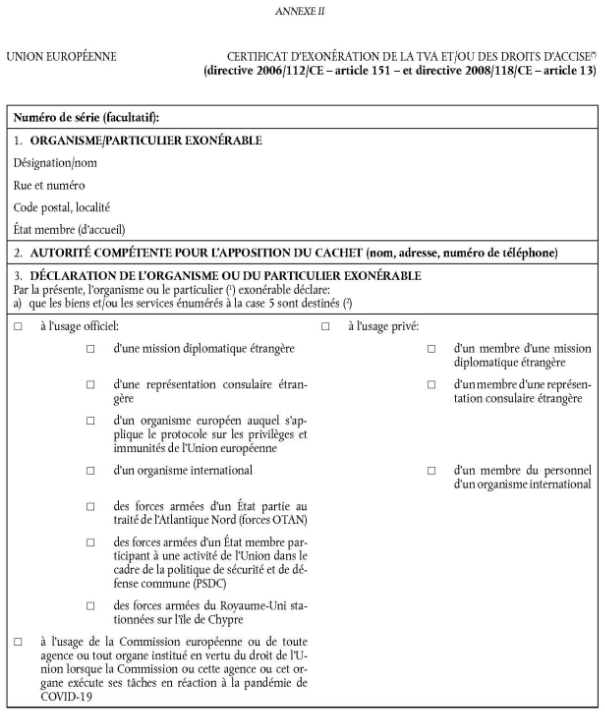
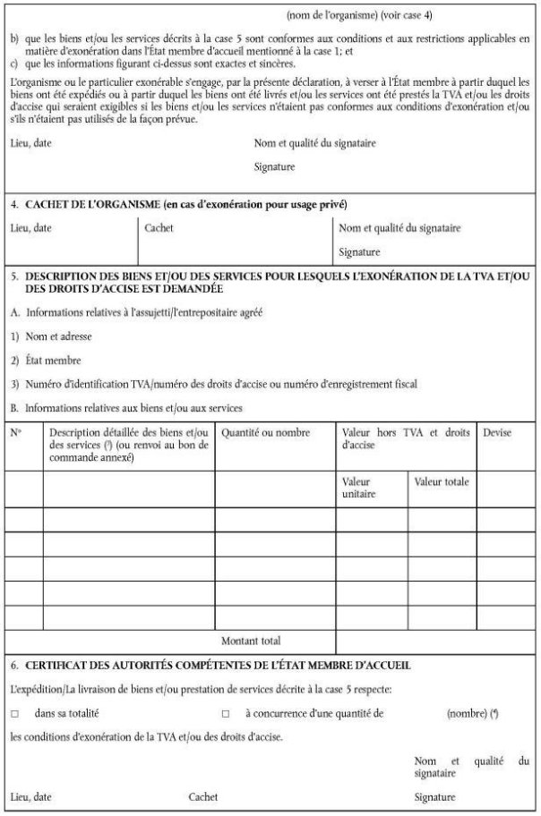
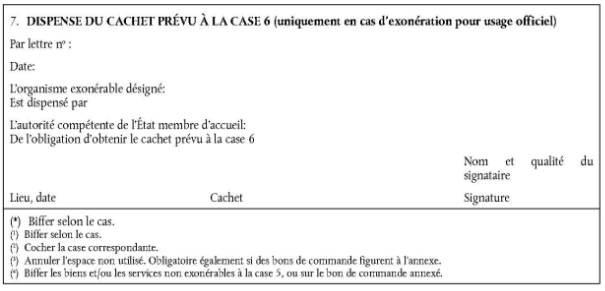

# Règlement d’exécution (UE) N° 282/2011 du Conseil du 15.03.2011 portant mesures d’exécution de la directive 2006/112/CE relative au système commun de la TVA

**RÈGLEMENT D’EXÉCUTION (UE) No 282/2011 DU CONSEIL du 15 mars 2011** portant mesures d’exécution de la directive 2006/112/CE relative au système commun de taxe sur la valeur ajoutée (JO L 77 du 23.03.2011, p. 1). 

[Mise à jour 01.07.2022] - [\[modifications\]](https://www.minfin.fgov.be/myminfin-web/pages/public/fisconet/document/5feab4a0-96c5-4a81-80f0-b068dda8cf03#modifications)

*Ce règlement d’exécution est dernièrement modifié par :*

*RÈGLEMENT D’EXÉCUTION (UE) 2022/432 DU CONSEIL du 15 mars 2022 modifiant le règlement d’exécution (UE) no 282/2011 en ce qui concerne le certificat d’exonération de la TVA et/ou de droits d’accise (JO L 88 du 16.03.2022, p. 15)* 

*La modification est applicable à partir du 01.07.2022* 

- [*L’annexe II est remplacée une seconde fois à partir du 1er juillet 2022*](https://www.minfin.fgov.be/myminfin-web/pages/public/fisconet/document/5feab4a0-96c5-4a81-80f0-b068dda8cf03#Cert_3).

## Table des matières

[**Chapitre I. OBJET**](https://www.minfin.fgov.be/myminfin-web/pages/public/fisconet/document/5feab4a0-96c5-4a81-80f0-b068dda8cf03#_Toc98336957)

   - [Article premier](https://www.minfin.fgov.be/myminfin-web/pages/public/fisconet/document/5feab4a0-96c5-4a81-80f0-b068dda8cf03#_Toc98336958)

[**Chapitre II. CHAMP D’APPLICATION**](https://www.minfin.fgov.be/myminfin-web/pages/public/fisconet/document/5feab4a0-96c5-4a81-80f0-b068dda8cf03#_Toc98336959)

   - [Article 2](https://www.minfin.fgov.be/myminfin-web/pages/public/fisconet/document/5feab4a0-96c5-4a81-80f0-b068dda8cf03#_Toc98336960)

   - [Article 3](https://www.minfin.fgov.be/myminfin-web/pages/public/fisconet/document/5feab4a0-96c5-4a81-80f0-b068dda8cf03#_Toc98336961)

   - [Article 4](https://www.minfin.fgov.be/myminfin-web/pages/public/fisconet/document/5feab4a0-96c5-4a81-80f0-b068dda8cf03#_Toc98336962)

[**Chapitre III. ASSUJETTIS**](https://www.minfin.fgov.be/myminfin-web/pages/public/fisconet/document/5feab4a0-96c5-4a81-80f0-b068dda8cf03#_Toc98336963)

   - [Article 5](https://www.minfin.fgov.be/myminfin-web/pages/public/fisconet/document/5feab4a0-96c5-4a81-80f0-b068dda8cf03#_Toc98336964)

[**Chapitre IV. OPÉRATIONS IMPOSABLES**](https://www.minfin.fgov.be/myminfin-web/pages/public/fisconet/document/5feab4a0-96c5-4a81-80f0-b068dda8cf03#_Toc98336965)

   - [SECTION 1. Livraisons de biens](https://www.minfin.fgov.be/myminfin-web/pages/public/fisconet/document/5feab4a0-96c5-4a81-80f0-b068dda8cf03#_Toc98336966) 

      - [Article 5 bis](https://www.minfin.fgov.be/myminfin-web/pages/public/fisconet/document/5feab4a0-96c5-4a81-80f0-b068dda8cf03#_Toc98336967)

      - [Article 5 ter](https://www.minfin.fgov.be/myminfin-web/pages/public/fisconet/document/5feab4a0-96c5-4a81-80f0-b068dda8cf03#_Toc98336968)

      - [Article 5 quater](https://www.minfin.fgov.be/myminfin-web/pages/public/fisconet/document/5feab4a0-96c5-4a81-80f0-b068dda8cf03#_Toc98336969)

      - [Article 5 quinquies](https://www.minfin.fgov.be/myminfin-web/pages/public/fisconet/document/5feab4a0-96c5-4a81-80f0-b068dda8cf03#_Toc98336970)

   - [SECTION 2. Prestations de services](https://www.minfin.fgov.be/myminfin-web/pages/public/fisconet/document/5feab4a0-96c5-4a81-80f0-b068dda8cf03#_Toc98336971)

      - [Article 6](https://www.minfin.fgov.be/myminfin-web/pages/public/fisconet/document/5feab4a0-96c5-4a81-80f0-b068dda8cf03#_Toc98336972)
      
      - [Article 6 bis](https://www.minfin.fgov.be/myminfin-web/pages/public/fisconet/document/5feab4a0-96c5-4a81-80f0-b068dda8cf03#_Toc98336973)
      
      - [Article 6 ter](https://www.minfin.fgov.be/myminfin-web/pages/public/fisconet/document/5feab4a0-96c5-4a81-80f0-b068dda8cf03#_Toc98336974)
      
      - [Article 7](https://www.minfin.fgov.be/myminfin-web/pages/public/fisconet/document/5feab4a0-96c5-4a81-80f0-b068dda8cf03#_Toc98336975)
      
      - [Article 8](https://www.minfin.fgov.be/myminfin-web/pages/public/fisconet/document/5feab4a0-96c5-4a81-80f0-b068dda8cf03#_Toc98336976)
      
      - [Article 9](https://www.minfin.fgov.be/myminfin-web/pages/public/fisconet/document/5feab4a0-96c5-4a81-80f0-b068dda8cf03#_Toc98336977)
      
      - [Article 9 bis](https://www.minfin.fgov.be/myminfin-web/pages/public/fisconet/document/5feab4a0-96c5-4a81-80f0-b068dda8cf03#_Toc98336978)

[**Chapitre V. LIEU DES OPÉRATIONS IMPOSABLES**](https://www.minfin.fgov.be/myminfin-web/pages/public/fisconet/document/5feab4a0-96c5-4a81-80f0-b068dda8cf03#_Toc98336979)

   - [SECTION 1. Concepts](https://www.minfin.fgov.be/myminfin-web/pages/public/fisconet/document/5feab4a0-96c5-4a81-80f0-b068dda8cf03#_Toc98336980) 

      - [Article 10](https://www.minfin.fgov.be/myminfin-web/pages/public/fisconet/document/5feab4a0-96c5-4a81-80f0-b068dda8cf03#_Toc98336981)

      - [Article 11](https://www.minfin.fgov.be/myminfin-web/pages/public/fisconet/document/5feab4a0-96c5-4a81-80f0-b068dda8cf03#_Toc98336982)

      - [Article 12](https://www.minfin.fgov.be/myminfin-web/pages/public/fisconet/document/5feab4a0-96c5-4a81-80f0-b068dda8cf03#_Toc98336983)

      - [Article 13](https://www.minfin.fgov.be/myminfin-web/pages/public/fisconet/document/5feab4a0-96c5-4a81-80f0-b068dda8cf03#_Toc98336984)

      - [Article 13 bis](https://www.minfin.fgov.be/myminfin-web/pages/public/fisconet/document/5feab4a0-96c5-4a81-80f0-b068dda8cf03#_Toc98336985)

      - [Article 13 ter](https://www.minfin.fgov.be/myminfin-web/pages/public/fisconet/document/5feab4a0-96c5-4a81-80f0-b068dda8cf03#_Toc98336986)

   - [SECTION 2. Lieu des livraisons de biens](https://www.minfin.fgov.be/myminfin-web/pages/public/fisconet/document/5feab4a0-96c5-4a81-80f0-b068dda8cf03#_Toc98336987) 

      - [Article 14](https://www.minfin.fgov.be/myminfin-web/pages/public/fisconet/document/5feab4a0-96c5-4a81-80f0-b068dda8cf03#_Toc98336988)

      - [Article 15](https://www.minfin.fgov.be/myminfin-web/pages/public/fisconet/document/5feab4a0-96c5-4a81-80f0-b068dda8cf03#_Toc98336989)

   - [SECTION 3. Lieu des acquisitions intracommunautaires de biens](https://www.minfin.fgov.be/myminfin-web/pages/public/fisconet/document/5feab4a0-96c5-4a81-80f0-b068dda8cf03#_Toc98336990)

      - [Article 16](https://www.minfin.fgov.be/myminfin-web/pages/public/fisconet/document/5feab4a0-96c5-4a81-80f0-b068dda8cf03#_Toc98336991)

   - [SECTION 4. Lieu des prestations de services](https://www.minfin.fgov.be/myminfin-web/pages/public/fisconet/document/5feab4a0-96c5-4a81-80f0-b068dda8cf03#_Toc98336992)

      - [Sous-section 1. Statut du preneur](https://www.minfin.fgov.be/myminfin-web/pages/public/fisconet/document/5feab4a0-96c5-4a81-80f0-b068dda8cf03#_Toc98336993)

         - [Article 17](https://www.minfin.fgov.be/myminfin-web/pages/public/fisconet/document/5feab4a0-96c5-4a81-80f0-b068dda8cf03#_Toc98336994)

         - [Article 18](https://www.minfin.fgov.be/myminfin-web/pages/public/fisconet/document/5feab4a0-96c5-4a81-80f0-b068dda8cf03#_Toc98336995)

      - [Sous-section 2. Qualité du preneur](https://www.minfin.fgov.be/myminfin-web/pages/public/fisconet/document/5feab4a0-96c5-4a81-80f0-b068dda8cf03#_Toc98336996)

         - [Article 19](https://www.minfin.fgov.be/myminfin-web/pages/public/fisconet/document/5feab4a0-96c5-4a81-80f0-b068dda8cf03#_Toc98336997)

      - [Sous-section 3. Lieu d’établissement du preneur](https://www.minfin.fgov.be/myminfin-web/pages/public/fisconet/document/5feab4a0-96c5-4a81-80f0-b068dda8cf03#_Toc98336998)

         - [Article 20](https://www.minfin.fgov.be/myminfin-web/pages/public/fisconet/document/5feab4a0-96c5-4a81-80f0-b068dda8cf03#_Toc98336999)

         - [Article 21](https://www.minfin.fgov.be/myminfin-web/pages/public/fisconet/document/5feab4a0-96c5-4a81-80f0-b068dda8cf03#_Toc98337000)

         - [Article 22](https://www.minfin.fgov.be/myminfin-web/pages/public/fisconet/document/5feab4a0-96c5-4a81-80f0-b068dda8cf03#_Toc98337001)

         - [Article 23](https://www.minfin.fgov.be/myminfin-web/pages/public/fisconet/document/5feab4a0-96c5-4a81-80f0-b068dda8cf03#_Toc98337002)

         - [Article 24](https://www.minfin.fgov.be/myminfin-web/pages/public/fisconet/document/5feab4a0-96c5-4a81-80f0-b068dda8cf03#_Toc98337003)

      - [Sous-section 3 bis. Présomptions relatives à la localisation du preneur](https://www.minfin.fgov.be/myminfin-web/pages/public/fisconet/document/5feab4a0-96c5-4a81-80f0-b068dda8cf03#_Toc98337004)

         - [Article 24 bis](https://www.minfin.fgov.be/myminfin-web/pages/public/fisconet/document/5feab4a0-96c5-4a81-80f0-b068dda8cf03#_Toc98337005)

         - [Article 24 ter](https://www.minfin.fgov.be/myminfin-web/pages/public/fisconet/document/5feab4a0-96c5-4a81-80f0-b068dda8cf03#_Toc98337006)

         - [Article 24 quater](https://www.minfin.fgov.be/myminfin-web/pages/public/fisconet/document/5feab4a0-96c5-4a81-80f0-b068dda8cf03#_Toc98337007)

      - [Sous-section 3 ter. Réfutation des présomptions](https://www.minfin.fgov.be/myminfin-web/pages/public/fisconet/document/5feab4a0-96c5-4a81-80f0-b068dda8cf03#_Toc98337008)

         - [Article 24 quinquies](https://www.minfin.fgov.be/myminfin-web/pages/public/fisconet/document/5feab4a0-96c5-4a81-80f0-b068dda8cf03#_Toc98337009)

      - [Sous-section 3 quater. Éléments de preuve permettant de déterminer la localisation du preneur et de réfuter des présomptions](https://www.minfin.fgov.be/myminfin-web/pages/public/fisconet/document/5feab4a0-96c5-4a81-80f0-b068dda8cf03#_Toc98337010)

         - [Article 24 sexies](https://www.minfin.fgov.be/myminfin-web/pages/public/fisconet/document/5feab4a0-96c5-4a81-80f0-b068dda8cf03#_Toc98337011)[Article 24 septies](https://www.minfin.fgov.be/myminfin-web/pages/public/fisconet/document/5feab4a0-96c5-4a81-80f0-b068dda8cf03#_Toc98337012)

      - [Sous-section 4. Dispositions communes concernant la détermination du statut, de la qualité et du lieu d’établissement du preneur](https://www.minfin.fgov.be/myminfin-web/pages/public/fisconet/document/5feab4a0-96c5-4a81-80f0-b068dda8cf03#_Toc98337013)

         - [Article 25](https://www.minfin.fgov.be/myminfin-web/pages/public/fisconet/document/5feab4a0-96c5-4a81-80f0-b068dda8cf03#_Toc98337014)

      - [Sous-section 5. Prestations de services couvertes par les règles générales](https://www.minfin.fgov.be/myminfin-web/pages/public/fisconet/document/5feab4a0-96c5-4a81-80f0-b068dda8cf03#_Toc98337015)

         - [Article 26](https://www.minfin.fgov.be/myminfin-web/pages/public/fisconet/document/5feab4a0-96c5-4a81-80f0-b068dda8cf03#_Toc98337016)

         - [Article 27](https://www.minfin.fgov.be/myminfin-web/pages/public/fisconet/document/5feab4a0-96c5-4a81-80f0-b068dda8cf03#_Toc98337017)

         - [Article 28](https://www.minfin.fgov.be/myminfin-web/pages/public/fisconet/document/5feab4a0-96c5-4a81-80f0-b068dda8cf03#_Toc98337018)

         - [Article 29](https://www.minfin.fgov.be/myminfin-web/pages/public/fisconet/document/5feab4a0-96c5-4a81-80f0-b068dda8cf03#_Toc98337019)

      - [Sous-section 6. Prestations de services des intermédiaires](https://www.minfin.fgov.be/myminfin-web/pages/public/fisconet/document/5feab4a0-96c5-4a81-80f0-b068dda8cf03#_Toc98337020)

         - [Article 30](https://www.minfin.fgov.be/myminfin-web/pages/public/fisconet/document/5feab4a0-96c5-4a81-80f0-b068dda8cf03#_Toc98337021)

         - [Article 31](https://www.minfin.fgov.be/myminfin-web/pages/public/fisconet/document/5feab4a0-96c5-4a81-80f0-b068dda8cf03#_Toc98337022)

      - [Sous-section 6 bis. Prestations de services se rattachant à un bien immeuble](https://www.minfin.fgov.be/myminfin-web/pages/public/fisconet/document/5feab4a0-96c5-4a81-80f0-b068dda8cf03#_Toc98337023)

         - [Article 31 bis](https://www.minfin.fgov.be/myminfin-web/pages/public/fisconet/document/5feab4a0-96c5-4a81-80f0-b068dda8cf03#_Toc98337024)

         - [Article 31 ter](https://www.minfin.fgov.be/myminfin-web/pages/public/fisconet/document/5feab4a0-96c5-4a81-80f0-b068dda8cf03#_Toc98337025)

         - [Article 31 quater](https://www.minfin.fgov.be/myminfin-web/pages/public/fisconet/document/5feab4a0-96c5-4a81-80f0-b068dda8cf03#_Toc98337026)

      - [Sous-section 7. Prestations de services culturels, artistiques, sportifs, scientifiques, éducatifs et de divertissement et manifestations similaires](https://www.minfin.fgov.be/myminfin-web/pages/public/fisconet/document/5feab4a0-96c5-4a81-80f0-b068dda8cf03#_Toc98337027)

        - [Article 32](https://www.minfin.fgov.be/myminfin-web/pages/public/fisconet/document/5feab4a0-96c5-4a81-80f0-b068dda8cf03#_Toc98337028)
        
        - [Article 33](https://www.minfin.fgov.be/myminfin-web/pages/public/fisconet/document/5feab4a0-96c5-4a81-80f0-b068dda8cf03#_Toc98337029)
        
        - [Article 33 bis](https://www.minfin.fgov.be/myminfin-web/pages/public/fisconet/document/5feab4a0-96c5-4a81-80f0-b068dda8cf03#_Toc98337030)

      - [Sous-section 8. Prestations de services accessoires au transport, expertises de biens meubles et travaux portant sur ces biens](https://www.minfin.fgov.be/myminfin-web/pages/public/fisconet/document/5feab4a0-96c5-4a81-80f0-b068dda8cf03#_Toc98337031)

         - [Article 34](https://www.minfin.fgov.be/myminfin-web/pages/public/fisconet/document/5feab4a0-96c5-4a81-80f0-b068dda8cf03#_Toc98337032)

      - [Sous-section 9. Prestations de services de restaurant et de restauration à bord de moyens de transport](https://www.minfin.fgov.be/myminfin-web/pages/public/fisconet/document/5feab4a0-96c5-4a81-80f0-b068dda8cf03#_Toc98337033)

         - [Article 35](https://www.minfin.fgov.be/myminfin-web/pages/public/fisconet/document/5feab4a0-96c5-4a81-80f0-b068dda8cf03#_Toc98337034)

         - [Article 36](https://www.minfin.fgov.be/myminfin-web/pages/public/fisconet/document/5feab4a0-96c5-4a81-80f0-b068dda8cf03#_Toc98337035)

         - [Article 37](https://www.minfin.fgov.be/myminfin-web/pages/public/fisconet/document/5feab4a0-96c5-4a81-80f0-b068dda8cf03#_Toc98337036)

      - [Sous-section 10. Location de moyens de transport](https://www.minfin.fgov.be/myminfin-web/pages/public/fisconet/document/5feab4a0-96c5-4a81-80f0-b068dda8cf03#_Toc98337037)

         - [Article 38](https://www.minfin.fgov.be/myminfin-web/pages/public/fisconet/document/5feab4a0-96c5-4a81-80f0-b068dda8cf03#_Toc98337038)

         - [Article 39](https://www.minfin.fgov.be/myminfin-web/pages/public/fisconet/document/5feab4a0-96c5-4a81-80f0-b068dda8cf03#_Toc98337039)

         - [Article 40](https://www.minfin.fgov.be/myminfin-web/pages/public/fisconet/document/5feab4a0-96c5-4a81-80f0-b068dda8cf03#_Toc98337040)

      - [Sous-section 11. Services fournis à des personnes non assujetties établies en dehors de la communauté](https://www.minfin.fgov.be/myminfin-web/pages/public/fisconet/document/5feab4a0-96c5-4a81-80f0-b068dda8cf03#_Toc98337041)

         - [Article 41](https://www.minfin.fgov.be/myminfin-web/pages/public/fisconet/document/5feab4a0-96c5-4a81-80f0-b068dda8cf03#_Toc98337042)

[**Chapitre V BIS. FAIT GÉNÉRATEUR ET EXIGIBILITÉ DELA TAXE**](https://www.minfin.fgov.be/myminfin-web/pages/public/fisconet/document/5feab4a0-96c5-4a81-80f0-b068dda8cf03#_Toc98337043) 

   - [Article 41 bis](https://www.minfin.fgov.be/myminfin-web/pages/public/fisconet/document/5feab4a0-96c5-4a81-80f0-b068dda8cf03#_Toc98337044)

[**Chapitre VI. BASE D’IMPOSITION** ](https://www.minfin.fgov.be/myminfin-web/pages/public/fisconet/document/5feab4a0-96c5-4a81-80f0-b068dda8cf03#_Toc98337045)

   - [Article 42](https://www.minfin.fgov.be/myminfin-web/pages/public/fisconet/document/5feab4a0-96c5-4a81-80f0-b068dda8cf03#_Toc98337046)

[**Chapitre VII. TAUX**](https://www.minfin.fgov.be/myminfin-web/pages/public/fisconet/document/5feab4a0-96c5-4a81-80f0-b068dda8cf03#_Toc98337047)

   - [Article 43](https://www.minfin.fgov.be/myminfin-web/pages/public/fisconet/document/5feab4a0-96c5-4a81-80f0-b068dda8cf03#_Toc98337048)

[**Chapitre VIII. EXONÉRATIONS** ](https://www.minfin.fgov.be/myminfin-web/pages/public/fisconet/document/5feab4a0-96c5-4a81-80f0-b068dda8cf03#_Toc98337049)

   - [SECTION 1. Exonérations en faveur de certaines activités d’intérêt général](https://www.minfin.fgov.be/myminfin-web/pages/public/fisconet/document/5feab4a0-96c5-4a81-80f0-b068dda8cf03#_Toc98337050)

      - [Article 44](https://www.minfin.fgov.be/myminfin-web/pages/public/fisconet/document/5feab4a0-96c5-4a81-80f0-b068dda8cf03#_Toc98337051)

   - [SECTION 2. Exonérations en faveur d’autres activités](https://www.minfin.fgov.be/myminfin-web/pages/public/fisconet/document/5feab4a0-96c5-4a81-80f0-b068dda8cf03#_Toc98337052)

      - [Article 45](https://www.minfin.fgov.be/myminfin-web/pages/public/fisconet/document/5feab4a0-96c5-4a81-80f0-b068dda8cf03#_Toc98337053)

   - [SECTION 2 bis. Exonérations liées aux opérations intracommunautaires](https://www.minfin.fgov.be/myminfin-web/pages/public/fisconet/document/5feab4a0-96c5-4a81-80f0-b068dda8cf03#_Toc98337054)

      - [Article 45 bis](https://www.minfin.fgov.be/myminfin-web/pages/public/fisconet/document/5feab4a0-96c5-4a81-80f0-b068dda8cf03#_Toc98337055)

   - [SECTION 3. Exonérations à l’importation](https://www.minfin.fgov.be/myminfin-web/pages/public/fisconet/document/5feab4a0-96c5-4a81-80f0-b068dda8cf03#_Toc98337056)

      - [Article 46](https://www.minfin.fgov.be/myminfin-web/pages/public/fisconet/document/5feab4a0-96c5-4a81-80f0-b068dda8cf03#_Toc98337057)

   - [SECTION 4. Exonérations à l’exportation](https://www.minfin.fgov.be/myminfin-web/pages/public/fisconet/document/5feab4a0-96c5-4a81-80f0-b068dda8cf03#_Toc98337058)

      - [Article 47](https://www.minfin.fgov.be/myminfin-web/pages/public/fisconet/document/5feab4a0-96c5-4a81-80f0-b068dda8cf03#_Toc98337059)

      - [Article 48](https://www.minfin.fgov.be/myminfin-web/pages/public/fisconet/document/5feab4a0-96c5-4a81-80f0-b068dda8cf03#_Toc98337060)

   - [SECTION 5. Exonérations concernant certaines opérations assimilées aux exportations](https://www.minfin.fgov.be/myminfin-web/pages/public/fisconet/document/5feab4a0-96c5-4a81-80f0-b068dda8cf03#_Toc98337061)

      - [Article 49](https://www.minfin.fgov.be/myminfin-web/pages/public/fisconet/document/5feab4a0-96c5-4a81-80f0-b068dda8cf03#_Toc98337062)

      - [Article 50](https://www.minfin.fgov.be/myminfin-web/pages/public/fisconet/document/5feab4a0-96c5-4a81-80f0-b068dda8cf03#_Toc98337063)

      - [Article 51](https://www.minfin.fgov.be/myminfin-web/pages/public/fisconet/document/5feab4a0-96c5-4a81-80f0-b068dda8cf03#_Toc98337064)

[**Chapitre IX. DÉDUCTIONS**](https://www.minfin.fgov.be/myminfin-web/pages/public/fisconet/document/5feab4a0-96c5-4a81-80f0-b068dda8cf03#_Toc98337065) 

   - [Article 52](https://www.minfin.fgov.be/myminfin-web/pages/public/fisconet/document/5feab4a0-96c5-4a81-80f0-b068dda8cf03#_Toc98337066)

[**Chapitre X. OBLIGATIONS DES ASSUJETTIS ET DE CERTAINES PERSONNES NON ASSUJETTIES**](https://www.minfin.fgov.be/myminfin-web/pages/public/fisconet/document/5feab4a0-96c5-4a81-80f0-b068dda8cf03#_Toc98337067) 

   - [SECTION 1. Redevables de la taxe envers le Trésor](https://www.minfin.fgov.be/myminfin-web/pages/public/fisconet/document/5feab4a0-96c5-4a81-80f0-b068dda8cf03#_Toc98337068)

      - [Article 53](https://www.minfin.fgov.be/myminfin-web/pages/public/fisconet/document/5feab4a0-96c5-4a81-80f0-b068dda8cf03#_Toc98337069)

      - [Article 54](https://www.minfin.fgov.be/myminfin-web/pages/public/fisconet/document/5feab4a0-96c5-4a81-80f0-b068dda8cf03#_Toc98337070)

   - [SECTION 1 bis. Obligations générales](https://www.minfin.fgov.be/myminfin-web/pages/public/fisconet/document/5feab4a0-96c5-4a81-80f0-b068dda8cf03#_Toc98337071)

      - [Article 54 bis](https://www.minfin.fgov.be/myminfin-web/pages/public/fisconet/document/5feab4a0-96c5-4a81-80f0-b068dda8cf03#_Toc98337072)

   - [SECTION 1 ter. Comptabilité](https://www.minfin.fgov.be/myminfin-web/pages/public/fisconet/document/5feab4a0-96c5-4a81-80f0-b068dda8cf03#_Toc98337073) 

      - [Article 54 ter](https://www.minfin.fgov.be/myminfin-web/pages/public/fisconet/document/5feab4a0-96c5-4a81-80f0-b068dda8cf03#_Toc98337074)

   - [SECTION 2. Dispositions diverses](https://www.minfin.fgov.be/myminfin-web/pages/public/fisconet/document/5feab4a0-96c5-4a81-80f0-b068dda8cf03#_Toc98337075)

      - [Article 55](https://www.minfin.fgov.be/myminfin-web/pages/public/fisconet/document/5feab4a0-96c5-4a81-80f0-b068dda8cf03#_Toc98337076)

[**Chapitre XI. RÉGIMES PARTICULIERS**](https://www.minfin.fgov.be/myminfin-web/pages/public/fisconet/document/5feab4a0-96c5-4a81-80f0-b068dda8cf03#_Toc98337077) 

   - [SECTION 1. Régime particulier applicable à l’or d’investissement](https://www.minfin.fgov.be/myminfin-web/pages/public/fisconet/document/5feab4a0-96c5-4a81-80f0-b068dda8cf03#_Toc98337078)

      - [Article 56](https://www.minfin.fgov.be/myminfin-web/pages/public/fisconet/document/5feab4a0-96c5-4a81-80f0-b068dda8cf03#_Toc98337079)

      - [Article 57](https://www.minfin.fgov.be/myminfin-web/pages/public/fisconet/document/5feab4a0-96c5-4a81-80f0-b068dda8cf03#_Toc98337080)

   - [SECTION 2. Régimes particuliers applicables aux assujettis qui fournissent des services à des personnes non assujetties ou qui effectuent des ventes à distance de biens ou certaines livraisons intérieures de biens](https://www.minfin.fgov.be/myminfin-web/pages/public/fisconet/document/5feab4a0-96c5-4a81-80f0-b068dda8cf03#_Toc98337081)

      - [Sous-section 1. Définitions](https://www.minfin.fgov.be/myminfin-web/pages/public/fisconet/document/5feab4a0-96c5-4a81-80f0-b068dda8cf03#_Toc98337082)

         - [Article 57 bis](https://www.minfin.fgov.be/myminfin-web/pages/public/fisconet/document/5feab4a0-96c5-4a81-80f0-b068dda8cf03#_Toc98337083)

      - [Sous-section 2. Application du régime UE](https://www.minfin.fgov.be/myminfin-web/pages/public/fisconet/document/5feab4a0-96c5-4a81-80f0-b068dda8cf03#_Toc98337084)

         - [Article 57 ter](https://www.minfin.fgov.be/myminfin-web/pages/public/fisconet/document/5feab4a0-96c5-4a81-80f0-b068dda8cf03#_Toc98337085)

      - [Sous-section 3. Champ d’application du régime UE](https://www.minfin.fgov.be/myminfin-web/pages/public/fisconet/document/5feab4a0-96c5-4a81-80f0-b068dda8cf03#_Toc98337086)

         - [Article 57 quater](https://www.minfin.fgov.be/myminfin-web/pages/public/fisconet/document/5feab4a0-96c5-4a81-80f0-b068dda8cf03#_Toc98337087)

      - [Sous-section 4. Identification](https://www.minfin.fgov.be/myminfin-web/pages/public/fisconet/document/5feab4a0-96c5-4a81-80f0-b068dda8cf03#_Toc98337088)

         - [Article 57 quinquies](https://www.minfin.fgov.be/myminfin-web/pages/public/fisconet/document/5feab4a0-96c5-4a81-80f0-b068dda8cf03#_Toc98337089)

         - [Article 57 sexies](https://www.minfin.fgov.be/myminfin-web/pages/public/fisconet/document/5feab4a0-96c5-4a81-80f0-b068dda8cf03#_Toc98337090)

         - [Article 57 septies](https://www.minfin.fgov.be/myminfin-web/pages/public/fisconet/document/5feab4a0-96c5-4a81-80f0-b068dda8cf03#_Toc98337091)

         - [Article 57 octies](https://www.minfin.fgov.be/myminfin-web/pages/public/fisconet/document/5feab4a0-96c5-4a81-80f0-b068dda8cf03#_Toc98337092)

      - [Sous-section 5. Obligations de déclaration](https://www.minfin.fgov.be/myminfin-web/pages/public/fisconet/document/5feab4a0-96c5-4a81-80f0-b068dda8cf03#_Toc98337093)

         - [Article 57 nonies](https://www.minfin.fgov.be/myminfin-web/pages/public/fisconet/document/5feab4a0-96c5-4a81-80f0-b068dda8cf03#_Toc98337094)

      - [Sous-section 6. Exclusion](https://www.minfin.fgov.be/myminfin-web/pages/public/fisconet/document/5feab4a0-96c5-4a81-80f0-b068dda8cf03#_Toc98337095)

         - [Article 58](https://www.minfin.fgov.be/myminfin-web/pages/public/fisconet/document/5feab4a0-96c5-4a81-80f0-b068dda8cf03#_Toc98337096)

         - [Article 58 bis](https://www.minfin.fgov.be/myminfin-web/pages/public/fisconet/document/5feab4a0-96c5-4a81-80f0-b068dda8cf03#_Toc98337097)

         - [Article 58 ter](https://www.minfin.fgov.be/myminfin-web/pages/public/fisconet/document/5feab4a0-96c5-4a81-80f0-b068dda8cf03#_Toc98337098)

         - [Article 58 quater](https://www.minfin.fgov.be/myminfin-web/pages/public/fisconet/document/5feab4a0-96c5-4a81-80f0-b068dda8cf03#_Toc98337099)

      - [Sous-section 7. Déclaration de TVA](https://www.minfin.fgov.be/myminfin-web/pages/public/fisconet/document/5feab4a0-96c5-4a81-80f0-b068dda8cf03#_Toc98337100)

         - [Article 59](https://www.minfin.fgov.be/myminfin-web/pages/public/fisconet/document/5feab4a0-96c5-4a81-80f0-b068dda8cf03#_Toc98337101)

         - [Article 59 bis](https://www.minfin.fgov.be/myminfin-web/pages/public/fisconet/document/5feab4a0-96c5-4a81-80f0-b068dda8cf03#_Toc98337102)

         - [Article 60](https://www.minfin.fgov.be/myminfin-web/pages/public/fisconet/document/5feab4a0-96c5-4a81-80f0-b068dda8cf03#_Toc98337103)

         - [Article 60 bis](https://www.minfin.fgov.be/myminfin-web/pages/public/fisconet/document/5feab4a0-96c5-4a81-80f0-b068dda8cf03#_Toc98337104)

         - [Article 61](https://www.minfin.fgov.be/myminfin-web/pages/public/fisconet/document/5feab4a0-96c5-4a81-80f0-b068dda8cf03#_Toc98337105)

         - [Article 61 bis](https://www.minfin.fgov.be/myminfin-web/pages/public/fisconet/document/5feab4a0-96c5-4a81-80f0-b068dda8cf03#_Toc98337106)

      - [Sous-section 7 bis. Régime d’importation — Fait générateur](https://www.minfin.fgov.be/myminfin-web/pages/public/fisconet/document/5feab4a0-96c5-4a81-80f0-b068dda8cf03#_Toc98337107)

         - [Article 61 ter](https://www.minfin.fgov.be/myminfin-web/pages/public/fisconet/document/5feab4a0-96c5-4a81-80f0-b068dda8cf03#_Toc98337108)

      - [Sous-section 8. Devise](https://www.minfin.fgov.be/myminfin-web/pages/public/fisconet/document/5feab4a0-96c5-4a81-80f0-b068dda8cf03#_Toc98337109)

         - [Article 61 quater](https://www.minfin.fgov.be/myminfin-web/pages/public/fisconet/document/5feab4a0-96c5-4a81-80f0-b068dda8cf03#_Toc98337110)

      - [Sous-section 9. Paiements](https://www.minfin.fgov.be/myminfin-web/pages/public/fisconet/document/5feab4a0-96c5-4a81-80f0-b068dda8cf03#_Toc98337111)

         - [Article 62](https://www.minfin.fgov.be/myminfin-web/pages/public/fisconet/document/5feab4a0-96c5-4a81-80f0-b068dda8cf03#_Toc98337112)

         - [Article 63](https://www.minfin.fgov.be/myminfin-web/pages/public/fisconet/document/5feab4a0-96c5-4a81-80f0-b068dda8cf03#_Toc98337113)

         - [Article 63 bis](https://www.minfin.fgov.be/myminfin-web/pages/public/fisconet/document/5feab4a0-96c5-4a81-80f0-b068dda8cf03#_Toc98337114)

         - [Article 63 ter](https://www.minfin.fgov.be/myminfin-web/pages/public/fisconet/document/5feab4a0-96c5-4a81-80f0-b068dda8cf03#_Toc98337115)

      - [Sous-section 10. Registres](https://www.minfin.fgov.be/myminfin-web/pages/public/fisconet/document/5feab4a0-96c5-4a81-80f0-b068dda8cf03#_Toc98337116)

         - [Article 63 quater](https://www.minfin.fgov.be/myminfin-web/pages/public/fisconet/document/5feab4a0-96c5-4a81-80f0-b068dda8cf03#_Toc98337117)

   - [SECTION 3. Régime particulier pour la déclaration et le paiement de la TVA à l’importation](https://www.minfin.fgov.be/myminfin-web/pages/public/fisconet/document/5feab4a0-96c5-4a81-80f0-b068dda8cf03#_Toc98337118)

      - [Article 63 quinquies](https://www.minfin.fgov.be/myminfin-web/pages/public/fisconet/document/5feab4a0-96c5-4a81-80f0-b068dda8cf03#_Toc98337119)

[**Chapitre XII. DISPOSITIONS FINALES**](https://www.minfin.fgov.be/myminfin-web/pages/public/fisconet/document/5feab4a0-96c5-4a81-80f0-b068dda8cf03#_Toc98337120) 

   - [Article 64](https://www.minfin.fgov.be/myminfin-web/pages/public/fisconet/document/5feab4a0-96c5-4a81-80f0-b068dda8cf03#_Toc98337121)

   - [Article 65](https://www.minfin.fgov.be/myminfin-web/pages/public/fisconet/document/5feab4a0-96c5-4a81-80f0-b068dda8cf03#_Toc98337122)

[**ANNEXE I. Article 7 du présent règlement**](https://www.minfin.fgov.be/myminfin-web/pages/public/fisconet/document/5feab4a0-96c5-4a81-80f0-b068dda8cf03#_Toc98337123)

[**ANNEXE II. Article 51 du présent règlement**](https://www.minfin.fgov.be/myminfin-web/pages/public/fisconet/document/5feab4a0-96c5-4a81-80f0-b068dda8cf03#_Toc98337124)

[**ANNEXE III. Article 56 du présent règlement**](https://www.minfin.fgov.be/myminfin-web/pages/public/fisconet/document/5feab4a0-96c5-4a81-80f0-b068dda8cf03#_Toc98337125)

[**ANNEXE IV. Tableau de correspondance**](https://www.minfin.fgov.be/myminfin-web/pages/public/fisconet/document/5feab4a0-96c5-4a81-80f0-b068dda8cf03#_Toc98337126) 

[**Modifications** ](https://www.minfin.fgov.be/myminfin-web/pages/public/fisconet/document/5feab4a0-96c5-4a81-80f0-b068dda8cf03#_Toc98337127)

## Chapitre I. OBJET

### Article premier

Le présent règlement porte mesures d’exécution de certaines dispositions des titres I à V et VII à XII de la directive 2006/112/CE. 

## Chapitre II. CHAMP D’APPLICATION

*(TITRE I DE LA DIRECTIVE 2006/112/CE)*

### Article 2

Ne donnent pas lieu à des acquisitions intracommunautaires au sens de l’article 2, paragraphe 1, point b), de la directive 2006/112/CE: 

1. le transfert d’un moyen de transport neuf effectué par une personne non assujettie à l’occasion d’un changement de résidence, pour autant que l’exonération prévue à l’article 138, paragraphe 2, point a), de la directive 2006/112/CE n’ait pas pu être appliquée au moment de la livraison; 

2. le renvoi d’un moyen de transport neuf effectué par une personne non assujettie vers l’État membre au départ duquel ce moyen de transport lui a été initialement fourni sous le couvert de l’exonération prévue à l’article 138, paragraphe 2, point a), de la directive 2006/112/CE. 

### Article 3

Sans préjudice de l’article 59 bis, premier alinéa, point b), de la directive 2006/112/CE, la prestation des services suivants n’est pas soumise à la TVA, si le prestataire démontre que le lieu de cette prestation déterminé conformément aux sous-sections 3 et 4 de la section 4 du chapitre V du présent règlement est situé en dehors de la Communauté: 

1. à partir du 1er janvier 2013, les services visés à l’article 56, paragraphe 2, premier alinéa, de la directive 2006/112/CE; 

2. à partir du 1er janvier 2015, les services énumérés à l’article 58 de la directive 2006/112/CE;

3. les services énumérés à l’article 59 de la directive 2006/112/CE.

### Article 4

L’assujetti pouvant bénéficier de la non-imposition de ses acquisitions intracommunautaires de biens, conformément à l’article 3 de la directive 2006/112/CE, continue à pouvoir en bénéficier lorsque, conformément à l’article 214, paragraphe 1, point d) ou e) de ladite directive, un numéro d’identification TVA lui a été attribué aux fins des services qu’il reçoit et pour lesquels il est redevable de la TVA ou des services qu’il fournit sur le territoire d’un autre État membre et pour lesquels la TVA est due exclusivement par le bénéficiaire. 

Toutefois, si cet assujetti communique ce numéro d’identification TVA à un fournisseur dans le cadre d’une acquisition intracommunautaire de biens, il est réputé avoir exercé l’option prévue à l’article 3, paragraphe 3, de ladite directive. 

## Chapitre III. ASSUJETTIS

*(TITRE III DE LA DIRECTIVE 2006/112/CE)* 
   
### Article 5

Le groupement européen d’intérêt économique (GEIE) constitué conformément au règlement (CEE) no 2137/85 qui effectue à titre onéreux des livraisons de biens ou des prestations de services en faveur de ses membres ou de tiers est un assujetti au sens de l’article 9, paragraphe 1, de la directive 2006/112/CE.

## Chapitre IV. OPÉRATIONS IMPOSABLES

*(TITRE IV DE LA DIRECTIVE 2006/112/CE)* 

### SECTION 1. Livraisons de biens

*(Articles 14 à 19 de la Directive 2006/112/CE)*

#### Article 5 bis

Aux fins de l’application de l’article 14, paragraphe 4, de la directive 2006/112/CE, les biens sont considérés comme expédiés ou transportés par le fournisseur ou pour son compte, y compris lorsque le fournisseur intervient indirectement dans l’expédition ou le transport des biens, en particulier dans les cas suivants:

1. lorsque l’expédition ou le transport des biens est sous-traité par le fournisseur à un tiers qui livre les biens à l’acquéreur; 

2. lorsque l’expédition ou le transport des biens est effectué par un tiers mais que le fournisseur assume en tout ou en partie la responsabilité de la livraison des biens à l’acquéreur;

3. lorsque le fournisseur facture les frais de transport à l’acquéreur et les perçoit auprès de celui-ci pour ensuite les reverser à un tiers qui assurera l’expédition ou le transport des biens;

4. lorsque le fournisseur promeut par tout moyen les services de livraison d’un tiers auprès de l’acquéreur, met en relation l’acquéreur et un tiers ou communique à un tiers les informations nécessaires à la livraison des biens à l’acquéreur. 

Les biens ne sont toutefois pas considérés comme expédiés ou transportés par le fournisseur ou pour son compte lorsque l’acquéreur transporte les biens lui-même ou lorsque l’acquéreur organise la livraison des biens avec un tiers et que le fournisseur n’intervient ni directement ni indirectement pour assurer ou aider à organiser l’expédition ou le transport des biens en question.

 #### Article 5 ter

Aux fins de l’application de l’article 14 bis de la directive 2006/112/CE, le terme “facilite” désigne l’utilisation d’une interface électronique permettant à un acquéreur et à un fournisseur qui met des biens en vente au moyen de cette interface électronique d’entrer en contact, ce qui aboutit à une livraison de biens au moyen de cette interface électronique. 

Toutefois, un assujetti ne facilite pas une livraison de biens lorsque toutes les conditions suivantes sont remplies: 

1. cet assujetti ne fixe, que ce soit directement ou indirectement, aucune des conditions générales en vertu desquelles la livraison des biens est effectuée;

2. cet assujetti n’intervient pas, que ce soit directement ou indirectement, dans l’autorisation de la facturation à l’acquéreur en ce qui concerne le paiement effectué;

3. cet assujetti n’intervient pas, que ce soit directement ou indirectement, dans la commande ou dans la livraison des biens. 

L’article 14 bis de la directive 2006/112/CE ne s’applique pas à un assujetti qui se charge uniquement d’un des aspects suivants: 

1. le traitement de paiements en rapport avec la livraison de biens;

2. le placement d’annonces concernant des biens ou la promotion de ceux-ci; 

3. le fait de rediriger ou de transférer des acquéreurs vers d’autres interfaces électroniques où des biens sont mis en vente, sans autre intervention dans la livraison.

#### Article 5 quater

Aux fins de l’application de l’article 14 bis de la directive 2006/112/CE, un assujetti réputé avoir reçu et livré les biens lui-même n’est pas redevable du paiement de la TVA excédant la TVA qu’il a déclarée et payée en rapport avec ces livraisons lorsque toutes les conditions suivantes sont remplies:

1. l’assujetti est tributaire des informations transmises par les fournisseurs qui vendent des biens au moyen d’une interface électronique ou par d’autres tiers afin de déclarer et d’acquitter correctement la TVA grevant ces livraisons; 

2. les informations visées au point a) sont erronées;

3. l’assujetti peut démontrer qu’il ignorait et ne pouvait pas raisonnablement savoir que ces informations étaient incorrectes. 

#### Article 5 quinquies

À moins qu’il ne dispose d’informations contraires, l’assujetti réputé avoir reçu et livré les biens en vertu de l’article 14 bis de la directive 2006/112/CE considère: 

1. la personne qui vend des biens au moyen d’une interface électronique comme un assujetti;

2. la personne qui acquiert ces biens comme une personne non assujettie.

### SECTION 2. Prestations de services

*(Articles 24 à 29 de la Directive 2006/112/CE)* 

#### Article 6

1. Les services de restaurant et de restauration consistent en la fourniture d’aliments ou de boissons préparés ou non ou des deux, destinés à la consommation humaine, accompagnée par des services connexes suffisants permettant la consommation immédiate de ces aliments ou boissons. La fourniture d’aliments ou de boissons ou des deux n’est qu’une composante d’un ensemble dans lequel les services prédominent. Les services de restaurant couvrent les services de ce type fournis dans les installations du prestataire, alors que les services de restauration couvrent les services de ce type fournis en dehors desdites installations. 

2. La fourniture d’aliments ou de boissons préparés ou non ou des deux, incluant ou non le transport mais sans aucun autre service connexe, n’est pas considérée comme un service de restaurant ou de restauration au sens du paragraphe 1. 

#### Article 6 bis

1. Les services de télécommunication au sens de l’article 24, paragraphe 2, de la directive 2006/112/CE couvrent notamment: 

   1) les services de téléphonie fixe et mobile pour la transmission et la commutation de la voix, de données et d’images, y compris les services téléphoniques comportant une composante d’imagerie (services de vidéophonie); 

   2) les services téléphoniques fournis sur l’internet, y compris le protocole de téléphonie vocale sur l’internet (VoIP); 

   3) la messagerie vocale, l’appel en instance, le transfert d’appel, l’identification de l’appelant, la conversation à trois et les autres services de gestion d’appels;

   4) les services de radiomessagerie; 

   5) les services d’audiotexte; 

   6) la télécopie, le télégraphe et le télex; 

   7) l’accès à l’internet, y compris le World Wide Web; 

   8) les connexions privées fournissant des liens de télécommunication à l’usage exclusif du preneur.

2. Les services de télécommunication au sens de l’article 24, paragraphe 2, de la directive 2006/112/CE ne couvrent pas: 

   1) les services fournis par voie électronique; 
   
   2) les services de radiodiffusion et de télévision. 

#### Article 6 ter

1. Les services de radiodiffusion et de télévision comprennent les services consistant en la fourniture de contenus audio et audiovisuels tels que les programmes de radio ou de télévision fournis au grand public via des réseaux de communication par un fournisseur de services de médias et sous la responsabilité éditoriale de celui-ci, pour l’écoute ou le visionnage simultanés, sur la base d’une grille de programmes.

2. Le paragraphe 1 couvre notamment: 

   1) les programmes de radio ou de télévision transmis ou retransmis sur un réseau de radiodiffusion ou de télévision; 

   2) les programmes de radio ou de télévision diffusés via l’internet ou un réseau électronique analogue (IP), s’ils sont retransmis simultanément à leur transmission ou retransmission sur un réseau de radiodiffusion ou de télévision. 

3. Le paragraphe 1 ne couvre pas: 

   1) les services de télécommunication; 

   2) les services fournis par voie électronique; 

   3) la fourniture d’informations sur des programmes particuliers à la demande;

   4) le transfert de droits de diffusion ou de transmission;

   5) le crédit-bail de matériel technique ou d’installations destinés à la réception d’un service de diffusion;

   6) les programmes de radio ou de télévision diffusés via l’internet ou un réseau électronique analogue (IP), à moins que les programmes ne soient diffusés simultanément à leur transmission ou retransmission sur un réseau de radiodiffusion ou de télévision. 

#### Article 7

1. Les «services fournis par voie électronique» visés par la directive 2006/112/CE comprennent les services fournis sur l’internet ou sur un réseau électronique et dont la nature rend la prestation largement automatisée, accompagnée d’une intervention humaine minimale, et impossible à assurer en l’absence de technologie de l’information. 

2. Le paragraphe 1 couvre, notamment: 

   1) la fourniture de produits numériques en général, en ce compris les logiciels et leurs modifications ou leurs mises à jour; 

   2) les services consistant à assurer ou à soutenir la présence d’entreprises ou de particuliers sur un réseau électronique, tels qu’un site ou une page internet; 

   3) les services générés automatiquement par ordinateur sur l’internet ou sur un réseau électronique, en réponse à des données particulières saisies par le preneur;

   4) l’octroi, à titre onéreux, du droit de mettre en vente des biens ou des services sur un site internet opérant comme marché en ligne, où les acheteurs potentiels font leurs offres par un procédé automatisé et où les parties sont averties de la réalisation d’une vente par un courrier électronique généré automatiquement par ordinateur; 

   5) les offres forfaitaires de services internet (ISP) dans lesquelles l’aspect télécommunications est auxiliaire et secondaire (c’est-à-dire forfaits allant au-delà du simple accès à l’internet et comprenant d’autres éléments comme des pages à contenu donnant accès aux actualités, à des informations météorologiques ou touristiques; espaces de jeu; hébergement de sites; accès à des débats en ligne; etc.);

   6) les services énumérés à l’annexe I. 

3. Le paragraphe 1 ne couvre pas: 

   1) les services de radiodiffusion et de télévision; 

   2) les services de télécommunications; 

   3) les biens pour lesquels la commande et le traitement de la commande se font par voie électronique;

   4) les CD-ROM, disquettes et supports matériels analogues;

   5) les imprimés tels que les livres, les lettres d’information, les journaux ou les périodiques;

   6) les CD et cassettes audio; 

   7) les cassettes vidéo et DVD; 

   8) les jeux sur CD-ROM; 

   9) les services de professionnels tels que les juristes et les consultants financiers, qui conseillent leurs clients par courrier électronique; 

   10) les services d’enseignement, lorsque le contenu des cours est fourni par un enseignant sur l’internet ou sur un réseau électronique (à savoir au moyen d’une connexion à distance);

   11) les services de réparation matérielle hors ligne de l’équipement informatique;

   12) les services de stockage de données hors ligne;

   13) les services de publicité, notamment dans les journaux, sur des affiches et à la télévision; 

   14) les services d’assistance téléphonique; 

   15) les services d’enseignement exclusivement fournis par correspondance, utilisant notamment les services postaux; 

   16) les services classiques de vente aux enchères reposant sur une intervention humaine directe, indépendamment de la façon dont les offres sont faites;

   17) les billets d’accès à des manifestations culturelles, artistiques, sportives, scientifiques, éducatives, de divertissement ou autres manifestations similaires réservés en ligne;

   18) les services d’hébergement, de location de voiture, de restauration, de transport de passagers ou services similaires réservés en ligne. 

#### Article 8

Lorsqu’un assujetti ne fait qu’assembler les différentes parties d’une machine qui lui ont toutes été fournies par son client, cette opération est une prestation de services au sens de l’article 24, paragraphe 1, de la directive 2006/112/CE. 

#### Article 9

La vente d’une option relevant du champ d’application de l’article 135, paragraphe 1, point f), de la directive 2006/112/CE est une prestation de services au sens de l’article 24, paragraphe 1, de ladite directive. Cette prestation de services est distincte des opérations sous-jacentes auxquelles elle se rapporte. 

#### Article 9 bis

1. Aux fins de l’application de l’article 28 de la directive 2006/112/CE, lorsque des services fournis par voie électronique sont fournis par l’intermédiaire d’un réseau de télécommunication, d’une interface ou d’un portail tel qu’une plateforme de téléchargement pour des applications, l’assujetti qui s’entremet dans cette prestation est présumé agir, en son nom propre mais pour le compte du fournisseur de ces services, à moins que ledit fournisseur ne soit explicitement reconnu comme étant le prestataire par ledit assujetti et que cela ressorte des accords contractuels entre les parties.

   Afin de pouvoir considérer le fournisseur de services fournis par voie électronique comme étant explicitement désigné en tant que prestataire de ces services par l’assujetti, les conditions suivantes sont réunies: 

   1) la facture émise ou mise à disposition par chaque assujetti participant à la fourniture des services fournis par voie électronique doit préciser ces services ainsi que le prestataire de ceux-ci; 

   2) la facture ou le reçu émis à l’intention du preneur ou mis à sa disposition doit préciser les services fournis par voie électronique et le prestataire de ceux-ci. 

      Aux fins du présent paragraphe, un assujetti qui, en ce qui concerne la fourniture de services fournis par voie électronique, autorise la facturation au preneur ou la fourniture des services, ou fixe les conditions générales de la fourniture, n’est pas autorisé à explicitement désigner une autre personne comme étant le prestataire de ces services. 

2. Le paragraphe 1 s’applique également lorsque des services téléphoniques fournis sur l’internet, y compris le protocole de téléphonie vocale sur l’internet (VoIP), sont fournis par l’intermédiaire d’un réseau de télécommunication, d’une interface ou d’un portail tel qu’une plateforme de téléchargement pour des applications, et ce aux mêmes conditions que celles énoncées audit paragraphe.

3. Le présent article ne s’applique pas à un assujetti qui assure uniquement le traitement des paiements en rapport avec des services fournis par voie électronique ou des services téléphoniques fournis sur l’internet, y compris le protocole de téléphonie vocale sur l’internet (VoIP), et qui ne participe pas à la fourniture de ces services fournis par voie électronique ou de ces services téléphoniques.

## Chapitre V. LIEU DES OPÉRATIONS IMPOSABLES

### SECTION 1. Concepts

#### Article 10

1. Pour l’application des articles 44 et 45 de la directive 2006/112/CE, le «lieu où l’assujetti a établi le siège de son activité économique» est le lieu où sont exercées les fonctions d’administration centrale de l’entreprise. 

2. Afin de déterminer le lieu visé au paragraphe 1, sont pris en considération le lieu où sont prises les décisions essentielles concernant la gestion générale de l’entreprise, le lieu de son siège statutaire et le lieu où se réunit la direction. 

   Lorsque ces critères ne permettent pas de déterminer avec certitude le lieu du siège de l’activité économique, le lieu où sont prises les décisions essentielles concernant la gestion générale de l’entreprise est le critère prépondérant. 

3. La présence d’une adresse postale ne peut déterminer à elle seule le lieu où l’assujetti a établi le siège de son activité économique. 

#### Article 11

1. Pour l’application de l’article 44 de la directive 2006/112/CE, l’ «établissement stable» désigne tout établissement, autre que le siège de l’activité économique visé à l’article 10 du présent règlement, qui se caractérise par un degré suffisant de permanence et une structure appropriée, en termes de moyens humains et techniques, lui permettant de recevoir et d’utiliser les services qui sont fournis pour les besoins propres de cet établissement. 

2. Pour l’application des articles suivants, l’«établissement stable» désigne tout établissement, autre que le siège de l’activité économique visé à l’article 10 du présent règlement, qui se caractérise par un degré suffisant de permanence et une structure appropriée, en termes de moyens humains et techniques, lui permettant de fournir les services dont il assure la prestation:

   1) Article 45 de la directive 2006/112/CE; 

   2) à partir du 1er janvier 2013, article 56, paragraphe 2, deuxième alinéa, de la directive 2006/112/CE;

   3) jusqu’au 31 décembre 2014, article 58 de la directive 2006/112/CE;

   4) Article 192 bis de la directive 2006/112/CE. 

3. Le fait de disposer d’un numéro d’identification TVA n’est pas en soi suffisant pour considérer qu’un assujetti a un établissement stable.

#### Article 12

Pour l’application de la directive 2006/112/CE, le «domicile» d’une personne physique, assujettie ou non, est l’adresse figurant dans le registre national de la population ou un registre similaire, ou l’adresse donnée par cette personne aux autorités fiscales compétentes, à moins qu’il n'existe des preuves indiquant que cette adresse n’est pas conforme à la réalité.

#### Article 13

La «résidence habituelle» d’une personne physique, assujettie ou non, visée par la directive 2006/112/CE est le lieu où cette personne physique réside habituellement en raison d’attaches personnelles et professionnelles. 

Lorsque des attaches professionnelles existent dans un autre pays que celui des attaches personnelles ou lorsqu’il n’existe pas d’attaches professionnelles, le lieu de résidence habituelle est déterminé par des attaches personnelles révélant des liens étroits entre la personne physique concernée et un endroit où elle vit. 

#### Article 13 bis

Le lieu d’établissement d’une personne morale non assujettie, visé à l’article 56, paragraphe 2, premier alinéa, et aux articles 58 et 59 de la directive 2006/112/CE, est:

1. l’endroit où les fonctions de l’administration centrale de ladite personne sont exercées; ou

2. l’endroit où se situe tout autre établissement caractérisé par un degré suffisant de permanence et une structure appropriée en termes de moyens humains et techniques lui permettant de recevoir et d’utiliser les services qui sont fournis pour les besoins propres de cet établissement. 

#### Article 13 ter

Pour l’application de la directive 2006/112/CE, est considéré comme «bien immeuble»:

1. toute partie déterminée de la terre, située à ou sous sa surface, à laquelle peuvent être attachés des droits de propriété et de possession; 

2. tout immeuble ou toute construction fixé(e) au sol ou dans le sol au-dessus ou au-dessous du niveau de la mer, qui ne peut être aisément démonté(e) ou déplacé(e);

3. tout élément installé et faisant partie intégrante d’un immeuble ou d’une construction sans lequel l’immeuble ou la construction est incomplet, tel que portes, fenêtres, toitures, escaliers et ascenseurs;

4. tout élément, matériel ou machine, installé à demeure dans un immeuble ou une construction qui ne peut être déplacé sans destruction ou modification de l’immeuble ou de la construction.

### SECTION 2. Lieu des livraisons de biens

*(articles 31 à 39 de la directive 2006/112/CE)* 

#### Article 14 (Supprimé)

#### Article 15

La partie d’un transport de passagers effectuée dans la Communauté, visée à l’article 37 de la directive 2006/112/CE, est déterminée par le parcours du moyen de transport et non par le parcours effectué par chacun des passagers. 

### SECTION 3. Lieu des acquisitions intracommunautaires de biens

*(articles 40, 41 et 42 de la directive 2006/112/CE)*

#### Article 16

Lorsqu’une acquisition intracommunautaire de biens, au sens de l’article 20 de la directive 2006/112/CE, a eu lieu, l’État membre d’arrivée de l’expédition ou du transport des biens exerce sa compétence de taxation, quel que soit le traitement TVA qui a été appliqué à l’opération dans l’État membre de départ de l’expédition ou du transport des biens. 

Une demande éventuelle de correction par le fournisseur des biens de la TVA qu’il a facturée et qu’il a déclarée à l’État membre de départ de l’expédition ou du transport des biens est traitée par cet État membre conformément à ses propres dispositions nationales. 

### SECTION 4. Lieu des prestations de services

*(articles 43 à 59 de la directive 2006/112/CE)* 

#### Sous-section 1. Statut du preneur

##### Article 17

1. Lorsque le lieu des prestations de services dépend du statut d’assujetti ou non du preneur, le statut du preneur est déterminé sur la base des articles 9 à 13 et de l’article 43 de la directive 2006/112/CE.

2. Une personne morale non assujettie identifiée ou tenue d’être identifiée à la TVA en vertu de l’article 214, paragraphe 1, point b), de la directive 2006/112/CE parce que ses acquisitions intracommunautaires de biens sont soumises à la TVA ou qu’elle a exercé l’option de soumettre à la TVA ces opérations est un assujetti au sens de l’article 43 de ladite directive. 

##### Article 18

1. Sauf s’il dispose d’informations contraires, le prestataire peut considérer qu’un preneur établi dans la Communauté a le statut d’assujetti: 

   1) lorsque le preneur lui a communiqué son numéro individuel d’identification TVA et s’il obtient la confirmation de la validité de ce numéro d’identification ainsi que du nom et de l’adresse y associés, conformément à l’article 31 du règlement (CE) no 904/2010 du Conseil du 7 octobre 2010 concernant la coopération administrative et la lutte contre la fraude dans le domaine de la taxe sur la valeur ajoutée ( 1 );

   2) lorsque le preneur n’a pas encore reçu un numéro individuel d’identification TVA mais qu’il informe le prestataire qu’il en a fait la demande, et si le prestataire obtient tout autre élément de preuve attestant que le preneur est un assujetti ou une personne morale non assujettie tenue d’être identifiée à la TVA et s’il effectue des vérifications d’une ampleur raisonnable en ce qui concerne l’exactitude des informations fournies par le preneur, au moyen des procédures de sécurité commerciales normales telles que celles relatives aux contrôles d’identité ou de paiement. 

2. Sauf s’il dispose d’informations contraires, le prestataire peut considérer qu’un preneur établi dans la Communauté a le statut de personne non assujettie lorsqu’il démontre que ce preneur ne lui a pas communiqué son numéro individuel d’identification TVA. 

   Néanmoins, même en présence d’informations contraires, le prestataire de services de télécommunication, de services de radiodiffusion et de télévision ou de services fournis par voie électronique peut considérer qu’un preneur établi dans la Communauté a le statut de personne non assujettie tant que ce dernier ne lui a pas communiqué son numéro individuel d’identification TVA. 

3. Sauf s’il dispose d’informations contraires, le prestataire peut considérer qu’un preneur établi en dehors de la Communauté a le statut d’assujetti: 

   1) s’il obtient du preneur un certificat délivré par les autorités fiscales dont relève le preneur confirmant que ce dernier se livre à des activités économiques lui permettant d’obtenir un remboursement de la TVA au titre de la directive 86/560/CEE du Conseil du 17 novembre 1986 en matière d’harmonisation des législations des États membres relatives aux taxes sur le chiffre d’affaires – modalités de remboursement de la taxe sur la valeur ajoutée aux assujettis non établis sur le territoire de la Communauté ( 2 ); 

   2) lorsque le preneur n’est pas en possession de ce certificat, s’il dispose du numéro de TVA du preneur, ou d’un numéro similaire attribué au preneur par le pays d’établissement de celui-ci et servant à identifier les entreprises ou tout autre élément de preuve attestant que le preneur est un assujetti et s’il effectue des vérifications d’une ampleur raisonnable en ce qui concerne l’exactitude des informations fournies par le preneur, au moyen des procédures de sécurité commerciales normales telles que celles relatives aux contrôles d’identité ou de paiement. 

#### Sous-section 2. Qualité du preneur

##### Article 19

Aux fins de l’application des règles relatives au lieu des prestations de services prévues aux articles 44 et 45 de la directive 2006/112/CE, un assujetti ou une personne morale non assujettie assimilée à un assujetti qui reçoit des services destinés exclusivement à un usage privé, en ce compris à celui de son personnel, est considéré comme une personne non assujettie.

Sauf s’il dispose d’informations contraires, telles que sur la nature des services fournis, le prestataire peut considérer que les services sont destinés aux fins de l’activité économique du preneur si, pour cette opération, il lui a communiqué son numéro individuel d’identification TVA. 

Lorsqu’un seul et même service est destiné à la fois à un usage privé, en ce compris à celui du personnel du preneur, et aux fins de l’activité économique, la prestation de ce service relève exclusivement de l’article 44 de la directive 2006/112/CE, pour autant qu’il n’existe aucune pratique abusive. 

#### Sous-section 3. Lieu d’établissement du preneur

##### Article 20

Lorsqu’une prestation de services effectuée en faveur d’un assujetti ou d’une personne morale non assujettie assimilée à un assujetti relève de l’article 44 de la directive 2006/112/CE et que cet assujetti est établi dans un seul pays ou, en l’absence d’un siège d’activité économique ou d’un établissement stable, a son domicile et sa résidence habituelle dans un seul pays, cette prestation de services est imposable dans ce pays. 

Le prestataire établit ce lieu sur la base des informations fournies par le preneur, qu’il vérifie au moyen des procédures de sécurité commerciales normales telles que celles relatives aux contrôles d’identité ou de paiement. 

Ces informations peuvent inclure un numéro d’identification TVA attribué par l’État membre où le preneur est établi. 

##### Article 21

Lorsqu’une prestation de services effectuée en faveur d’un assujetti ou d’une personne morale non assujettie assimilée à un assujetti relève de l’article 44 de la directive 2006/112/CE et que l’assujetti est établi dans plus d’un pays, cette prestation est imposable dans le pays où cet assujetti a établi le siège de son activité économique. 

Toutefois, lorsque la prestation de services est fournie à un établissement stable de l’assujetti situé en un lieu autre que l’endroit où il a établi le siège de son activité économique, cette prestation est imposable au lieu de l’établissement stable qui reçoit ce service et l’utilise pour ses propres besoins. 

Lorsque l’assujetti ne dispose pas d’un siège d’activité économique ou d’un établissement stable, le service est imposable au lieu de son domicile ou de sa résidence habituelle.

##### Article 22

1. Afin d’identifier l’établissement stable du preneur auquel le service est fourni, le prestataire examine la nature et l’utilisation du service fourni. 

   Lorsque la nature et l’utilisation du service fourni ne lui permettent pas d’identifier l’établissement stable auquel le service est fourni, le prestataire, pour identifier cet établissement stable, examine en particulier si le contrat, le bon de commande et le numéro d’identification TVA attribué par l’État membre du preneur et qui lui a été communiqué par le preneur identifient l’établissement stable comme preneur du service et si l’établissement stable est l’entité qui paie pour le service. 

   Lorsque l’établissement stable du preneur auquel le service est fourni ne peut pas être déterminé en vertu des alinéas 1 et 2 du présent paragraphe ou lorsque des services relevant de l’article 44 de la directive 2006/112/CE sont fournis à un assujetti dans le cadre d’un contrat couvrant un ou plusieurs services destinés à être utilisés, de manière non identifiable ou non quantifiable, le prestataire considère légitimement que les services sont fournis au lieu où le preneur a établi le siège de son activité économique. 

2. L’application du présent article est sans préjudice des obligations du preneur.

##### Article 23

1. À partir du 1er janvier 2013, lorsqu’en vertu de l’article 56, paragraphe 2, premier alinéa, de la directive 2006/112/CE, une prestation de services est imposable au lieu d’établissement du preneur ou, en l’absence d’établissement, au lieu où celui-ci a son domicile ou sa résidence habituelle, le prestataire établit ce lieu sur la base des informations factuelles fournies par le preneur, qu’il vérifie au moyen des procédures de sécurité commerciales normales telles que celles relatives aux contrôles d’identité ou de paiement. 

2. Lorsqu’en vertu des articles 58 et 59 de la directive 2006/112/CE, une prestation de services est imposable au lieu d’établissement du preneur ou, en l’absence d’établissement, au lieu où celui-ci a son domicile ou sa résidence habituelle, le prestataire établit ce lieu sur la base des informations factuelles fournies par le preneur, qu’il vérifie au moyen des procédures de sécurité commerciales normales telles que celles relatives aux contrôles d’identité ou de paiement.

##### Article 24

Lorsque des services relevant de l’article 56, paragraphe 2, premier alinéa, ou des articles 58 et 59 de la directive 2006/112/CE sont fournis à une personne non assujettie établie dans plus d’un pays ou ayant son domicile dans un pays et sa résidence habituelle dans un autre, la priorité est donnée: 

1. dans le cas d’une personne morale non assujettie, au lieu visé au point a) de l’article 13 bis du présent règlement, sauf si des éléments de preuve indiquent que le service est utilisé sur le lieu d’établissement visé au point b) dudit article; 

2. dans le cas d’une personne physique, au lieu où elle a sa résidence habituelle, sauf si des éléments de preuve indiquent que le service est utilisé à son domicile. 

#### Sous-section 3 bis. Présomptions relatives à la localisation du preneur

##### Article 24 bis

1. Pour l’application des articles 44, 58 et 59 bis de la directive 2006/112/CE, lorsqu’un prestataire de services de télécommunication, de services de radiodiffusion et de télévision ou de services fournis par voie électronique fournit ces services dans un lieu tel qu’une cabine téléphonique, une zone d’accès sans fil, un café internet, un restaurant ou le foyer d’un hôtel, où la présence physique à cet endroit du destinataire du service est requise pour que le service lui soit fourni par ce prestataire, il est présumé que le preneur est établi, a son domicile ou a sa résidence habituelle audit lieu et que le service y est effectivement utilisé ou exploité. 

2. Si le lieu d’établissement visé au paragraphe 1 du présent article se situe à bord d’un bateau, d’un avion ou d’un train effectuant un transport de passagers à l’intérieur de la Communauté en application des articles 37 et 57 de la directive 2006/112/CE, le lieu de localisation est le pays de départ de l’opération de transport de passagers. 

##### Article 24 ter

Pour l'application de l'article 58 de la directive 2006/112/CE, lorsque des services de télécommunication, des services de radiodiffusion et de télévision ou des services fournis par voie électronique sont fournis à une personne non assujettie: 

1. par l'intermédiaire de sa ligne fixe, il est présumé que le preneur est établi, a son domicile ou a sa résidence habituelle au lieu d'installation de la ligne fixe; 

2. à partir de réseaux mobiles, il est présumé que le preneur est établi, a son domicile ou a sa résidence habituelle dans le pays identifié par le code mobile national de la carte SIM utilisée lorsqu'il reçoit les services en question; 

3. pour lesquels l'utilisation d'un décodeur ou d'un dispositif similaire ou d'une carte de décryptage est nécessaire et qui ne donnent pas lieu à l'utilisation d'une ligne fixe, il est présumé que le preneur est établi, a son domicile ou a sa résidence habituelle au lieu où se trouve ce décodeur ou ce dispositif similaire ou, si ce lieu n'est pas connu, au lieu où la carte de décryptage est envoyée en vue d'y permettre son utilisation;

4. dans des conditions autres que celles qui sont visées à l'article 24 bis et aux points a), b) et c) du présent article, il est présumé que le preneur est établi, a son domicile ou a sa résidence habituelle au lieu identifié comme tel par le prestataire sur la base de deux éléments de preuve non contradictoires visés à l'article 24 septies du présent règlement. 

   Sans préjudice du premier alinéa, point d), pour les prestations de services relevant dudit point, lorsque la valeur totale de ces prestations, hors TVA, effectuées par un assujetti à partir du siège de son activité économique ou d'un établissement stable situé dans un État membre, ne dépasse pas 100 000  EUR ou sa contre-valeur en monnaie nationale, au cours de l'année civile en cours et de la précédente, il est présumé que le preneur est établi, a son domicile ou a sa résidence habituelle au lieu identifié comme tel par le prestataire sur la base d'un élément de preuve visé à l'article 24 septies, points a) à e), fourni par une personne participant à la prestation des services, autre que le prestataire ou le preneur.

   Lorsque, au cours d'une année civile, le seuil prévu au deuxième alinéa a été dépassé, ledit alinéa ne s'applique plus à compter de ce moment et jusqu'à ce que les conditions énoncées dans ledit alinéa soient à nouveau remplies. 

   La contre-valeur du montant en monnaie nationale est calculée par application du taux de change publié par la Banque centrale européenne à la date d'adoption du règlement d'exécution (UE) 2017/2459 du Conseil ( 3 ). 

##### Article 24 quater

   Pour l’application de l’article 56, paragraphe 2, de la directive 2006/112/CE, lorsque la location, autre que la location de courte durée, de moyens de transport est fournie à une personne non assujettie, il est présumé que le preneur est établi, a son domicile ou a sa résidence habituelle au lieu identifié comme tel par le prestataire sur la base de deux éléments de preuve non contradictoires énumérés à l’article 24 sexies du présent règlement. 

#### Sous-section 3 ter. Réfutation des présomptions

##### Article 24 quinquies

1. Lorsqu’un prestataire fournit un service mentionné à l’article 58 de la directive 2006/112/CE, il peut réfuter une présomption visée à l’article 24 bis ou à l’article 24 ter, points a), b) ou c), du présent règlement sur la base de trois éléments de preuve non contradictoires indiquant que le preneur est établi ou a son domicile ou sa résidence habituelle à un autre endroit. 

2. Une autorité fiscale peut réfuter des présomptions fondées sur l’article 24 bis, 24 ter ou 24 quater lorsqu’il existe des indications d’abus ou de fraude du prestataire.

#### Sous-section 3 quater. Éléments de preuve permettant de déterminer la localisation du preneur et de réfuter des présomptions

##### Article 24 sexies

Aux fins de l’application des règles prévues à l’article 56, paragraphe 2, de la directive 2006/112/CE et du respect des exigences prévues à l’article 24 quater du présent règlement, les éléments suivants font notamment office de preuve: 

1) l’adresse de facturation du preneur; 

2) les coordonnées bancaires, telles que le lieu où est tenu le compte bancaire utilisé pour le paiement ou l’adresse de facturation du preneur connue par la banque;

3) des informations détaillées sur l’immatriculation du moyen de transport loué par le preneur, si celle-ci est requise à l’endroit où le véhicule est utilisé, ou d’autres informations similaires;

4) d’autres informations commerciales pertinentes.

##### Article 24 septies

Aux fins de l’application des règles prévues à l’article 58 de la directive 2006/112/CE et du respect des exigences prévues à l’article 24 ter, point d), ou à l’article 24 quinquies, paragraphe 1, du présent règlement, les éléments suivants font notamment office de preuve: 

1) l’adresse de facturation du preneur; 

2) l’adresse IP (protocole internet) du dispositif utilisé par le preneur ou toute autre méthode de géolocalisation; 

3) les coordonnées bancaires, telles que le lieu où est tenu le compte bancaire utilisé pour le paiement ou l’adresse de facturation du preneur connue par la banque;

4) le code mobile national (MCC) de l’identité internationale de l’abonné mobile (IMSI) enregistré sur la carte SIM (module d’identité de l’abonné) utilisée par le preneur; 

5) la localisation de la ligne fixe du preneur par l’intermédiaire de laquelle le service lui est fourni; 

6) d’autres informations commerciales pertinentes.

#### Sous-section 4. Dispositions communes concernant la détermination du statut, de la qualité et du lieu d’établissement du preneur

##### Article 25

Pour l’application des règles relatives au lieu des prestations de services, seules les circonstances existant au moment du fait générateur sont prises en compte. Toute modification ultérieure de l’usage du service fourni est sans conséquence sur la détermination du lieu de prestation, pour autant qu’il n’existe aucune pratique abusive. 

#### Sous-section 5. Prestations de services couvertes par les règles générales

##### Article 26

Une opération par laquelle un organisme octroie des droits de retransmission télévisée de matchs de football à des assujettis relève de l’article 44 de la directive 2006/112/CE.

##### Article 27

Les prestations de services qui consistent à demander ou à percevoir un remboursement de la TVA au titre de la directive 2008/9/CE du Conseil du 12 février 2008 définissant les modalités du remboursement de la taxe sur la valeur ajoutée, prévu par la directive 2006/112/CE, en faveur des assujettis qui ne sont pas établis dans l’État membre du remboursement, mais dans un autre État membre ( 4 ) relèvent de l’article 44 de la directive 2006/112/CE. 

##### Article 28

Dans la mesure où elles constituent un seul et même service, les prestations de services effectuées dans le cadre de l’organisation d’obsèques relèvent des articles 44 et 45 de la directive 2006/112/CE.

##### Article 29

Sans préjudice de l’article 41 du présent règlement, les prestations de services consistant en la traduction de textes relèvent des articles 44 et 45 de la directive 2006/112/CE.

#### Sous-section 6. Prestations de services des intermédiaires

##### Article 30

Les prestations de services des intermédiaires visées à l’article 46 de la directive 2006/112/CE couvrent aussi bien les prestations de services effectuées par les intermédiaires qui agissent au nom et pour le compte du preneur de la prestation entremise que les prestations de services effectuées par les intermédiaires qui agissent au nom et pour le compte du prestataire de la prestation entremise.

##### Article 31

Les services prestés par des intermédiaires agissant au nom et pour le compte d’autrui, et qui ont pour objet de s’entremettre dans un service d’hébergement dans le secteur hôtelier ou des secteurs ayant une fonction similaire relèvent: 

1. de l’article 44 de la directive 2006/112/CE, s’ils sont fournis à un assujetti agissant en tant que tel ou à une personne morale non assujettie considérée comme un assujetti;

2. de l’article 46 de ladite directive, s’ils sont fournis à une personne non assujettie.

#### Sous-section 6 bis. Prestations de services se rattachant à un bien immeuble

##### Article 31 bis

1. Les services se rattachant à un bien immeuble, au sens de l’article 47 de la directive 2006/112/CE, ne comprennent que les services présentant un lien suffisamment direct avec le bien concerné. Les services sont considérés comme ayant un lien suffisamment direct avec un bien immeuble dans les cas suivants: 

   1) lorsqu’ils sont issus d’un bien immeuble, que ledit bien immeuble est un élément constitutif du service et qu’il est central et essentiel pour les services fournis; 

   2) lorsqu’ils sont fournis ou destinés à un bien immeuble et ont pour objet de modifier le statut juridique ou les caractéristiques physiques dudit bien. 

2. Le paragraphe 1 couvre notamment: 

   1) l’établissement de plans d’un immeuble ou de parties d’un immeuble destiné à être érigé sur une parcelle de terrain déterminée, indépendamment du fait que la construction ait lieu ou non;

   2) la prestation de services de surveillance ou de sécurité sur place;

   3) la construction d’un immeuble sur un terrain, ainsi que les travaux de construction et de démolition exécutés sur un immeuble ou des parties d’un immeuble;

   4) la construction de structures permanentes sur un terrain, ainsi que les travaux de construction et de démolition exécutés sur des structures permanentes telles que les réseaux de canalisations pour le gaz et l’eau, les égouts et les structures similaires; 

   5) les travaux effectués sur des terrains, y compris des services agricoles tels que le labourage, l’ensemencement, l’irrigation et la fertilisation; 

   6) l’étude et l’évaluation du risque et de l’intégrité du bien immeuble; 

   7) l’évaluation du bien immeuble, y compris lorsque ces services sont nécessaires à des fins d’assurance, pour déterminer la valeur d’un bien immeuble comme garantie pour un prêt ou pour apprécier les risques et dommages dans des litiges; 

   8) le crédit-bail ou la location d’un bien immeuble, dans les cas autres que ceux couverts par le paragraphe 3, point c), y compris l’entreposage de biens dans une partie spécifique du bien immeuble affectée à l’usage exclusif du preneur; 

   9) les services d’hébergement dans le secteur hôtelier ou dans des secteurs ayant une fonction similaire, tels que les camps de vacances ou les terrains aménagés pour le camping, y compris le droit de séjourner dans un lieu spécifique résultant de la conversion de droits d’utilisation à temps partagé et les situations analogues; 

   10) l’octroi ou le transfert de droits, autres que ceux visés aux points h) et i), relatifs à l’usage de l’ensemble ou de parties d’un bien immeuble, y compris l’autorisation d’utiliser une partie d’un bien, tels que l’octroi de droits de pêche ou de chasse, ou d’accès à des salons d’attente dans les aéroports, ou d’utiliser une infrastructure soumise au péage, comme les ponts ou les tunnels;

   11) l’entretien, la rénovation et la réparation d’un immeuble ou de parties d’un immeuble, y compris les travaux tels que le nettoyage, la pose de carrelage, de papier peint et de parquet;

   12) l’entretien, la rénovation et la réparation de structures permanentes telles que les réseaux de canalisations pour le gaz et l’eau, les égouts et les structures similaires;

   13) l’installation ou le montage de machines ou de matériel qui, après installation ou montage, sont considérés comme des biens immeubles; 

   14) l’entretien et la réparation, l’inspection et le contrôle des machines ou du matériel si ces machines ou ce matériel sont considérés comme des biens immeubles;

   15) la gestion de propriété, autre que la gestion des portefeuilles d’investissements immobiliers visée au paragraphe 3, point g), consistant en l’exploitation de biens immobiliers commerciaux, industriels ou résidentiels, par le propriétaire ou pour le compte de celui-ci; 

   16) les services d’intermédiaire concernant la vente, le crédit-bail ou la location de biens immeubles et l’octroi ou le transfert de certains droits sur un bien immeuble ou de droits réels immobiliers (qu’ils soient ou non assimilés à des biens corporels), autres que les services d’intermédiaire visés au paragraphe 3, point d);

   17) les services juridiques relatifs au transfert d’un titre de propriété immobilière, à l’octroi ou au transfert de certains droits sur un bien immeuble ou de droits réels immobiliers (qu’ils soient ou non assimilés à des biens corporels), tels que les actes notariés, ou à l’établissement d’un contrat en vue de la vente ou de l’achat d’un bien immeuble, même si l’opération principale se traduisant par la modification du statut juridique desdits biens n’est pas menée à terme.

3. Le paragraphe 1 ne couvre pas: 

   1) l’établissement de plans d’un immeuble ou de parties d’un immeuble si l’immeuble n’est pas destiné à être érigé sur une parcelle de terrain déterminée;

   2) l’entreposage de biens dans un bien immeuble si aucune partie spécifique du bien immeuble n’est affectée à l’usage exclusif du preneur; 

   3) les services de publicité, même s’ils impliquent l’usage de biens immeubles;
 
   4) les services d’intermédiaire dans la prestation de services d’hébergement dans le secteur hôtelier ou dans des secteurs ayant une fonction similaire, telles que les camps de vacances ou les terrains aménagés pour le camping, si l’intermédiaire agit au nom et pour le compte d’une autre personne;

   5) la mise à disposition d’un stand sur le site d’une foire ou d’une exposition, ainsi que d’autres services connexes permettant à l’exposant de présenter des objets, tels que la conception du stand, le transport et l’entreposage des objets, la mise à disposition de machines, le câblage, l’assurance et la publicité; 

   6) l’installation ou le montage, l’entretien et la réparation, l’inspection ou le contrôle des machines ou du matériel qui ne font pas partie du bien immeuble ou n’en deviennent pas partie;

   7) la gestion des portefeuilles d’investissements immobiliers;

   8) les services juridiques relatifs à des contrats, autres que ceux visés au paragraphe 2, point q), y compris les conseils donnés sur les clauses d’un contrat de transfert d’un bien immeuble, ou l’exécution d’un tel contrat, ou visant à prouver l’existence d’un tel contrat, lorsque ces services ne sont pas spécifiques au transfert d’un titre de propriété sur un bien immeuble.

##### Article 31 ter

Lorsque du matériel est mis à la disposition d’un preneur en vue de l’exécution de travaux sur un bien immeuble, cette opération ne constitue une prestation de services se rattachant à un bien immeuble que si le prestataire assume la responsabilité de l’exécution des travaux. 

Un prestataire qui fournit du matériel ainsi que du personnel en nombre suffisant pour son fonctionnement en vue de l’exécution de travaux est considéré comme ayant assumé la responsabilité de l’exécution des travaux concernés. Cette présomption selon laquelle le prestataire assume la responsabilité de l’exécution des travaux peut être réfutée par tout moyen pertinent de fait ou de droit.

##### Article 31 quater

Aux fins de la détermination du lieu de prestation de services de télécommunication, de services de radiodiffusion et de télévision ou de services fournis par voie électronique fournis par un assujetti agissant en son nom propre dans le cadre d’un service d’hébergement dans le secteur hôtelier ou dans des secteurs ayant une fonction similaire, tels que les camps de vacances ou les terrains aménagés pour le camping, ces services sont considérés comme étant fournis sur les lieux de prestation concernés.

#### Sous-section 7. Prestations de services culturels, artistiques, sportifs, scientifiques, éducatifs et de divertissement et manifestations similaires

##### Article 32

1. Les services ayant pour objet l’accès à des manifestions culturelles, artistiques, sportives, scientifiques, éducatives, de divertissement ou similaires visés à l’article 53 de la directive 2006/112/CE comprennent les prestations de services dont les caractéristiques essentielles consistent à octroyer un droit d’accès à une manifestation en échange d’un billet ou d’une rémunération, y compris une rémunération sous forme d’un abonnement ou d’une cotisation périodique. 

2. Le paragraphe 1 s’applique notamment: 

   1) au droit d’accès à des spectacles, représentations théâtrales, spectacles de cirques, foires, parcs d’attraction, concerts, expositions, ainsi qu’à d’autres manifestations culturelles similaires;

   2) au droit d’accès à des manifestations sportives telles que matches ou compétitions;

   3) au droit d’accès à des manifestations éducatives et scientifiques telles que des conférences et des séminaires. 

3. Ne relève pas du paragraphe 1 l’utilisation d’installations, telles que des salles de gymnastique ou autres, en échange du paiement d’une cotisation. 

##### Article 33

Les services accessoires visés à l’article 53 de la directive 2006/112/CE comprennent les services qui sont en relation directe avec l’accès à des manifestations culturelles, artistiques, sportives, scientifiques, éducatives, de divertissement ou similaires et qui sont fournis séparément à la personne qui assiste à une manifestation, moyennant une contrepartie distincte.

De tels services accessoires comprennent notamment l’utilisation de vestiaires ou d’installations sanitaires, mais ne comprennent pas les simples services d’intermédiaires relatifs à la vente de billets.

##### Article 33 bis

La délivrance de billets d’accès à une manifestation culturelle, artistique, sportive, scientifique, éducative, de divertissement ou à une manifestation similaire par un intermédiaire agissant en son nom propre, mais pour le compte de l’organisateur, ou par un assujetti autre que l’organisateur, agissant en son nom propre, est couverte par l’article 53 et l’article 54, paragraphe 1, de la directive 2006/112/CE.

#### Sous-section 8. Prestations de services accessoires au transport, expertises de biens meubles et travaux portant sur ces biens

##### Article 34

À l’exception du cas où les biens à assembler sont intégrés dans un bien immeuble, le lieu des prestations de services fournies à une personne non assujettie et consistant uniquement en l’assemblage, par un assujetti, de différentes parties d’une machine, dont la totalité a été fournie au prestataire par le preneur, est déterminé conformément à l’article 54 de la directive 2006/112/CE. 

#### Sous-section 9. Prestations de services de restaurant et de restauration à bord de moyens de transport

##### Article 35

La partie d’un transport de passagers effectuée dans la Communauté, visée à l’article 57 de la directive 2006/112/CE, est déterminée par le parcours du moyen de transport et non par le parcours effectué par chacun des passagers. 

##### Article 36

Les prestations de services de restaurant et de restauration fournies au cours de la partie d’un transport de passagers effectuée dans la Communauté relèvent de l’article 57 de la directive 2006/112/CE.

Les prestations de services de restaurant et de restauration fournies en dehors de la partie d’un transport de passagers effectuée dans la Communauté, mais sur le territoire d’un État membre ou d’un pays tiers ou d’un territoire tiers, relèvent de l’article 55 de ladite directive. 

##### Article 37

Le lieu de prestation d’un service de restaurant ou de restauration exécuté dans la Communauté partiellement au cours de la partie d’un transport de passagers effectuée dans la Communauté et partiellement en dehors de cette partie, mais sur le territoire d’un État membre, est déterminé dans sa totalité selon les règles utilisées pour déterminer le lieu de prestation au début de la prestation du service de restaurant ou de restauration.

#### Sous-section 10. Location de moyens de transport

##### Article 38

1. Les «moyens de transport» visés à l’article 56 et à l’article 59, premier alinéa, point g), de la directive 2006/112/CE incluent les véhicules, motorisés ou non, et les autres dispositifs ou équipements destinés au transport de personnes ou de biens d’un endroit à l’autre, susceptibles d’être tirés, tractés ou poussés par des véhicules et qui sont normalement conçus pour être utilisés à des fins de transport et effectivement aptes à l’être. 

2. Sont notamment des moyens de transport visés au paragraphe 1, les véhicules suivants:

   1) les véhicules terrestres tels qu’automobiles, motocyclettes, bicyclettes, tricycles et caravanes;

   2) les remorques et semi-remorques; 

   3) les wagons de chemin de fer; 

   4) les bateaux; 

   5) les aéronefs; 

   6) les véhicules spécialement conçus pour le transport de personnes malades ou blessées;

   7) les tracteurs et autres véhicules agricoles;

   8) les véhicules à propulsion mécanique ou électronique pour personnes handicapées.

3. Ne sont pas des moyens de transport visés au paragraphe 1, les véhicules qui sont immobilisés en permanence et les conteneurs. 

##### Article 39

1. Pour l’application de l’article 56 de la directive 2006/112/CE, la durée de la possession ou de l’utilisation continue d’un moyen de transport qui fait l’objet d’une location est déterminée sur la base du contrat conclu entre les parties concernées. 

   Le contrat constitue une présomption qui peut être réfutée par tout moyen de fait ou de droit permettant d’établir la durée réelle de la possession ou de l’utilisation continue. 

   Le dépassement pour cause de force majeure de la durée contractuelle de la location de courte durée au sens de l’article 56 de la directive 2006/112/CE n’a pas d’incidence sur la détermination de la durée de la possession ou de l’utilisation continue du moyen de transport. 

2. Lorsque la location d’un même moyen de transport est couverte par des contrats successifs conclus entre les mêmes parties, la durée est celle de la possession ou de l’utilisation continue du moyen de transport au titre de l’ensemble des contrats. 

   Aux fins du premier alinéa, un contrat et ses prorogations sont des contrats successifs.

   Cependant, la durée du ou des contrats de location de courte durée qui précèdent le contrat qui est qualifié de longue durée n’est pas remise en question pour autant qu’il n’existe pas de pratique abusive.

3. Sauf pratique abusive, des contrats successifs entre les mêmes parties relatifs à des moyens de transport différents ne sont pas considérés comme des contrats successifs aux fins du paragraphe 2.

##### Article 40

Le lieu où le moyen de transport est effectivement mis à la disposition du preneur tel que visé à l’article 56, paragraphe 1, de la directive 2006/112/CE est celui où le preneur ou un tiers agissant pour le compte de ce dernier en prend physiquement possession. 

#### Sous-section 11. Services fournis à des personnes non assujetties établies en dehors de la communauté

##### Article 41

Les prestations de services consistant en la traduction de textes fournies à une personne non assujettie établie en dehors de la Communauté relèvent de l’article 59, premier alinéa, point c), de la directive 2006/112/CE. 

## Chapitre V BIS. FAIT GÉNÉRATEUR ET EXIGIBILITÉ DE LA TAXE

*(TITRE VI DE LA DIRECTIVE 2006/112/CE)* 

### Article 41 bis

Aux fins de l’application de l’article 66 bis de la directive 2006/112/CE, le moment où le paiement a été accepté désigne le moment où la confirmation du paiement, le message d’autorisation du paiement ou un engagement de paiement de la part de l’acquéreur est reçu par le fournisseur vendant les biens au moyen de l’interface électronique ou pour son compte, indépendamment du moment où le montant est effectivement versé, selon ce qui intervient en premier. 

## Chapitre VI. BASE D’IMPOSITION

*(TITRE VII DE LA DIRECTIVE 2006/112/CE)*

### Article 42

Lorsqu’un fournisseur de biens ou un prestataire de services exige que, pour l’acceptation d’un paiement par carte de crédit ou de débit, le client paie un montant à lui-même ou à une autre entreprise, et lorsque le prix total à payer par ce client reste inchangé, quel que soit le mode de paiement, ce montant fait partie intégrante de la base d’imposition de la livraison de biens ou de la prestation de services conformément aux articles 73 à 80 de la directive 2006/112/CE. 

## Chapitre VII. TAUX

### Article 43

La «fourniture d’hébergement de vacances», visée à l’annexe III, point 12, de la directive 2006/112/CE, inclut la location de tentes, de caravanes ou de mobile homes qui sont installés sur des terrains de camping et utilisés à titre d’hébergement. 

## Chapitre VIII. EXONÉRATIONS

### SECTION 1. Exonérations en faveur de certaines activités d’intérêt général

*(articles 132, 133 et 134 de la directive 2006/112/CE)*

#### Article 44

Les services de formation ou de recyclage professionnel dispensés dans les conditions de l’article 132, paragraphe 1, point i), de la directive 2006/112/CE comprennent l’enseignement directement lié à un secteur ou à une profession, ainsi que l’enseignement dispensé en vue de l’acquisition ou de l’entretien de 

connaissances dans un but professionnel. La durée d’une formation ou d’un recyclage professionnel n’a aucune incidence à cet effet. 

### SECTION 2. Exonérations en faveur d’autres activités

*(articles 135, 136 et 137 de la directive 2006/112/CE)*

#### Article 45

L’exonération prévue à l’article 135, paragraphe 1, point e), de la directive 2006/112/CE ne s’applique pas aux nobles de platine. 

### SECTION 2 bis. Exonérations liées aux opérations intracommunautaires

*(articles 138 à 142 de la directive 2006/112/CE)* 

#### Article 45 bis

1. Aux fins de l'application des exonérations prévues à l'article 138 de la directive 2006/112/CE, il est présumé que les biens ont été expédiés ou transportés à partir d'un État membre vers une destination située en dehors de son territoire mais dans la Communauté dans l'un des cas suivants:

   1) le vendeur indique que les biens ont été expédiés ou transportés par lui ou par un tiers pour son compte, 

      et soit le vendeur est en possession d'au moins deux éléments de preuve non contradictoires visés au paragraphe 3, point a), délivrés par deux parties différentes qui sont indépendantes l'une de l'autre, du vendeur et de l'acquéreur, soit le vendeur est en possession d'un seul élément de preuve visé au paragraphe 3, point a), en combinaison avec un seul élément de preuve non contradictoire visé au paragraphe 3, point b), confirmant l'expédition ou le transport, délivrés par deux parties différentes qui sont indépendantes l'une de l'autre, du vendeur et de l'acquéreur; 

   2) le vendeur est en possession des documents suivants:

   3) une déclaration écrite de l'acquéreur, attestant que les biens ont été expédiés ou transportés par lui, ou par un tiers pour son compte, et spécifiant l'État membre de destination des biens; cette déclaration écrite mentionne: la date d'émission; le nom et l'adresse de l'acquéreur; la quantité et la nature des biens; la date et le lieu d'arrivée des biens; en cas de livraison de moyens de transport, le numéro d'identification du moyen de transport; et l'identification de la personne qui accepte les biens au nom de l'acquéreur; et 

   4) au moins deux éléments de preuve non contradictoires visés au paragraphe 3, point a) délivrés par deux parties différentes qui sont indépendantes l'une de l'autre, du vendeur et de l'acquéreur ou un seul élément de preuve visé au paragraphe 3, point a), en combinaison avec un seul élément de preuve non contradictoire visé au paragraphe 3, point b), confirmant le transport ou l'expédition, délivrés par deux parties différentes qui sont indépendantes l'une de l'autre, du vendeur et de l'acquéreur.

      L'acquéreur doit fournir au vendeur la déclaration écrite visée au point b) i) au plus tard le dixième jour du mois suivant la livraison. 

2. Une autorité fiscale peut réfuter une présomption qui a été faite en vertu du paragraphe 1.

3. Aux fins du paragraphe 1, les éléments suivants sont acceptés comme preuve de l'expédition ou du transport: 

   1) des documents relatifs à l'expédition ou au transport des biens, tels qu'un document ou une lettre CMR signé, un connaissement, une facture de fret aérien ou une facture du transporteur des biens;

   2) les documents suivants: 

   3) une police d'assurance concernant l'expédition ou le transport des biens ou des documents bancaires prouvant le paiement de l'expédition ou du transport des biens;

   4) des documents officiels délivrés par une autorité publique, telle qu'un notaire, confirmant l'arrivée des biens dans l'État membre de destination;

   5) un récépissé délivré par un entrepositaire dans l'État membre de destination attestant l'entreposage des biens dans cet État membre. 

### SECTION 3. Exonérations à l’importation

*(articles 143, 144 et 145 de la directive 2006/112/CE)* 

#### Article 46

L’exonération prévue à l’article 144 de la directive 2006/112/CE s’applique aux prestations de services de transport se rapportant à une importation de biens meubles à l’occasion d’un transfert de résidence.

### SECTION 4. Exonérations à l’exportation

*(articles 146 et 147 de la directive 2006/112/CE)*

#### Article 47

Les «moyens de transport à usage privé» visés à l’article 146, paragraphe 1, point b), de la directive 2006/112/CE comprennent les moyens de transport utilisés à des fins non professionnelles par des personnes autres que des personnes physiques, telles que des organismes de droit public au sens de l’article 13 de ladite directive et des associations. 

#### Article 48

Afin de déterminer, comme condition à l’exonération de la livraison de biens transportés dans les bagages personnels des voyageurs, si le seuil fixé par un État membre conformément à l’article 147, paragraphe 1, premier alinéa, point c), de la directive 2006/112/CE a été dépassé, le calcul nécessaire est effectué sur la base de la valeur de la facture. La valeur cumulée de plusieurs biens ne peut être utilisée que si l’ensemble de ces biens figure sur la même facture émise par le même assujetti fournissant les biens au même client. 

### SECTION 5. Exonérations concernant certaines opérations assimilées aux exportations

*(articles 151 et 152 de la directive 2006/112/CE)*

#### Article 49

L’exonération prévue à l’article 151 de la directive 2006/112/CE s’applique également aux services électroniques lorsque ceux-ci sont fournis par un assujetti bénéficiant du régime particulier applicable aux services fournis par voie électronique prévu aux articles 357 à 369 de ladite directive. 

#### Article 50

1. Pour être reconnu comme organisme international aux fins de l’article 143, paragraphe 1, point g) et de l’article 151, paragraphe 1, premier alinéa, point b), de la directive 2006/112/CE, un organisme devant être établi en tant que consortium pour une infrastructure européenne de recherche (ERIC), visé au règlement (CE) no 723/2009 du Conseil du 25 juin 2009 relatif à un cadre juridique communautaire applicable à un Consortium pour une infrastructure européenne de recherche (ERIC) ( 5 ), remplit toutes les conditions suivantes: 

   1) il est doté de la personnalité juridique propre et dispose de la pleine capacité juridique;

   2) il est établi conformément au droit de l’Union européenne et relève de celui-ci; 
   
   3) il compte parmi ses membres des États membres et, le cas échéant, des pays tiers et des organisations intergouvernementales, mais aucun organisme privé;
   
   4) il a des objectifs spécifiques et légitimes qui sont poursuivis conjointement et sont essentiellement de nature non commerciale. 

2. L’exonération prévue à l’article 143, paragraphe 1, point g), et à l’article 151, paragraphe 1, premier alinéa, point b), de la directive 2006/112/CE s’applique à un ERIC visé au paragraphe 1, lorsqu’il est reconnu comme organisme international par l’État membre d’accueil. 

   Les limites et conditions de cette exonération sont fixées dans un accord entre les membres de l’ERIC conformément à l’article 5, paragraphe 1, point d), du règlement (CE) no 723/2009. Lorsque les biens ne sont pas expédiés ou transportés en dehors de l’État membre où la livraison de ces biens est effectuée, de même que pour les prestations de services, le bénéfice de l’exonération peut être accordé selon une procédure de remboursement de la TVA, conformément à l’article 151, paragraphe 2, de la directive 2006/112/CE. 

#### Article 51

1. Lorsque le destinataire d’une livraison de biens ou d’une prestation de services est établi dans la Communauté mais en dehors de l’État membre dans lequel la livraison ou la prestation a lieu, le certificat d’exonération de la TVA et/ou des droits d’accise prévu à l’annexe II du présent règlement sert à confirmer que l’opération peut bénéficier de ladite exonération en vertu de l’article 151 de la directive 2006/112/CE, sous réserve des notes explicatives figurant à l’annexe dudit certificat.

   En utilisant ce certificat, l’État membre où est établi celui qui reçoit la livraison de biens ou la prestation de services peut décider s’il utilise un certificat d’exonération commun TVA et accises ou s’il utilise deux certificats distincts. 

2. Le certificat visé au paragraphe 1 est revêtu du cachet des autorités compétentes de l’État membre d’accueil. Toutefois, si les biens ou services sont destinés à un usage officiel, les États membres peuvent, dans les conditions qu’ils fixent, dispenser le destinataire de l’obligation de faire apposer le cachet sur le certificat. Cette dispense peut être retirée en cas d’abus.

   Les États membres communiquent à la Commission quel est le point de contact désigné pour identifier les services chargés d’apposer le cachet sur le certificat et dans quelle mesure ils ont accordé une exemption de l’obligation de faire apposer le cachet sur le certificat. La Commission en informe les autres États membres.

3. Lorsqu’une exonération directe est appliquée dans l’État membre où la livraison de biens ou la prestation de services a lieu, le fournisseur ou le prestataire obtient le certificat visé au paragraphe 1 du présent article auprès du destinataire des biens ou des services et conserve ce certificat dans ses livres. Si l’exonération est accordée sous forme d’un remboursement de la TVA, conformément à l’article 151, paragraphe 2, de la directive 2006/112/CE, le certificat est joint à la demande de remboursement adressée à l’État membre concerné. 

## Chapitre IX. DÉDUCTIONS

*(TITRE X DE LA DIRECTIVE 2006/112/CE)*

#### Article 52

Lorsque l’État membre d’importation a mis en place un système permettant l’accomplissement des formalités douanières par des procédés électroniques, les termes «document constatant l’importation» à l’article 178, point e), de la directive 2006/112/CE se rapportent aux versions électroniques de ces documents si celles-ci permettent de contrôler l’exercice du droit à déduction. 

## Chapitre X. OBLIGATIONS DES ASSUJETTIS ET DE CERTAINES PERSONNES NON ASSUJETTIES

*(TITRE XI DE LA DIRECTIVE 2006/112/CE)* 

### SECTION 1. Redevables de la taxe envers le Trésor

*(articles 192 bis à 205 de la directive 2006/112/CE)*

#### Article 53

1. Pour l’application de l’article 192 bis de la directive 2006/112/CE, est pris en considération un établissement stable dont l’assujetti dispose, seulement lorsqu’il est caractérisé par un degré suffisant de permanence et une structure appropriée en termes de moyens humains et techniques, lui permettant d’effectuer la livraison de biens ou la prestation de services à laquelle il participe.

2. Lorsqu’un assujetti dispose d’un établissement stable sur le territoire de l’État membre dans lequel la TVA est due, cet établissement est considéré comme ne participant pas à la livraison de biens ou la prestation de services au sens de l’article 192 bis, point b), de la directive 2006/112/CE, à moins que les moyens techniques et humains de cet établissement stable ne soient utilisés par cet assujetti pour des opérations inhérentes à l’accomplissement de la livraison de ces biens ou de la prestation de ces services imposable effectuée dans cet État membre, avant ou pendant la réalisation de cette livraison ou prestation.

   Lorsque les moyens de l’établissement stable sont utilisés uniquement pour des tâches de soutien administratif comme la comptabilité, la facturation et le recouvrement de créances, ils ne sont pas considérés comme étant utilisés aux fins de la livraison de biens ou la prestation de services. 

   Toutefois, si une facture est émise sous le numéro d’identification TVA attribué par l’État membre de l’établissement stable, cet établissement stable est réputé avoir participé à la livraison de biens ou à la prestation de services effectuée dans cet État membre, sauf preuve du contraire. 

#### Article 54

   Lorsqu’un assujetti a établi le siège de son activité économique sur le territoire de l’État membre dans lequel la TVA est due, l’article 192 bis de la directive 2006/112/CE ne s’applique pas, que ce siège participe ou ne participe pas à la livraison de biens ou à la prestation de services qu’il réalise dans cet État membre. 

### SECTION 1 bis. Obligations générales

*(Articles 242 et 243 de la directive 2006/112/CE)*

#### Article 54 bis

1. Le registre visé à l'article 243, paragraphe 3, de la directive 2006/112/CE qui doit être tenu par tout assujetti qui transfère des biens sous le régime des stocks sous contrat de dépôt contient les informations suivantes: 

   1) l'État membre à partir duquel les biens ont été expédiés ou transportés, et la date d'expédition ou de transport des biens; 

   2) le numéro d'identification TVA de l'assujetti auquel les biens sont destinés, attribué par l'État membre vers lequel les biens sont expédiés ou transportés;

   3) l'État membre vers lequel les biens sont expédiés ou transportés, le numéro d'identification TVA de l'entrepositaire, l'adresse de l'entrepôt où les biens sont stockés à l'arrivée et la date d'arrivée des biens dans l'entrepôt; 

   4) la valeur, la description et la quantité des biens arrivés dans l'entrepôt;
   
   5) le numéro d'identification TVA de l'assujetti remplaçant la personne visée au point b), du présent paragraphe, dans les conditions énoncées à l'article 17 bis, paragraphe 6, de la directive 2006/112/CE;

   6) le montant imposable, la description des biens livrés et leur quantité, la date à laquelle la livraison des biens visés à l'article 17 bis, paragraphe 3, point a), de la directive 2006/112/CE a été effectuée et le numéro d'identification TVA de l'acquéreur; 
   
   7) le montant imposable, la description des biens et leur quantité, et la date de survenance de l'une des conditions et la justification correspondante conformément à l'article 17 bis, paragraphe 7, de la directive 2006/112/CE; 

   8) la valeur, la description et la quantité des biens renvoyés et la date du renvoi des biens visés à l'article 17 bis, paragraphe 5, de la directive 2006/112/CE. 

2. Le registre visé à l'article 243, paragraphe 3, de la directive 2006/112/CE qui doit être tenu par tout assujetti auquel des biens sont livrés sous le régime des stocks sous contrat de dépôt contient les informations suivantes: 

   1) le numéro d'identification TVA de l'assujetti qui transfère les biens sous le régime des stocks sous contrat de dépôt; 

   2) la description et la quantité des biens qui lui sont destinés;

   3) la date à laquelle les biens qui lui sont destinés arrivent dans l'entrepôt;

   4) le montant imposable, la description et la quantité des biens qui lui sont livrés et la date à laquelle l'acquisition intracommunautaire des biens visés à l'article 17 bis, paragraphe 3, point b), de la directive 2006/112/CE est effectuée;

   5) la description et la quantité des biens, et la date à laquelle les biens sont enlevés de l'entrepôt sur ordre de l'assujetti visée au point a); 

   6) la description et la quantité des biens détruits ou manquants et la date de destruction, de perte ou de vol des biens précédemment arrivés à l'entrepôt ou la date à laquelle il a été constaté que les biens étaient détruits ou manquants. 

      Lorsque les biens sont expédiés ou transportés sous le régime des stocks sous contrat de dépôt chez un entrepositaire autre que l'assujetti auquel les biens sont destinés à être livrés, le registre de cet assujetti ne doit pas contenir les informations visées aux points c), e) et f) du premier alinéa. 

### SECTION 1 ter. Comptabilité

*(Articles 241 à 249 de la Directive 2006/112/CE)*

#### Article 54 ter

1. 1.Aux fins de l’application de l’article 242 bis de la directive 2006/112/CE, le terme “facilite” désigne l’utilisation d’une interface électronique permettant à un acquéreur ou preneur et à un fournisseur ou prestataire, qui propose à la vente des services ou des biens au moyen de cette interface électronique, d’entrer en contact, ce qui aboutit à une livraison de biens ou prestation de services au moyen de cette interface électronique. 

   Le terme “facilite” ne couvre cependant pas la livraison de biens ou la prestation de services lorsque toutes les conditions suivantes sont remplies: 

   1) l’assujetti ne fixe, que ce soit directement ou indirectement, aucune des conditions générales en vertu desquelles la livraison ou la prestation est effectuée;

   2) l’assujetti n’intervient pas, que ce soit directement ou indirectement, dans l’autorisation de la facturation à l’acquéreur ou au preneur en ce qui concerne le paiement effectué;

   3) l’assujetti n’intervient pas, que ce soit directement ou indirectement, à la commande ou à la livraison de biens, ou à la prestation de services. 

2. Aux fins de l’application de l’article 242 bis de la directive 2006/112/CE, le terme “facilite” ne couvre pas les cas dans lesquels un assujetti se charge uniquement d’un des aspects suivants:

   1) le traitement de paiements en rapport avec la livraison de biens ou la prestation de services;

   2) le placement d’annonces concernant des biens ou des services ou leur promotion;

   3) le fait de rediriger ou de transférer des acquéreurs ou des preneurs vers d’autres interfaces électroniques où des biens ou des services sont proposés, sans autre intervention dans la livraison ou la prestation.

#### Article 54 quater 

1. L’assujetti visé à l’article 242 bis de la directive 2006/112/CE, dans le cas de livraisons pour lesquelles il est réputé avoir reçu et livré les biens lui-même conformément à l’article 14 bis de la directive 2006/112/CE ou lorsqu’il s’entremet dans une prestation de services fournis par voie électronique pour lesquels il est présumé agir en son nom propre conformément à l’article 9 bis du présent règlement, tient les registres suivants: 

   1) les registres visés à l’article 63 quater du présent règlement, lorsque l’assujetti a choisi d’appliquer l’un des régimes particuliers prévus au titre XII, chapitre 6, de la directive 2006/112/CE;

   1) les registres visés à l’article 242 de la directive 2006/112/CE, lorsque l’assujetti n’a pas choisi d’appliquer l’un des régimes particuliers prévus au titre XII, chapitre 6, de la directive 2006/112/CE.

2. L’assujetti visé à l’article 242 bis de la directive 2006/112/CE, dans le cas des opérations autres que celles visées au paragraphe 1, conserve les informations suivantes:

   1) le nom, l’adresse postale et l’adresse électronique ou le site internet du fournisseur dont les opérations sont facilitées par l’utilisation de l’interface électronique et, si ces données sont disponibles:

   2) le numéro d’identification TVA ou le numéro fiscal national du fournisseur ou prestataire; 

   3) le numéro de compte bancaire ou le numéro de compte virtuel du fournisseur ou prestataire;

   4) une description des biens, leur valeur, le lieu d’arrivée de l’expédition ou du transport des biens, ainsi que le moment de la livraison et, si ces données sont disponibles, le numéro de commande ou le numéro unique de l’opération;

   5) une description des services, leur valeur, des informations permettant d’établir le lieu et le moment de la prestation et, si ces données sont disponibles, le numéro de commande ou le numéro unique de l’opération.

### SECTION 2. Dispositions diverses

*(articles 272 et 273 de la directive 2006/112/CE)*

#### Article 55

Pour les opérations visées à l’article 262 de la directive 2006/112/CE, les assujettis à qui un numéro individuel d’identification TVA doit être attribué conformément à l’article 214 de ladite directive et les personnes morales non assujetties identifiées à la TVA sont tenus de communiquer, lorsqu’ils agissent en tant que tels, leur numéro d’identification TVA à leurs fournisseurs de biens ou à leurs prestataires de services dès qu’ils en disposent. 

Les assujettis visés à l’article 3, paragraphe 1, point b) de la directive 2006/112/CE, qui bénéficient de la non-imposition de leurs acquisitions intracommunautaires de biens conformément à l’article 4, premier alinéa, du présent règlement ne sont pas tenus de communiquer leur numéro individuel d’identification TVA à leurs fournisseurs de biens lorsqu’ils sont identifiés à la TVA conformément à l’article 214, paragraphe 1, point d) ou e) de ladite directive. 

## Chapitre XI. RÉGIMES PARTICULIERS

### SECTION 1. Régime particulier applicable à l’or d’investissement 

*(articles 344 à 356 de la directive 2006/112/CE)*

#### Article 56

Les «poids acceptés sur les marchés de l’or» visés à l’article 344, paragraphe 1, point l), de la directive 2006/112/CE couvrent au moins les unités et les poids commercialisés figurant à l’annexe III du présent règlement. 

#### Article 57

Pour établir la liste des pièces d’or visée à l’article 345 de la directive 2006/112/CE, le «prix» et la «valeur sur le marché libre» visés à l’article 344, paragraphe 1, point 2), de ladite directive correspondent au prix et à la valeur sur le marché libre au 1er avril de chaque année. Si le 1er avril ne coïncide pas avec un jour où ces valeurs sont fixées, les valeurs du jour suivant au cours duquel elles sont fixées sont utilisées.

### SECTION 2. Régimes particuliers applicables aux assujettis qui fournissent des services à des personnes non assujetties ou qui effectuent des ventes

**à distance de biens ou certaines livraisons intérieures de biens** 

*(Articles 358 à 369 quinvicies de la Directive 2006/112/CE)* 

### Sous-section 1. Définitions

#### Article 57 bis

Aux fins de la présente section, on entend par: 

1. “régime non-UE”: le régime particulier applicable aux services fournis par des assujettis non établis sur le territoire de la Communauté, prévu au titre XII, chapitre 6, section 2, de la directive 2006/112/CE;

2. “régime UE”: le régime particulier applicable aux ventes à distance intracommunautaires de biens, aux livraisons de biens effectuées dans un État membre par des interfaces électroniques facilitant ces livraisons et aux services fournis par des assujettis établis sur le territoire de la Communauté, mais non dans l’État membre de consommation, prévu au titre XII, chapitre 6, section 3, de la directive 2006/112/CE;

3. “régime d’importation”: le régime particulier applicable aux ventes à distance de biens importés de territoires tiers ou de pays tiers, prévu au titre XII, chapitre 6, section 4, de la directive 2006/112/CE;

4. “régime particulier”: le “régime non-UE”, le “régime UE” ou le “régime d’importation”, selon les cas; 

5. “assujetti”: un assujetti visé à l’article 359 de la directive 2006/112/CE qui est autorisé à appliquer le régime non-UE, un assujetti visé à l’article 369 ter de ladite directive qui est autorisé à appliquer le régime UE ou un assujetti visé à l’article 369 quaterdecies de ladite directive qui est autorisé à appliquer le régime d’importation; 

6. “intermédiaire”: une personne telle que définie à l’article 369 terdecies, deuxième alinéa, point 2, de la directive 2006/112/CE. 

### Sous-section 2. Application du régime UE

#### Article 57 ter (supprimé) 

### Sous-section 3. Champ d’application du régime UE

#### Article 57 quater

Le régime UE ne s’applique pas aux services fournis dans un État membre où l’assujetti a établi le siège de son activité économique ou dans lequel il dispose d’un établissement stable. La prestation de ces services est déclarée aux autorités fiscales compétentes de cet État membre, dans la déclaration de TVA prévue à l’article 250 de la directive 2006/112/CE. 

#### Sous-section 4. Identification

### Article 57 quinquies

1. Lorsqu’un assujetti informe l’État membre d’identification qu’il a l’intention d’appliquer le régime non-UE ou le régime UE, ce régime particulier s’applique à partir du premier jour du trimestre civil suivant. 

   Toutefois, lorsque la première livraison de biens ou prestation de services devant relever du régime non-UE ou du régime UE a lieu avant cette date, le régime particulier s’applique à partir de la date de la première livraison ou prestation, à condition que les informations relatives au commencement des activités devant relever dudit régime soient communiquées par l’assujetti à l’État membre d’identification au plus tard le dixième jour du mois suivant la première livraison ou prestation. 

2. Lorsqu’un assujetti ou un intermédiaire agissant pour son compte informe l’État membre d’identification de son intention d’appliquer le régime d’importation, ce régime particulier s’applique à partir du jour où est attribué à l’assujetti ou à l’intermédiaire le numéro individuel d’identification TVA pour le régime d’importation, conformément à l’article 369 octodecies, paragraphes 1 et 3, de la directive 2006/112/CE.

#### Article 57 sexies

L’État membre d’identification identifie l’assujetti qui applique le régime UE au moyen de son numéro d’identification TVA visé aux articles 214 et 215 de la directive 2006/112/CE. 

Le numéro individuel d’identification attribué à un intermédiaire en application de l’article 369 octodecies, paragraphe 2, de la directive 2006/112/CE lui permet d’agir en qualité d’intermédiaire pour le compte d’assujettis qui appliquent le régime d’importation. Ce numéro ne peut cependant pas être utilisé par l’intermédiaire pour déclarer la TVA grevant des opérations imposables. 

#### Article 57 septies

1. Lorsqu’un assujetti qui applique le régime UE ne satisfait plus aux conditions fixées dans la définition figurant à l’article 369 bis, point 2), de la directive 2006/112/CE, l’État membre dans lequel il a été identifié cesse d’être l’État membre d’identification. 

   Toutefois, si cet assujetti continue de remplir les conditions nécessaires pour appliquer ce régime particulier, et afin de pouvoir encore l’appliquer, il désigne en tant que nouvel État membre d’identification l’État membre dans lequel il a établi le siège de son activité économique ou, s’il n’a pas établi ce siège dans la Communauté, un État membre dans lequel il dispose d’un établissement stable. Si l’assujetti qui applique le régime UE pour des livraisons de biens n’est pas établi sur le territoire de la Communauté, il désigne comme nouvel État membre d’identification un État membre à partir duquel il expédie ou transporte des biens. 

   En cas de changement d’État membre d’identification conformément au deuxième alinéa, ce changement prend effet à partir de la date à laquelle l’assujetti cesse d’avoir le siège de son activité économique ou de disposer d’un établissement stable dans l’État membre précédemment désigné comme l’État membre d’identification ou à partir de la date à laquelle cet assujetti cesse d’expédier ou de transporter des biens au départ de cet État membre. 

2. Lorsqu’un assujetti qui applique le régime d’importation ou un intermédiaire agissant pour son compte ne satisfait plus aux conditions fixées à l’article 369 terdecies, deuxième alinéa, points 3 b) à e), de la directive 2006/112/CE, l’État membre dans lequel l’assujetti ou son intermédiaire a été identifié cesse d’être l’État membre d’identification. 

   Toutefois, si cet assujetti ou son intermédiaire continue de remplir les conditions nécessaires pour appliquer ce régime particulier, et afin de pouvoir encore l’appliquer, il désigne en tant que nouvel État membre d’identification l’État membre dans lequel il a établi le siège de son activité économique ou, s’il n’a pas établi ce siège dans la Communauté, un État membre dans lequel il dispose d’un établissement stable.

   En cas de changement d’État membre d’identification conformément au deuxième alinéa, ce changement prend effet à partir de la date à laquelle l’assujetti ou son intermédiaire cesse d’avoir le siège de son activité économique ou de disposer d’un établissement stable dans l’État membre précédemment désigné comme l’État membre d’identification. 

#### Article 57 octies

1. Un assujetti qui applique le régime non-UE ou le régime UE peut cesser d’appliquer ces régimes particuliers, même s’il continue d’effectuer des livraisons de biens ou des prestations de services qui peuvent relever de ces régimes particuliers. L’assujetti informe l’État membre d’identification de sa décision au moins quinze jours avant la fin du trimestre civil précédant celui à partir duquel il a l’intention de cesser d’appliquer le régime. La cessation prend effet à compter du premier jour du trimestre civil suivant. 

   Les obligations en matière de TVA pour les livraisons de biens et prestations de services nées après la date à laquelle la cessation est devenue effective sont réglées directement auprès des autorités fiscales de l’État membre de consommation concerné. 

2. Un assujetti qui applique le régime d’importation peut cesser d’appliquer ce régime, même s’il continue d’effectuer des ventes à distance de biens importés de territoires tiers ou de pays tiers. L’assujetti ou l’intermédiaire agissant pour son compte informe l’État membre d’identification de sa décision au moins quinze jours avant la fin du mois précédant celui à partir duquel il a l’intention de cesser d’appliquer le régime. La cessation prend effet à partir du premier jour du mois suivant et l’assujetti n’est plus autorisé à appliquer le régime pour les livraisons effectuées à compter de cette date.

### Sous-section 5. Obligations de déclaration

#### Article 57 nonies

1. Un assujetti ou un intermédiaire agissant pour son compte informe, par voie électronique, l’État membre d’identification au plus tard le dixième jour du mois suivant l’une des situations suivantes:

   1) lorsqu’il cesse ses activités relevant d’un régime particulier; 

   2) lorsqu’il modifie ses activités relevant d’un régime particulier de manière telle qu’il ne remplit plus les conditions requises pour appliquer ce régime; 
   
   3) en cas de modifications des informations précédemment fournies à l’État membre d’identification.

2. En cas de changement d’État membre d’identification conformément à l’article 57 septies, l’assujetti ou l’intermédiaire agissant pour son compte informe les deux États membres concernés du changement au plus tard le dixième jour du mois suivant ce changement. Il communique au nouvel État membre d’identification les données d’enregistrement requises lorsqu’un assujetti applique un régime particulier pour la première fois. 

### Sous-section 6. Exclusion

#### Article 58

1. Lorsqu’un assujetti qui applique l’un des régimes particuliers remplit un ou plusieurs des critères d’exclusion prévus à l’article 369 sexies ou des critères de radiation du registre d’identification prévus à l’article 363 ou à l’article 369 novodecies, paragraphes 1 et 3, de la directive 2006/112/CE, l’État membre d’identification exclut cet assujetti du régime en question. 

   Seul l’État membre d’identification peut exclure un assujetti de l’un des régimes particuliers.

   L’État membre d’identification fonde sa décision d’exclusion ou de radiation sur toute information disponible, y compris les informations fournies par tout autre État membre.

2. L’exclusion d’un assujetti du régime non-UE ou du régime UE prend effet le premier jour du trimestre civil suivant la date à laquelle la décision d’exclusion a été communiquée par voie électronique à l’assujetti. Toutefois, lorsque l’exclusion résulte d’un changement du siège de l’activité économique ou de l’établissement stable, ou du lieu de départ de l’expédition ou du transport, elle prend effet à la date à laquelle intervient ce changement. 

3. L’exclusion d’un assujetti du régime d’importation prend effet le premier jour du mois suivant la date à laquelle la décision d’exclusion a été communiquée par voie électronique à l’assujetti, sauf dans les situations suivantes: 

   1) lorsque l’exclusion résulte d’un changement du siège de son activité économique ou de son établissement stable, auquel cas elle prend effet à la date à laquelle intervient ce changement;

   2) lorsque l’assujetti est exclu en raison d’une non-conformité systématique avec la réglementation relative à ce régime, auquel cas l’exclusion prend effet à compter du lendemain du jour où la décision d’exclusion a été communiquée par voie électronique à l’assujetti. 

4. À l’exception de la situation visée au paragraphe 3, point b), le numéro individuel d’identification TVA attribué aux fins de l’application du régime d’importation demeure valable pendant la durée nécessaire pour l’importation des biens qui ont été livrés avant la date de l’exclusion, durée qui ne peut toutefois excéder deux mois à partir de cette date. 

5. Lorsqu’un intermédiaire remplit l’un des critères de radiation définis à l’article 369 novodecies, paragraphe 2, de la directive 2006/112/CE, l’État membre d’identification radie cet intermédiaire du registre d’identification et exclut du régime d’importation les assujettis représentés par cet intermédiaire.

   Seul l’État membre d’identification peut radier un intermédiaire du registre d’identification.

   L’État membre d’identification fonde sa décision de radiation sur toute information disponible, y compris les informations fournies par tout autre État membre.

   La radiation d’un intermédiaire du registre d’identification prend effet le premier jour du mois suivant la date à laquelle la décision de radiation a été communiquée par voie électronique à l’intermédiaire et aux 

   assujettis qu’il représente, sauf dans les situations suivantes: 

   1) lorsque la radiation résulte d’un changement du siège de son activité économique ou de son établissement stable, auquel cas elle prend effet à la date à laquelle intervient ce changement;

   2) lorsque l’intermédiaire est radié en raison d’une non-conformité systématique avec la réglementation relative au régime d’importation, auquel cas la radiation prend effet à compter du lendemain du jour où la décision de radiation a été communiquée par voie électronique à l’intermédiaire et aux assujettis qu’il représente. 

#### Article 58 bis

   Lorsqu’un assujetti qui applique un régime particulier n’a effectué, pendant une période de deux ans, aucune livraison de biens ou prestation de services relevant de ce régime dans aucun État membre de consommation, il est réputé avoir cessé ses activités imposables au sens de l’article 363, point b), de l’article 369 sexies, point b), de l’article 369 novodecies, paragraphe 1, point b), ou de l’article 369 novodecies, paragraphe 3, point b), de la directive 2006/112/CE, selon le cas. Cette cessation ne l’empêche pas de pouvoir appliquer un régime particulier s’il reprend ses activités relevant de l’un de ces régimes.

#### Article 58 ter

1. Lorsqu’un assujetti est exclu de l’un des régimes particuliers en raison d’une non-conformité systématique avec la réglementation relative à ce régime, il reste exclu de l’application à l’un quelconque des régimes particuliers dans tout État membre pendant une période de deux ans suivant la période de déclaration au cours de laquelle il a été exclu. 

   Le premier alinéa ne s’applique cependant pas en ce qui concerne le régime d’importation lorsque l’exclusion était due à une non-conformité systématique avec la réglementation de la part de l’intermédiaire agissant pour le compte de l’assujetti. 

   Lorsqu’un intermédiaire est radié du registre d’identification en raison d’une non-conformité systématique avec la réglementation relative au régime d’importation, il n’est pas autorisé à agir en qualité d’intermédiaire pendant les deux années qui suivent le mois au cours duquel il a été radié de ce registre. 

2. Un assujetti ou un intermédiaire est réputé ne pas s’être conformé de manière systématique aux règles relatives à l’un des régimes particuliers, au sens de l’article 363, point d), de l’article 369 sexies, point d), de l’article 369 novodecies, paragraphe 1, point d), de l’article 369 novodecies, paragraphe 2, point c), ou de l’article 369 novodecies, paragraphe 3, point d), de la directive 2006/112/CE, dans au moins l’un des cas suivants: 

   1) des rappels au titre de l’article 60 bis ont été émis à son intention ou à l’intention de l’intermédiaire agissant pour son compte par l’État membre d’identification pour les trois périodes de déclaration immédiatement précédentes et la déclaration de TVA n’a pas été déposée pour chacune de ces périodes dans les dix jours suivant l’émission du rappel; 

   2) des rappels au titre de l’article 63 bis ont été émis à son intention ou à l’intention de l’intermédiaire agissant pour son compte par l’État membre d’identification pour les trois périodes de déclaration immédiatement précédentes et l’assujetti ou l’intermédiaire agissant pour son compte n’a pas versé l’intégralité de la TVA déclarée pour chacune de ces périodes dans les dix jours suivant l’émission du rappel, sauf lorsque le solde impayé est inférieur à 100 EUR pour chaque période de déclaration;

   3) après une demande de l’État membre d’identification et un mois après un rappel ultérieur de l’État membre d’identification, l’assujetti ou l’intermédiaire agissant pour son compte n’a pas mis à disposition, par voie électronique, les registres visés aux articles 369, 369 duodecies et 369 quinvicies de la directive 2006/112/CE. 

#### Article 58 quater

Lorsqu’un assujetti est exclu du régime non-UE ou du régime UE, il s’acquitte de toutes ses obligations en matière de TVA pour les livraisons de biens ou prestations de services, nées après la date à laquelle l’exclusion est devenue effective, directement auprès des autorités fiscales de l’État membre de consommation concerné. 

### Sous-section 7. Déclaration de TVA

#### Article 59

1. Toute période de déclaration au sens des articles 364, 369 septies ou 369 vicies de la directive 2006/112/CE est une période de déclaration séparée.

2. Lorsque, conformément à l’article 57 quinquies, paragraphe 1, deuxième alinéa, le régime non-UE ou le régime UE s’applique à partir de la date de la première livraison ou prestation, l’assujetti dépose une déclaration de TVA séparée pour le trimestre civil durant lequel la première livraison ou prestation a eu lieu. 

3. Lorsqu’un assujetti est enregistré au titre du régime non-UE et du régime UE pendant une période de déclaration, il adresse les déclarations de TVA et les paiements correspondants aux États membres d’identification de chacun des régimes dont relèvent les livraisons ou prestations effectuées durant les périodes respectives couvertes par ces régimes.

4. Lorsque le changement d’État membre d’identification en application de l’article 57 septies intervient après le premier jour de la période de déclaration en question, l’assujetti ou l’intermédiaire agissant pour son compte adresse les déclarations de TVA et les paiements correspondants à l’ancien et au nouvel État membre d’identification pour les livraisons ou prestations effectuées pendant les périodes respectives durant lesquelles ces États membres ont été l’État membre d’identification.

#### Article 59 bis

Lorsqu’un assujetti qui applique un régime particulier n’a effectué aucune livraison de biens ou prestation de services dans un État membre de consommation au titre dudit régime au cours d’une période de déclaration et qu’il n’a pas de correction à apporter à des déclarations précédentes, cet assujetti ou l’intermédiaire agissant pour son compte dépose une déclaration de TVA indiquant qu’aucune livraison ou prestation n’a été effectuée au cours de cette période (déclaration TVA “néant”). 

#### Article 60

Les montants des déclarations de TVA déposées au titre des régimes particuliers ne sont pas arrondis à l’unité monétaire la plus proche. C’est le montant de TVA exact qui est déclaré et versé.

#### Article 60 bis

Lorsqu’un assujetti ou l’intermédiaire agissant pour son compte n’a pas déposé de déclaration de TVA conformément aux articles 364, 369 septies ou 369 vicies de la directive 2006/112/CE, l’État membre d’identification lui rappelle, par voie électronique, l’obligation de déposer sa déclaration de TVA. Le rappel est émis le dixième jour suivant la date à laquelle la déclaration aurait dû être déposée et l’État membre d’identification informe, par ailleurs, les autres États membres, par voie électronique, de l’émission du rappel. 

Tous les rappels ultérieurs et les mesures prises pour déterminer le montant de la taxe et percevoir la TVA relèvent de la responsabilité de l’État membre de consommation concerné.

Nonobstant les rappels émis, et autres mesures prises, par un État membre de consommation, l’assujetti ou l’intermédiaire agissant pour son compte dépose la déclaration de TVA auprès de l’État membre d’identification. 

#### Article 61

1. Dès lors qu’une déclaration de TVA relative à des périodes allant jusqu’à la deuxième période de déclaration de 2021 incluse a été déposée, les éventuelles modifications apportées ultérieurement aux chiffres qui y figurent ne peuvent s’effectuer qu’au moyen de modifications de cette déclaration, et non par des ajustements opérés dans une déclaration ultérieure.

   Dès lors qu’une déclaration de TVA relative à des périodes à compter de la troisième période de déclaration de 2021 a été déposée, les éventuelles modifications apportées ultérieurement aux chiffres qui y figurent ne peuvent s’effectuer qu’au moyen d’ajustements opérés dans une déclaration ultérieure.

2. Les modifications visées au paragraphe 1 sont soumises par voie électronique à l’État membre d’identification pendant une période de trois ans à compter de la date à laquelle l’assujetti était tenu de déposer la déclaration initiale. 

   Cependant, les règles de l’État membre de consommation en ce qui concerne les déterminations du montant de la taxe et les modifications restent inchangées.

#### Article 61 bis

1. Un assujetti ou un intermédiaire agissant pour son compte dépose la déclaration de TVA finale et effectue toute communication tardive de déclarations précédentes, ainsi que les paiements correspondants, auprès 

   de l’État membre qui était l’État membre d’identification au moment de la cessation, de l’exclusion ou du changement, lorsqu’il: 

   1) cesse d’appliquer l’un des régimes particuliers; 0

   2) est exclu de l’un des régimes particuliers; 

   3) change d’État membre d’identification conformément à l’article 57 septies.

Toute correction à apporter à la déclaration finale et aux déclarations précédentes après le dépôt de la déclaration finale est réglée directement auprès des autorités fiscales de l’État membre de consommation concerné. 

2. Pour tous les assujettis pour le compte desquels il agit, un intermédiaire dépose les déclarations de TVA finales et effectue tout dépôt tardif de déclarations précédentes ainsi que les paiements correspondants auprès de l’État membre qui était l’État membre d’identification au moment de la radiation ou du changement, lorsqu’il: 

   1) est radié du registre d’identification; 

   2) change d’État membre d’identification conformément à l’article 57 septies, paragraphe 2.

Toute correction à apporter à la déclaration finale et aux déclarations précédentes après le dépôt de la déclaration finale est réglée directement auprès des autorités fiscales de l’État membre de consommation concerné. 

### Sous-section 7 bis. Régime d’importation — Fait générateur

#### Article 61 ter

Aux fins de l’application de l’article 369 quindecies de la directive 2006/112/CE, le moment où le paiement a été accepté désigne le moment où la confirmation du paiement, le message d’autorisation du paiement ou 

un engagement de paiement de la part de l’acquéreur est reçu par l’assujetti qui applique le régime 

d’importation ou pour son compte, indépendamment du moment où le montant est effectivement versé, selon ce qui intervient en premier. 

### Sous-section 8. Devise

#### Article 61 quater

Lorsqu’un État membre d’identification dont la devise n’est pas l’euro décide que les déclarations de TVA doivent être libellées dans sa monnaie nationale, cette décision s’applique aux déclarations de TVA de tous les assujettis qui appliquent les régimes particuliers. 

### Sous-section 9. Paiements

#### Article 62

Sans préjudice de l’article 63 bis, troisième alinéa, et de l’article 63 ter, l’assujetti effectue tout paiement auprès de l’État membre d’identification. 

Les paiements de TVA effectués par l’assujetti au titre de l’article 367 ou de l’article 369 decies de la directive 2006/112/CE sont spécifiques à la déclaration de TVA déposée conformément à l’article 364 ou à l’article 369 septies de ladite directive. Tout ajustement ultérieur des montants versés ne peut être effectué par l’assujetti qu’en référence à cette déclaration et ne peut être imputé sur une autre déclaration, ni faire l’objet d’un ajustement dans une déclaration ultérieure. Chaque paiement indique le numéro de référence de cette déclaration spécifique. 

#### Article 63

L’État membre d’identification qui perçoit une somme supérieure à celle qui résulte de la déclaration de TVA déposée conformément à l’article 364 ou à l’article 369 septies de la directive 2006/112/CE rembourse directement le trop-perçu à l’assujetti concerné. 

Lorsqu’un État membre d’identification a perçu un montant pour une déclaration de TVA qui s’est ensuite révélée erronée, et que cet État membre a déjà distribué ce montant aux États membres de consommation, ces États membres de consommation remboursent leur part respective du trop-perçu éventuel directement à l’assujetti. 

Toutefois, lorsque les trop-perçus concernent des périodes allant jusqu’à la dernière période de déclaration de 2018 incluse, l’État membre d’identification rembourse à due concurrence la part correspondante du montant conservé conformément à l’article 46, paragraphe 3, du règlement UE no 904/2010 et l’État membre de consommation rembourse le trop-perçu, déduction faite du montant devant être remboursé par l’État membre d’identification. 

Les États membres de consommation communiquent, par voie électronique, à l’État membre d’identification le montant de ces remboursements.

#### Article 63 bis

Lorsqu’un assujetti a déposé une déclaration de TVA conformément à l’article 364 ou à l’article 369 septies de la directive 2006/112/CE, mais qu’aucun paiement n’a été effectué ou que le paiement est inférieur à celui prévu dans la déclaration, l’État membre d’identification notifie à l’assujetti, par voie électronique, tout montant de TVA restant dû le dixième jour suivant la date à laquelle le paiement aurait dû être effectué au plus tard, conformément à l’article 367 ou à l’article 369 decies de la directive 2006/112/CE. 

L’État membre d’identification informe par voie électronique les États membres de consommation de l’envoi de ce rappel. 

Tous les rappels ultérieurs et les mesures prises pour percevoir la TVA relèvent de la responsabilité de l’État membre de consommation concerné. Si des rappels ultérieurs ont été émis par un État membre de consommation, la TVA correspondante est payée à cet État membre. 

L’État membre de consommation informe, par voie électronique, l’État membre d’identification de l’émission d’un rappel. 

#### Article 63 ter

Lorsque aucune déclaration de TVA n’a été déposée, ou lorsque la déclaration de TVA est tardive, incomplète ou inexacte, ou que le paiement de la TVA intervient tardivement, les intérêts, pénalités ou autres frais sont calculés et évalués par l’État membre de consommation. L’assujetti paie directement à l’État membre de consommation ces intérêts, pénalités ou autres frais.

### Sous-section 10. Registres

#### Article 63 quater

1. Pour être considérés comme suffisamment détaillés au sens des articles 369 et 369 duodecies de la directive 2006/112/CE, les registres tenus par l’assujetti contiennent les informations suivantes:

   1) l’État membre de consommation dans lequel les livraisons de biens sont effectuées ou les prestations de services sont fournies; 

   2) le type de services prestés ou la description et la quantité des biens livrés;

   3) la date de la livraison des biens ou de la prestation des services;

   4) la base d’imposition, avec indication de la devise utilisée; 

   5) toute augmentation ou réduction ultérieure de la base d’imposition;

   6) le taux de TVA appliqué; 

   7) le montant de TVA dû, avec indication de la devise utilisée; 

   8) la date et le montant des paiements reçus;

   9) tout acompte reçu avant la livraison des biens ou la prestation des services;

   10) lorsqu’une facture est émise, les informations figurant sur la facture;

   11) en ce qui concerne les services, les informations utilisées pour déterminer le lieu où le preneur est établi ou a son domicile ou sa résidence habituelle et, en ce qui concerne les biens, les informations utilisées pour déterminer le lieu de départ et le lieu d’arrivée de l’expédition ou du transport des biens à destination de l’acquéreur; 

   12) tout élément de preuve concernant un retour possible des biens, y compris la base d’imposition et le taux de TVA appliqué. 

2. Pour être considérés comme suffisamment détaillés au sens de l’article 369 quinvicies de la directive 2006/112/CE, les registres tenus par l’assujetti ou l’intermédiaire agissant pour son compte contiennent les informations suivantes: 

   1) l’État membre de consommation dans lequel les livraisons de biens sont effectuées;

   2) la description et la quantité des biens livrés; 

   3) la date de la livraison des biens; 

   4) la base d’imposition, avec indication de la devise utilisée; 

   5) toute augmentation ou réduction ultérieure de la base d’imposition;

   6) le taux de TVA appliqué; 

   7) le montant de TVA dû, avec indication de la devise utilisée; 

   8) la date et le montant des paiements reçus;

   9) lorsqu’une facture est émise, les informations figurant sur la facture;

   10) les informations utilisées pour déterminer le lieu de départ et le lieu d’arrivée de l’expédition ou du transport des biens à destination de l’acquéreur;

   11) une preuve concernant un retour possible des biens, y compris la base d’imposition et le taux de TVA appliqué; 

   12) le numéro de commande ou le numéro unique de l’opération; 

   13) le numéro unique de l’envoi lorsque cet assujetti intervient directement à la livraison. 

3. Les informations visées aux paragraphes 1 et 2 sont enregistrées par l’assujetti ou l’intermédiaire agissant pour son compte de manière à pouvoir être mises à disposition par voie électronique sans délai et pour chaque livraison de biens ou prestation de services. 

   Lorsqu’un assujetti ou l’intermédiaire agissant pour son compte a été invité à transmettre, par voie électronique, les registres visés aux articles 369, 369 duodecies et 369 quinvicies de la directive 2006/112/CE, et qu’il a omis de les soumettre dans un délai de vingt jours à compter de la date de la demande, l’État membre d’identification rappelle à l’assujetti ou à l’intermédiaire agissant pour son compte qu’il doit présenter ces registres. L’État membre d’identification informe, par voie électronique, les États membres de consommation de l’envoi de ce rappel. 

### SECTION 3. Régime particulier pour la déclaration et le paiement de la TVA à l’importation

*(Articles 369 sexvicies à 369 Septvicies ter de la Directive 2006/112/CE)*

#### Article 63 quinquies

L’application du paiement mensuel de la TVA à l’importation conformément au régime particulier pour la déclaration et le paiement de la TVA à l’importation prévu au titre XII, chapitre 7, de la  directive 2006/112/CE peut être subordonnée aux conditions applicables au report de paiement des droits de douane conformément au règlement (UE) no 952/2013 du Parlement européen et du Conseil.

Aux fins de l’application du régime particulier, les États membres peuvent considérer que la condition consistant à “présenter les biens en douane pour le compte de la personne destinataire des biens” est remplie si la personne qui présente les biens en douane déclare son intention d’appliquer les régimes particuliers et de percevoir la TVA auprès de la personne à qui les biens sont destinés.

## Chapitre XII. DISPOSITIONS FINALES

### Article 64

Le règlement (CE) no 1777/2005 est abrogé. 

Les références faites au règlement abrogé s’entendent comme faites au présent règlement et sont à lire selon le tableau de correspondance figurant à l’annexe IV. 

### Article 65

Le présent règlement entre en vigueur le vingtième jour suivant celui de sa publication au Journal officiel de l’Union européenne. 

Il est applicable à partir du 1er juillet 2011. Cependant: 

- l’article 3, point a), l’article 11, paragraphe 2, point b), l’article 23, paragraphe 1, et l’article 24, paragraphe 1, sont applicables à partir du 1er janvier 2013, 

- l’article 3, point b), est applicable à partir du 1er janvier 2015, 

- l’article 11, paragraphe 2, point c), est applicable jusqu’au 31 décembre 2014.

Le présent règlement est obligatoire dans tous ses éléments et directement applicable dans tout État membre.

## ANNEXE I. Article 7 du présent règlement

1. Point 1 de l’annexe II de la directive 2006/112/CE:

   1) fourniture et hébergement de sites internet;

   2) maintenance automatisée de programmes, à distance et en ligne;

   3) administration de systèmes à distance;

   4) entreposage de données en ligne, permettant le stockage et l’extraction de données particulières par voie électronique; 

   5) fourniture en ligne d’espace disque sur demande. 

2. Point 2 de l’annexe II de la directive 2006/112/CE: 

   1) logiciels utilisés en ligne ou téléchargés (notamment, programmes de passation des marchés/de comptabilité, logiciels antivirus) et leurs mises à jour; 

   2) logiciels servant à empêcher l’apparition de bannières publicitaires, connus également comme filtres antibannières; 

   3) pilotes à télécharger, tels que les logiciels d’interconnexion entre un ordinateur et des périphériques (tels que les imprimantes); 

   4) installation automatisée en ligne de filtres sur des sites internet;

   5) installation automatisée en ligne de pare-feu. 

3. Point 3 de l’annexe II de la directive 2006/112/CE: 

   1) consultation ou téléchargement d’éléments servant à personnaliser le «bureau» de l’ordinateur;

   2) consultation ou téléchargement de photos, d’images ou d’économiseurs d’écran;

   3) contenu numérisé de livres et autres publications électroniques;

   4) abonnement à des journaux et à des périodiques en ligne;

   5) blogs et statistiques de fréquentation de sites internet;

   6) informations en ligne, informations routières et bulletins météorologiques en ligne;

   7) informations en ligne générées automatiquement par un logiciel, au départ de données saisies par le client, telles que des données juridiques ou financières (notamment, cours des marchés boursiers en temps réel); 

   8) fourniture d’espaces publicitaires, en ce compris de bannières sur un site ou une page internet;

   9) utilisation de moteurs de recherche et d’annuaires internet.

4. Point 4 de l’annexe II de la directive 2006/112/CE: 

   1) consultation ou téléchargement de musique sur les ordinateurs et les téléphones mobiles;

   2) consultation ou téléchargement de sonals, d’extraits, de sonneries ou d’autres sons;

   3) consultation ou téléchargement de films; 

   4) téléchargement de jeux sur les ordinateurs et les téléphones mobiles;

   5) accès à des jeux automatisés en ligne qui sont dépendants de l’internet ou de réseaux électroniques analogues et où les différents joueurs sont géographiquement distants les uns des autres;

   ▼M2 

   6) réception d’émissions de radio ou de télévision diffusées via un réseau de radiodiffusion ou de télévision, l’internet ou un réseau électronique analogue, pour l’écoute ou la visualisation de programmes au moment choisi par l’utilisateur et à la demande individuelle de l’utilisateur, sur la base de la liste des programmes retenus par le fournisseur de services de médias, tels que des chaînes de télévision ou de vidéo à la demande; 

   7) réception d’émissions de radio ou de télévision diffusées via l’internet ou un réseau électronique analogue (IP), à moins qu’elles ne soient diffusées simultanément à leur transmission ou retransmission sur un réseau de radiodiffusion et de télévision; 

   8) la fourniture de contenus audio et audiovisuels via des réseaux de communication qui ne sont pas fournis par un prestataire de services de médias et sous la responsabilité éditoriale de celui-ci; 

   9) la fourniture ultérieure de la production audio et audiovisuelle d’un prestataire de services de médias, 0diffusée via des réseaux de communication par une personne autre que ledit prestataire.

   ▼B 

5. Point 5 de l’annexe II de la directive 2006/112/CE: 

   1) enseignement à distance automatisé dont le fonctionnement dépend de l’internet ou d’un réseau électronique analogue et dont la fourniture exige une intervention humaine limitée, voire nulle, y compris les classes virtuelles, sauf lorsque l’internet ou un réseau électronique analogue est utilisé comme simple moyen de communication entre l’enseignant et l’étudiant;

   2) cahiers d’exercices complétés en ligne par les élèves, avec notation automatique ne nécessitant aucune intervention humaine.

## ANNEXE II. Article 51 du présent règlement

**Certificat applicable à partir du 01.07.2022** 

### Notes explicatives

1. Pour l’assujetti et/ou l’entrepositaire agréé, le présent certificat sert d’attestation pour l’exonération fiscale des livraisons de biens et des prestations de services ou des expéditions de biens aux organismes et aux particuliers exonérables visés à l’article 151 de la directive 2006/112/CE et à l’article 13 de la directive 2008/118/CE. En conséquence, un certificat est établi pour chaque assujetti/entrepositaire. L’assujetti/L’entrepositaire est en outre tenu de conserver ce certificat dans ses livres, conformément aux dispositions législatives applicables dans son État membre.

2. _

   1) Le papier à utiliser doit répondre aux spécifications générales établies au Journal officiel des Communautés européennes (C 164 du 1.7.1989, p. 3). 

      Le papier doit être de couleur blanche pour tous les exemplaires et son format doit être de 210 sur 297 millimètres, une tolérance maximale de 5 millimètres en moins ou de 8 millimètres en plus étant admise en ce qui concerne la longueur. 

      En cas d’exonération des droits d’accise, le certificat d’exonération est établi en double exemplaire:

      - un exemplaire est à conserver par l’expéditeur, 

      - l’autre exemplaire doit accompagner la circulation des produits soumis au droit d’accise.

   2) Tout espace inutilisé dans la case 5 B doit être barré, de manière à ce qu’aucune mention ne puisse y être ajoutée. 

   3) Le document doit être rempli lisiblement et de manière à rendre indélébiles les indications qui y figurent. Les effacements ou ratures ne sont pas autorisés. Le document doit être rempli dans une langue reconnue par l’État membre d’accueil. 

   4) Si la description des biens et/ou des services (case 5 B du certificat) renvoie à un bon de commande établi dans une langue non reconnue par l’État membre d’accueil, l’organisme ou le particulier exonérable doit en joindre une traduction en annexe. 

   5) Par ailleurs, si le certificat est établi dans une langue non reconnue dans l’État membre de l’assujetti/l’entrepositaire, l’organisme ou le particulier exonérable est tenu d’y joindre une traduction des informations relatives aux biens et aux services figurant à la case 5 B. 

   6) On entend par “langue reconnue” une des langues officiellement utilisées dans l’État membre ou toute autre langue officielle de l’Union que l’État membre déclare pouvoir être utilisée à cette fin.

3. Par la déclaration prévue à la case 3 du certificat, l’organisme ou le particulier exonérable fournit les informations nécessaires à l’examen de la demande d’exonération dans l’État membre d’accueil.

4. En apposant son visa à la case 4 du certificat, l’organisme confirme les informations figurant aux cases 1 et 3 a) du document et certifie que le particulier exonérable fait partie de son personnel.

5. _

   1) Le renvoi au bon de commande (case 5 B du certificat) doit mentionner au moins la date et le numéro de la commande. Le bon de commande doit contenir tous les éléments qui figurent à la case 5 du certificat. Si le certificat doit être revêtu du cachet de l’autorité compétente de l’État membre d’accueil, le bon de commande doit également en être muni. 

   2) L’indication du numéro d’accise défini à l’article 2, point 12), du règlement (UE) no 389/2012 du Conseil du 2 mai 2012 relatif à la coopération administrative dans le domaine des droits d’accise et abrogeant le règlement (CE) no 2073/2004 est facultative; l’indication du numéro d’identification TVA ou d’enregistrement fiscal est obligatoire. 

   3) Les devises doivent être indiquées au moyen d’un code à trois lettres conforme à la norme internationale ISO 4217 établie par l’Institut international de normalisation (5). 

6. La déclaration susmentionnée de l’organisme ou du particulier exonérable doit être certifiée à la case 6 par le cachet de l’autorité compétente de l’État membre d’accueil. Celle-ci peut subordonner son approbation à l’accord d’une autre autorité du même État membre. Il appartient à l’autorité fiscale compétente d’obtenir cet accord. 

7. En vue de simplifier la procédure, l’autorité compétente peut dispenser l’organisme exonérable de l’obligation de demander le cachet en cas d’exonération pour un usage officiel. L’organisme concerné doit signaler cette dispense à la case 7 du certificat.

   1) *Biffer selon le cas.* 

   2) *Cocher la case correspondante.* 

   3) *Annuler l’espace non utilisé. Obligatoire également si des bons de commande figurent à l’annexe.* 

   4) *Biffer les biens et/ou les services non exonérables à la case 5, ou sur le bon de commande annexé.* 

   5) *À titre indicatif, voici certains codes de devises actuellement en vigueur: EUR (euro), BGN (lev bulgare), CZK (couronne tchèque), DKK (couronne danoise), GBP (livre sterling), HUF (forint), LTL (litas), PLN (zloty), RON (leu roumain), SEK (couronne suédoise), USD (dollar des États-Unis).*

## ANNEXE III. Article 56 du présent règlement

|**Unité** |**Poids commercialisés** |
| - | - |
|Kg |12,5/1 |
|Gramme |500/250/100/50/20/10/5/2,5/2|
|Once (1 oz = 31,1035 g) |
100/10/5/1/ /2/ /4 

1 1
|
|Tael (1 tael = 1,193 oz.)[ (1) ](https://eur-lex.europa.eu/legal-content/FR/TXT/HTML/?uri=CELEX:02011R0282-20200101&from=EN#E0007)|10/5/1 |
|Tola (10 tolas = 3,75 oz.)[ (2) ](https://eur-lex.europa.eu/legal-content/FR/TXT/HTML/?uri=CELEX:02011R0282-20200101&from=EN#E0008)|10 |
|
()   Tael = unité de poids chinoise traditionnelle. Le titre nominal d’une barre tael de Hong Kong est 

1
||
|égal à 990, mais à Taïwan, 5 et 10 barres tael peuvent titrer 999,9.||
|(2)   Tola = unité de poids indienne traditionnelle pour l’or. La dimension de la barre la plus populaire ||
|est 10 tola, titrée à 999. ||

## ANNEXE IV. Tableau de correspondance

|**Règlement (CE) no 1777/2005** |**Présent règlement** |
| - | - |
|Chapitre I |Chapitre I |
|
Article 1

er
|
Article 1

er
|
|Chapitre II |Chapitres III et IV |
|Chapitre II, section 1 |Chapitre III |
|Article 2 |Article 5 |
|Chapitre II, section 2 |Chapitre IV |
|Article 3, paragraphe 1 |Article 9 |
|Article 3, paragraphe 2 |Article 8 |
|Chapitre III |Chapitre V |
|Chapitre III, section 1 |Chapitre V, section 4 |
|Article 4 |Article 28 |
|Chapitre III, section 2 |Chapitre V, section 4 |
|Article 5 |Article 34 |
|Article 6 |Articles 29 et 41 |
|Article 7 |Article 26 |
|Article 8 |Article 27 |
|Article 9 |Article 30 |
|Article 10 |Article 38, paragraphe 2, points b) et c) |
|Article 11, paragraphes 1 et 2 |Article 7, paragraphes 1 et 2 |
|Article 12 |Article 7, paragraphe 3 |
|Chapitre IV |Chapitre VI |
|Article 13 |Article 42 |
|Chapitre V |Chapitre VIII |
|Chapitre V, section 1 |Chapitre VIII, section 1 |
|Article 14 |Article 44 |
|Article 15 |Article 45 |
|Chapitre V, section 2 |Chapitre VIII, section 4 |
|Article 16 |Article 47 |
| - | - |
|Article 17 |Article 48 |
|Chapitre VI |Chapitre IX |
|Article 18 |Article 52 |
|Chapitre VII |Chapitre XI |
|Article 19, paragraphe 1 |Article 56 |
|Article 19, paragraphe 2 |Article 57 |
|Article 20, paragraphe 1 |Article 58 |
|Article 20, paragraphe 2 |Article 62 |
|Article 20, paragraphe 3, premier alinéa |Article 59 |
|Article 20, paragraphe 3, deuxième alinéa |Article 60 |
|Article 20, paragraphe 3, troisième alinéa |Article 63 |
|Article 20, paragraphe 4 |Article 61 |
|Chapitre VIII |Chapitre V, section 3 |
|Article 21 |Article 16 |
|Article 22 |Article 14 |
|Chapitre IX |Chapitre XII |
|Article 23 |Article 65 |
|Annexe I |Annexe I |
|Annexe II |Annexe III |

*( 1 ) JO L 268 du 12.10.2010, p. 1.* 

*( 2 ) JO L 326 du 21.11.1986, p. 40.* 

*( 3 ) Règlement d'exécution (UE) 2017/2459 du Conseil du 5 décembre 2017 modifiant le règlement d'exécution (UE) no 282/2011 portant mesures d'exécution de la directive 2006/112/CE relative au système commun de taxe sur la valeur ajoutée (JO L 348 du 29.12.2017, p. 32).* 

*( 4 ) JO L 44 du 20.2.2008, p. 23.* *( 5 ) JO L 206 du 8.8.2009, p. 1.* 

*( 6 ) À titre indicatif, voici certains codes de devises actuellement en vigueur: EUR (euro), BGN (lev bulgare), CZK (couronne tchèque), DKK (couronne danoise), GBP (livre sterling), HUF (forint), LTL (litas), PLN (zloty), RON (leu roumain), SEK(couronne suédoise), USD (dollar des États-Unis).* 
