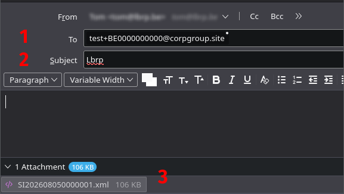
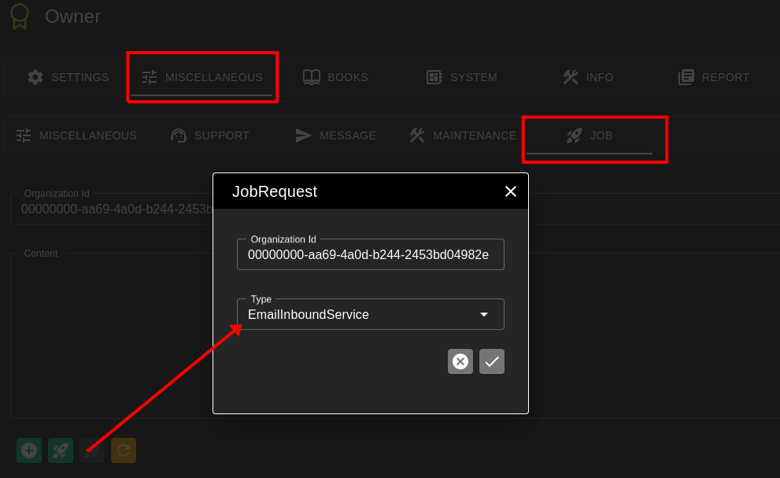
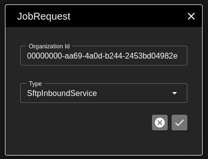
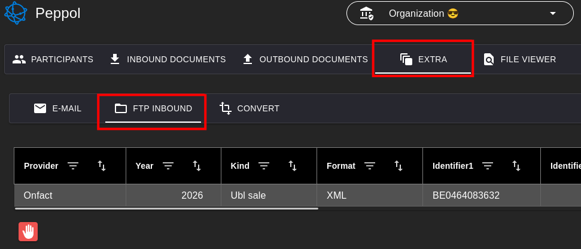

# SFTP en E-mail Inbound Testen

# Voorbereiding

Het is makkelijker als je eerst wat test documenten kunt aanmaken
Zie [Documenten Testen](../Documents/README.md)

Er hoeven voor de werking in feite geen Applicaties te worden geactiveerd, maar omdat
het SFTP-Inbound grid op de Peppol Pagina staat is het beter dat de Peppol Applicatie ook aan staat.

Download de UBL of PDF versie van een Document, naargelang wat je wil testen.

# Mail vertsturen

Verstuur een mail naar test+BE0000000000@corpgroup.site.
Wijzig het Vat Number naar hetzelfde als van de Organisatie (BE0662348959).

Zet de Provider die je wil testen in het onderwerp (Lbrp, OnFact, Billit, ...):

Voeg het bestand toe als Attachment

# Processor starten

- Start een EmailInboundService Job

   

- Start een SftpInboundService Job

   

# Resultaat

Je zou nu een record moeten hebben in de SftpInbound Grid:
Peppol -> Extra -> FTP Inbound

