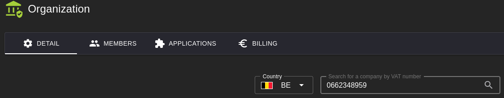
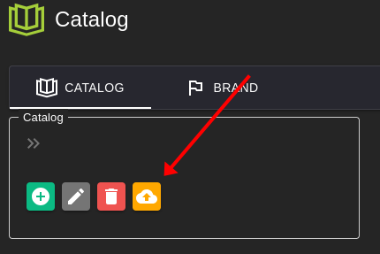

# Documenten Testen

Deze handleiding beschrijft hoe u een testorganisatie en testdocumenten kunt aanmaken in de **DEV**-omgeving.

## 1. Voorbereiding

- Zet het **btw-nummer** van de organisatie op een geregistreerd bedrijf in de Scrada-testomgeving.
- Gebruik bij voorkeur **0662348959** (indien deze nog vrij is). Dan hebt u meteen een test-btw-nummer voor zowel Scrada als de FOD-applicatie.
- Het **Plan Type** van de organisatie mag niet **Free** zijn; kies een hoger plan.

   

LET OP 💡: Veel van de Test Scenario's gebruiken de Processor, de Rapport en de Mcp Server. Deze dienen in de DEV-omgeving omhoog te staan.

## 2. Testdata aanmaken (Seeding)

- Seed Relation Test Data

   

- Seed Catalog Test Data

   

## 3. Testdocument aanmaken

Maak een document (**SalesInvoice**) aan met uzelf als klant en voeg enkele documentlijnen toe.

## 4. Volgende stap

U kunt deze testdocumenten nu gebruiken om de **SFTP- en e-mailinbound**-verwerking te testen. Zie [SFTP en e-mail inbound testen](../Common/README.md).
