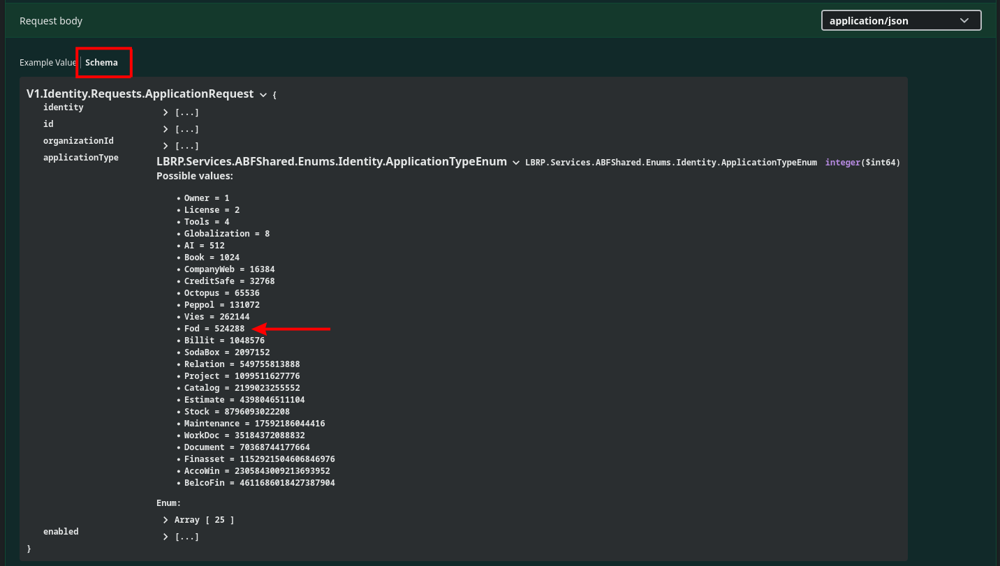

# Identity Flow

## 1. Gebruikers

### 1.1 Registratie

 [/identity/register](https://abfapi.dev.corpgroup.site/swagger/index.html#/%F0%9F%97%9D%EF%B8%8Fidentity/post_identity_register)

- De `Request` voor het registreren van een nieuwe **gebruiker** (***User***) zorgt er meteen voor dat ook een **organisatie** (***Organization***) wordt aangemaakt waarvan deze nieuwe gebruiker beheerder (***lid***) is.
- De `Response` geeft u een `Token` terug waarmee u andere, beveiligde, eindpunten kan oproepen.<br/>
  Vul dit `Token` in in de **Authorization** `header` van een **request**.

### 1.2 Aanmelden

 [/identity/login](https://abfapi.dev.corpgroup.site/swagger/index.html#/%F0%9F%97%9D%EF%B8%8Fidentity/post_identity_login)

- Indien u reeds een **gebruiker** en **organisatie** hebt geregistreerd, kunt u inloggen met de inloggegevens om een `Token` te verkrijgen.
- U kunt meteen een gekende `Identity` waarde van een **organisatie** in de **Organization** `header` van dit **request** meegeven.
- **LET OP**: Bij het wisselen van een **organisatie** moet u steeds opnieuw een `Token` aanvragen (*= aanmelden*).

### 1.3 Token Vernieuwen

 [/identity/refresh](https://abfapi.dev.corpgroup.site/swagger/index.html#/%F0%9F%97%9D%EF%B8%8Fidentity/post_identity_refresh)

- U kunt een `Token` op 2 manieren vernieuwen:
   - Door opnieuw **aan te melden**
   - Door dit `Refresh` endpoint aan te roepen met een eerder verkregen `Token` en `RefreshToken`.


## 2. Organisaties

### 2.1 Lijst

 [/owner/organization/member](https://abfapi.dev.corpgroup.site/swagger/index.html#/%F0%9F%98%8Eowner/get_owner_organization_member)

- Nadat de **Authorization** `header` van een **request** is ingevuld met een `Token`, kunt u een lijst ophalen van alle **organisaties** waarvan een **gebruiker** **lid** is.
- Om andere beveiligde endpoints aan te roepen die **organisatie** afhankelijk zijn, dient u de `Identity` waarde in de **Organization** `header` van een **request** in te vullen.
- **TIP**: U kunt de `Identity` waarde van een **organisatie** eventueel bewaren in uw software.

### 2.2 Aanpassen

 [/owner/organization](https://abfapi.dev.corpgroup.site/swagger/index.html#/%F0%9F%98%8Eowner/put_owner_organization)

- U kunt de details van een **organisatie** aanpassen door dit endpoint aan te roepen.

## 3. Applicaties

### 3.1 Lijst

 [/owner/application/organization](https://abfapi.dev.corpgroup.site/swagger/index.html#/%F0%9F%98%8Eowner/get_owner_application_organization)

- Nadat de **Organization** `header` van een **request** is ingevuld met de `Identity` waarde van een **organisatie**, kunt u een lijst ophalen van alle **applicaties** toegankelijk voor een **lid** van een **organisatie**.
- Het `Enabled` vlag in de `Response` toont aan of de **applicatie** actief is.

### 3.2 Activeren

 [/owner/application/enable](https://abfapi.dev.corpgroup.site/swagger/index.html#/%F0%9F%98%8Eowner/post_owner_application_enable)

- U kunt een **applicatie** activeren door dit endpoint aan te roepen.
- De volgende `Request` zal de **FOD** applicatie activeren:

   ```json
   {
     "applicationType": 524288,
     "enabled": false  # bevat de huidige waarde van de applicatie
   }
   ```

- Druk op **Schema** bij een **request body** om de mogelijke waarden van het **applicatietype** te zien:

   