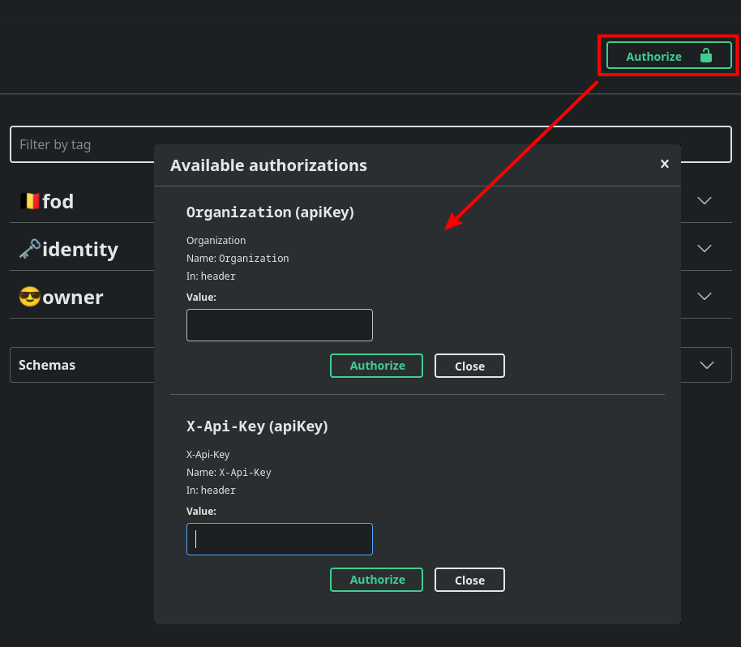

# Developers Handleidingen

## 1. Omgevingen

Alle testen moeten in de **DEV** omgeving worden uitgevoerd.
- [https://abfapi.**DEV**.corpgroup.site](https://abfapi.dev.corpgroup.site/swagger)

De **PRD** omgeving is de productieomgeving en dient niet gebruikt te worden voor testen of implementatie.
- [https://abfapi.corpgroup.site](https://abfapi.corpgroup.site/health)

## 2. OpenAPI Documentatie

[https://abfapi.dev.corpgroup.site/swagger](https://abfapi.dev.corpgroup.site/swagger)

## 3. Request Headers

De volgende Headers **MOETEN** aanwezig zijn in een `Request`:

```
Api-Key: te verkrijgen door LBRP
```

De volgende Headers **MOGEN** aanwezig zijn in een `Request`:

```
X-Legacy:  te verkrijgen door LBRP
X-Version: 1.0
```

De volgende Headers **MOETEN** aanwezig zijn in een ge-authenticeerd `Request`:

```
Authorization: Bearer <AccessToken>
Organization:  <Organization Guid>
```

U kunt deze `Header` waarden in **Swagger** invullen door op de knop **Authorize 🔒** te klikken:



## 4. Requestds/Responses

De meeste **JSON-contracten** hebben, in de meeste gevallen, altijd de volgende velden:

- `identity`:     **Primaire** database sleutel als `Guid`.
- `id`:           <br/>Extra sleutelwaarde als `Integer`.<br/>*❗Wordt momenteel niet gebruikt ❗*<br/><br/>
- `lastModified`: Tijdstip van laatste **Wijziging**.
- `created`:      Tijdstip van **Toevoeging**.
- `createdBy`:    Gebruiker die het record heeft aangemaakt.

## 5. API Onderdelen

- [Identity Flow](Identity/README.md)
- [FOD](Fod/README.md)

## 6. Code Voorbeelden

- [Code Voorbeelden](Code/README.md)


