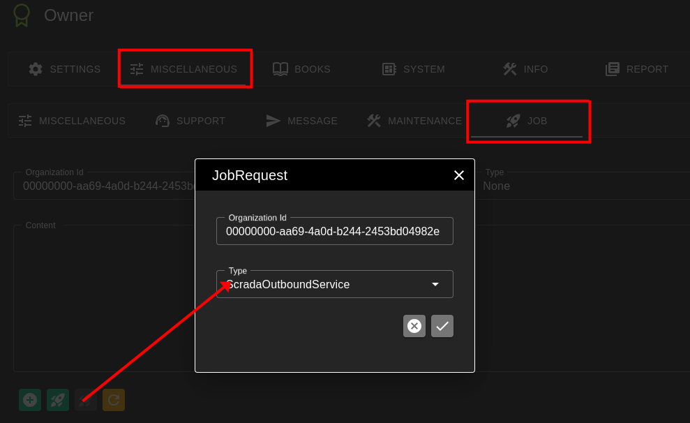
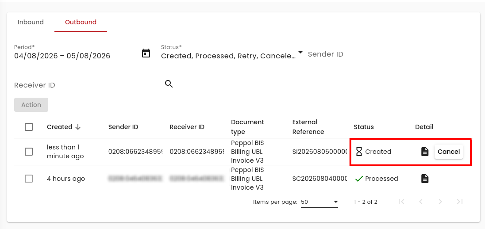
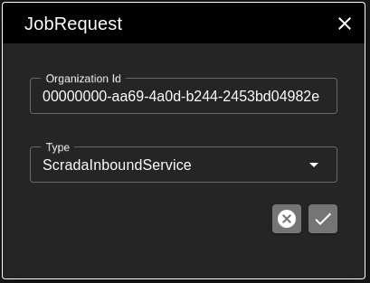
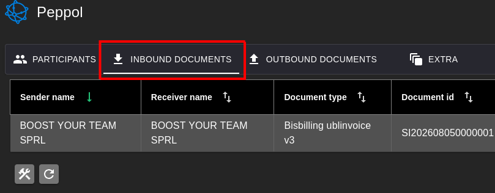

# Scrada inbound testen

Deze handleiding beschrijft hoe u de verwerking van inkomende documenten via **Scrada/Peppol** kunt testen.

## 1. Voorbereiding

- Het is handig als u eerst enkele testdocumenten aanmaakt. Zie [Documenten testen](../Documents/README.md).
- Activeer zeker de **Peppol-applicatie**.

## 2. Versturen naar Scrada/Peppol

Druk op de knop in een document om dit rechtstreeks naar Scrada te versturen:

## 3. Processor starten

- Start een **ScradaOutboundService**-job.

   

- Wacht op verwerking door [Scrada](https://mytest.scrada.be).

   De **Outbound**-verwerking duurt een tiental minuten.

   

    De verwerking door Peppol voor **Inbound** neemt eveneens enige tijd in beslag. Zodra het document door het Peppol-netwerk is doorgestuurd (naar uzelf):

   

- Start een **ScradaInboundService**-job.

   

## 4. Resultaat controleren

Als alles correct is verwerkt, vindt u nu een record in het **Peppol Inbound**-grid:

**Peppol → Inbound Documents**

