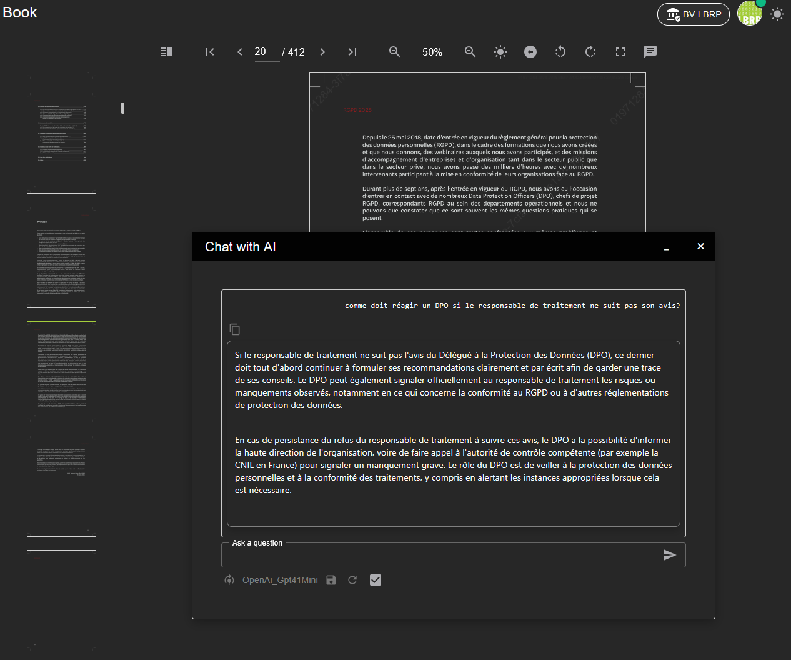
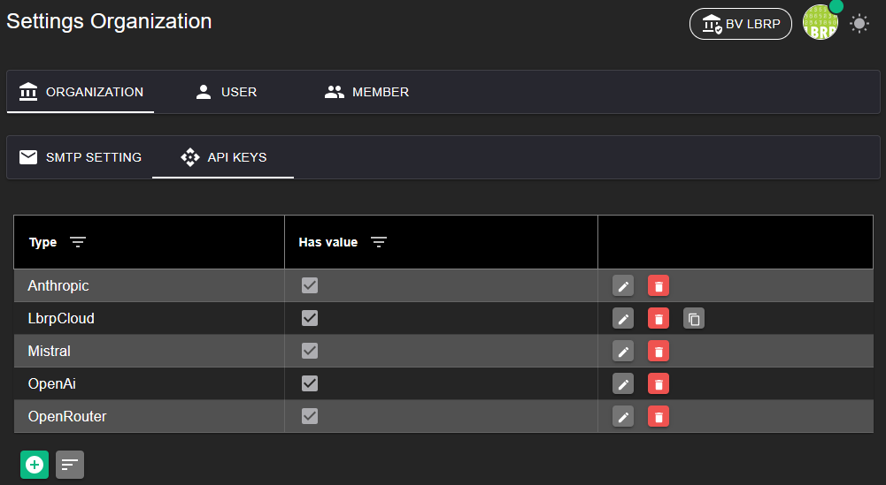

# LBRP Cloud - Books - AI

Tijdens het lezen van een boek kun je vragen stellen over de inhoud aan een AI-model. Zo kun je snel extra uitleg of samenvattingen krijgen, of specifieke informatie opzoeken binnen het boek.

Om de AI-modellen te kunnen gebruiken, heb je een API-key nodig. 

- Voor het gebruik van OpenAI-modellen: maak een API-key aan via [OpenAI API Keys](https://platform.openai.com/api-keys).
- Voor het gebruik van Anthropic-modellen: maak een API-key aan via [Anthropic Console](https://console.anthropic.com/settings/keys).

Voer deze [API-key(s)](../../Identity/Menu/README.md) in bij de instellingen van organisatie, gebruiker of lid om de AI-functionaliteit te activeren.

