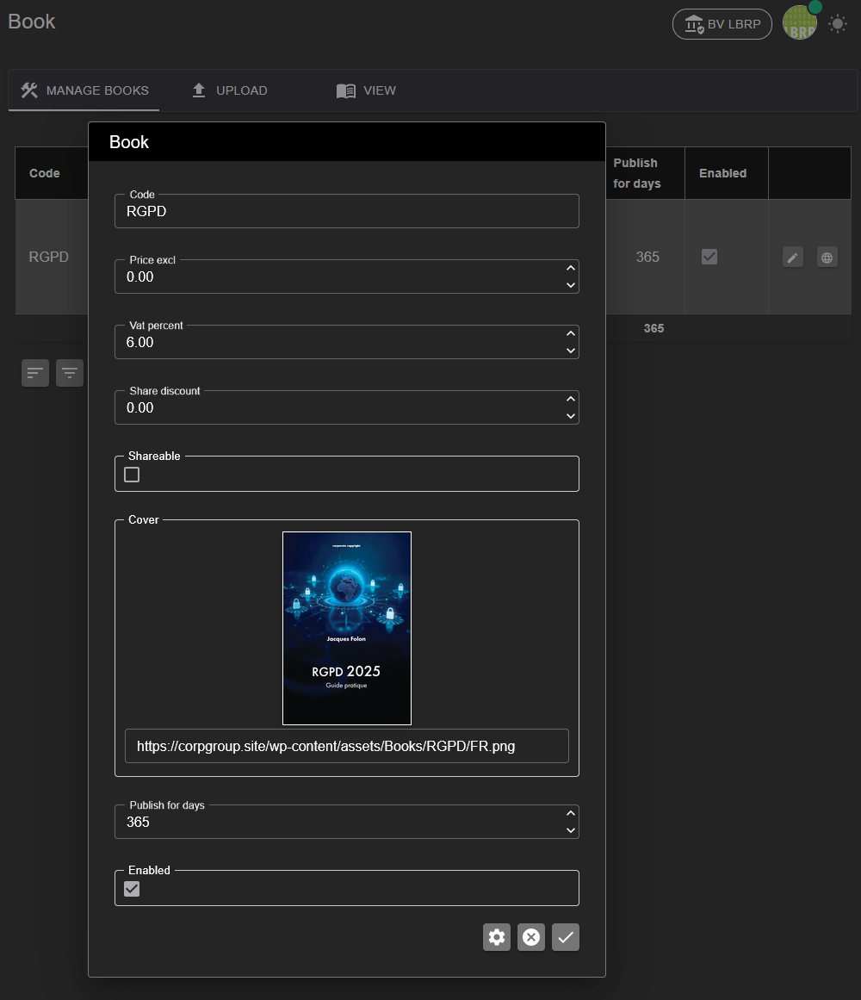
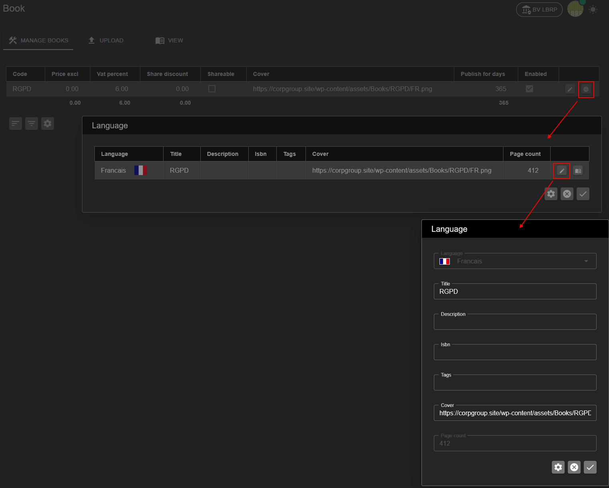
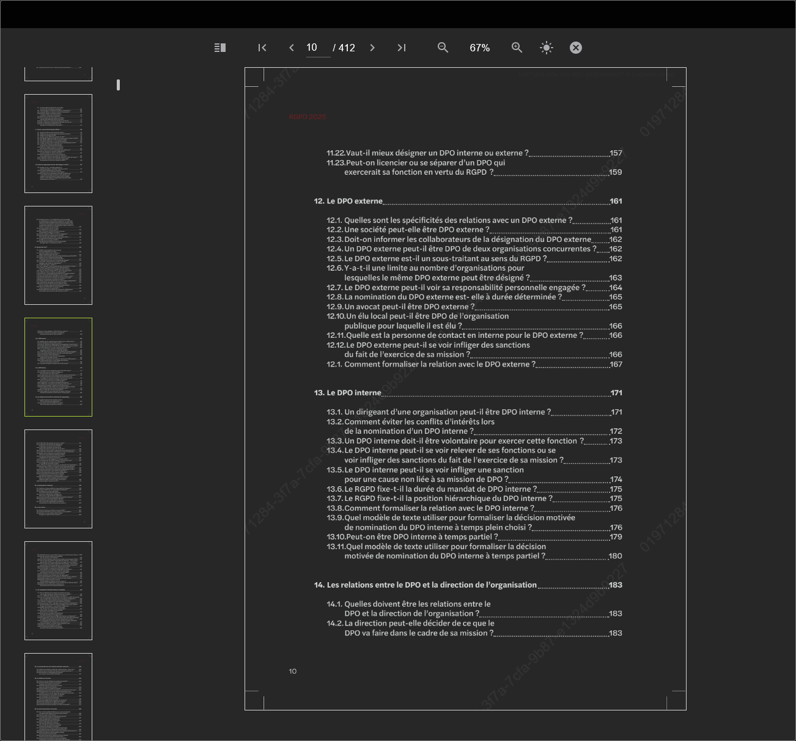

# LBRP Cloud - Books - Manage

In het onderdeel "Manage" kunnen beheerders bestaande e-books beheren. 

- Je ziet een overzicht van alle boeken, waar je de meta-gegevens (zoals titel, prijs, cover, enzovoort) kunt aanpassen.

- Per boek kun je de beschikbare talen beheren.

- Je kunt ook het boek openen om de inhoud te bekijken of te lezen.

Gebruik deze pagina om boeken up-to-date te houden en beschikbaar te maken voor gebruikers.
