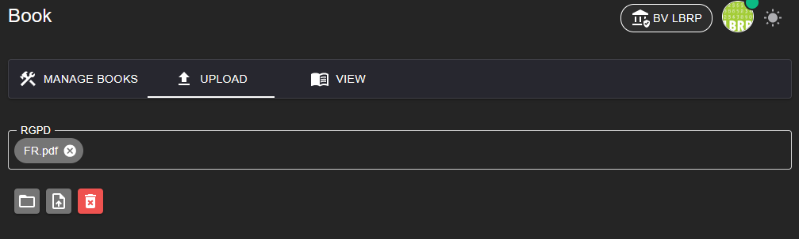

# LBRP Cloud - Books - Upload

Op deze pagina kunnen beheerders nieuwe e-books toevoegen aan de Books App. Na het uploaden worden de boeken klaargezet zodat ze later beheerd en beschikbaar gemaakt kunnen worden voor gebruikers.

