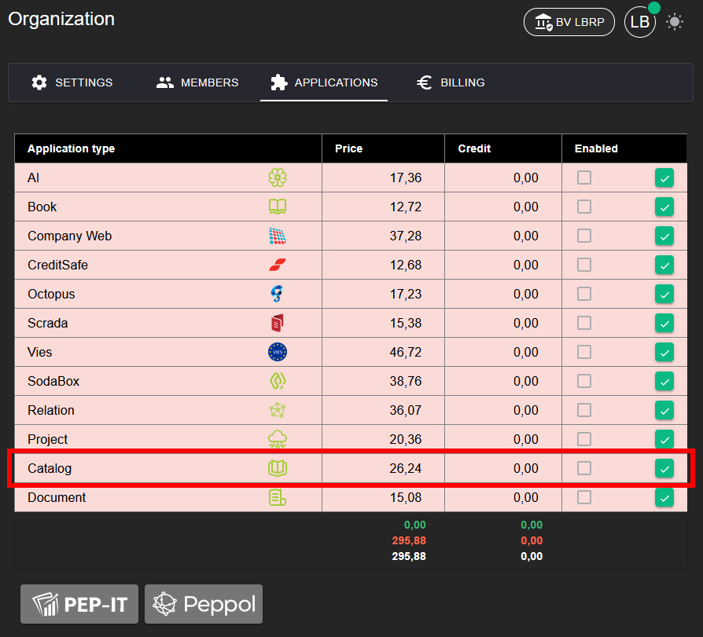
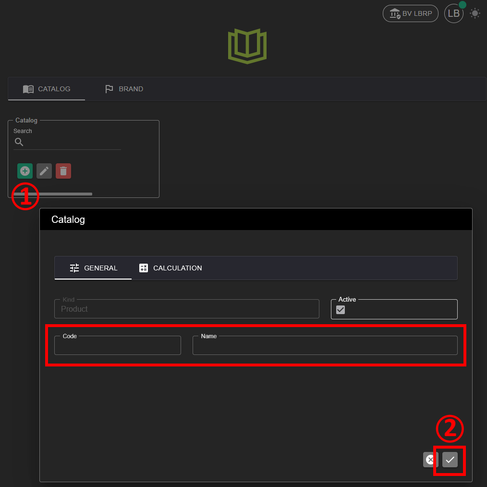
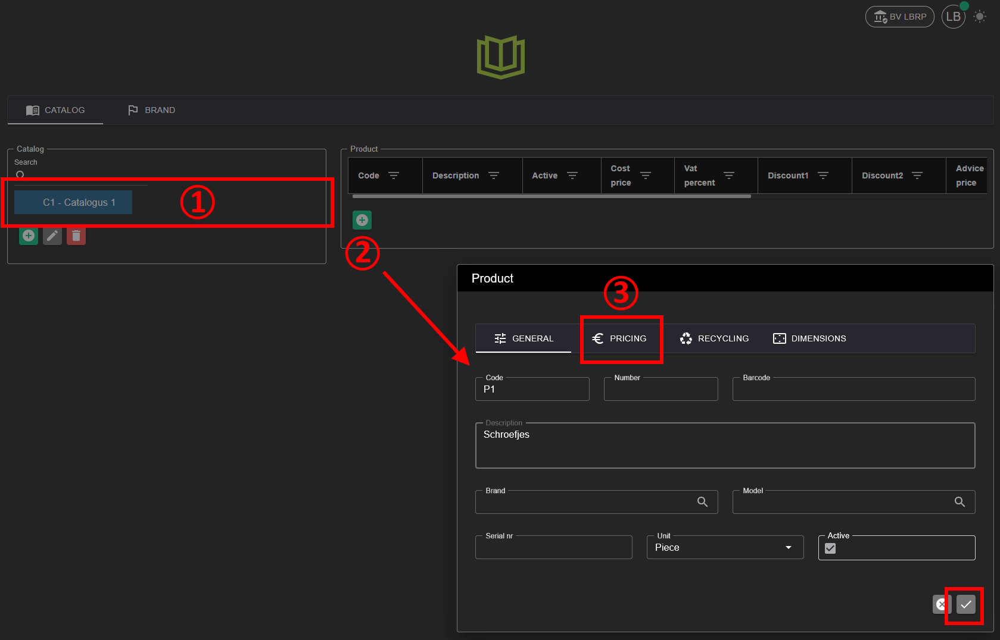
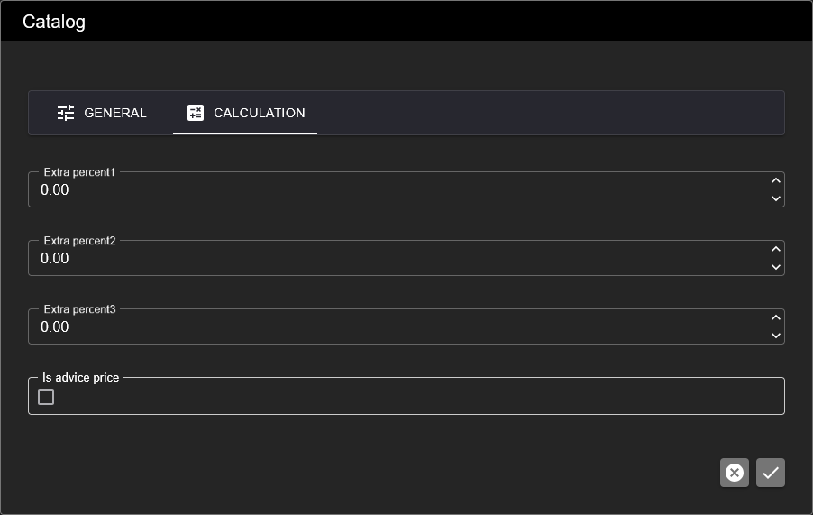
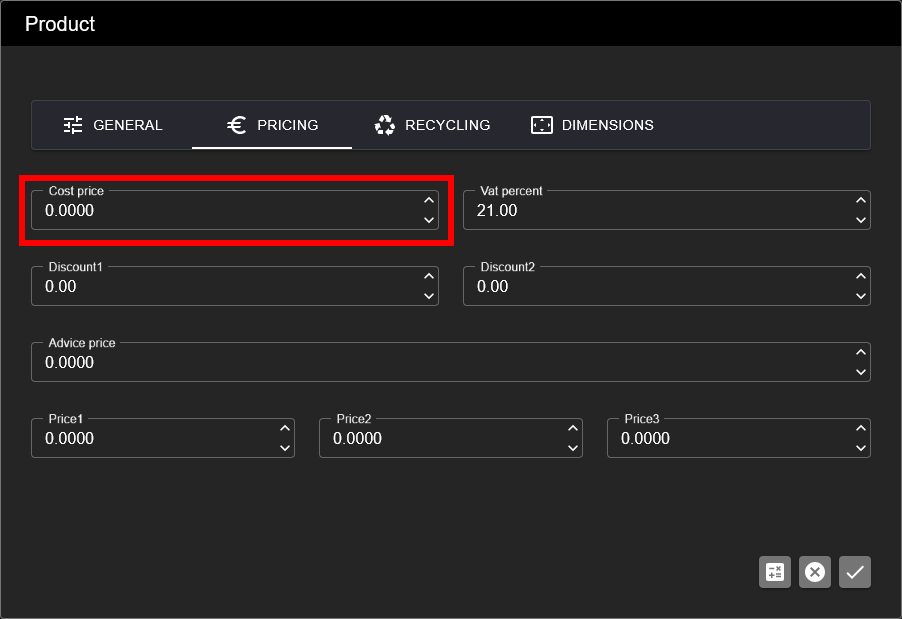

# Catalog

Met de Catalog applicatie kan u één of meerdere catalogi aanmaken om producten of diensten te beheren.

## 1. Applicatie Activeren

Om de **CATALOG** applicatie te kunnen gebruiken, moet deze eerst geactiveerd worden.

**Stappen:**
1. Ga naar **Organization → [Applications](../Identity/Applications/README.md)**.
2. Activeer de applicatie **Catalog** voor uw organisatie.
3. Na activatie is het catalogusbeheer beschikbaar in het menu.

## 2. Catalogus Aanmaken

**Stappen:**
1. Open de **Catalog** applicatie.
2. Klik op de groene **+** knop om een nieuwe catalogus aan te maken.
3. Geef de catalogus een naam en eventueel een beschrijving.
4. Sla de catalogus op.

## 3. Producten Toevoegen aan Catalogus

Aan een catalogus kan u verschillende producten of diensten koppelen.

**Stappen:**
1. Open de gewenste catalogus.
2. Klik op **Product toevoegen**.
3. Vul de productgegevens in, zoals:
   - Naam
   - Omschrijving
   - Prijs
   - BTW-percentage
4. Sla het product op.

De producten zijn nu beschikbaar binnen de catalogus.

## 4. Calculatie

### 4.1 Catalogus Winstmarges

Per catalogus kunnen 3 winstmarges in percenten worden ingegeven

### 4.2 Prijsberekening Producten

