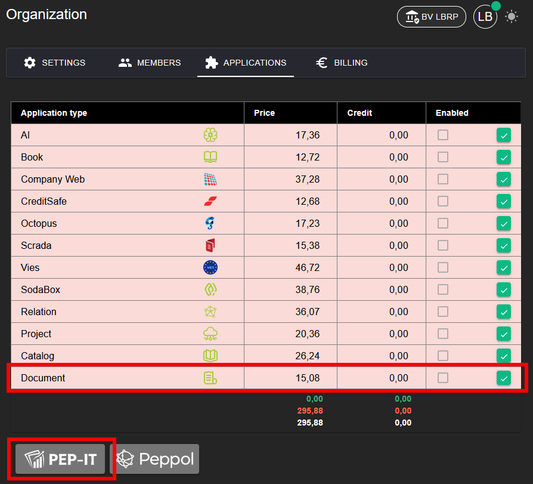
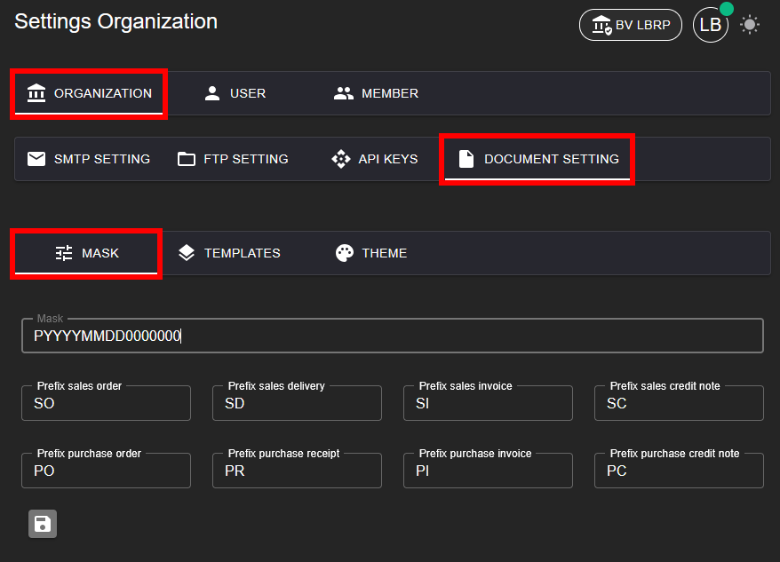
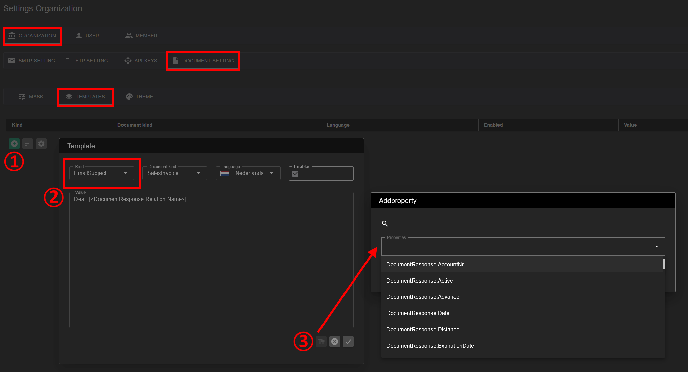
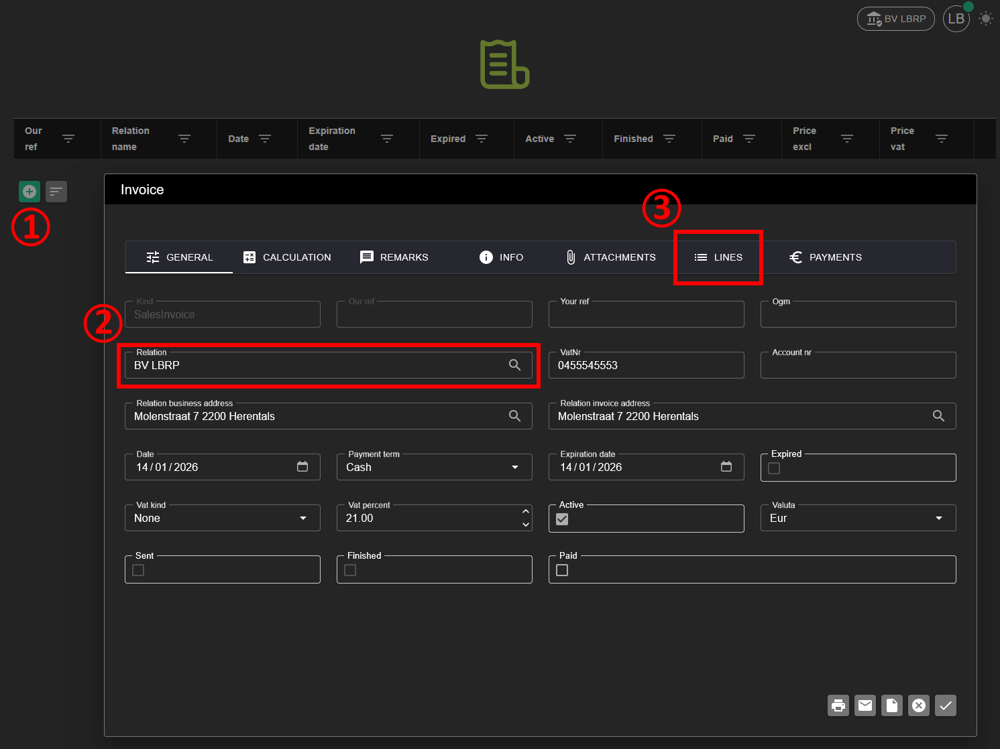
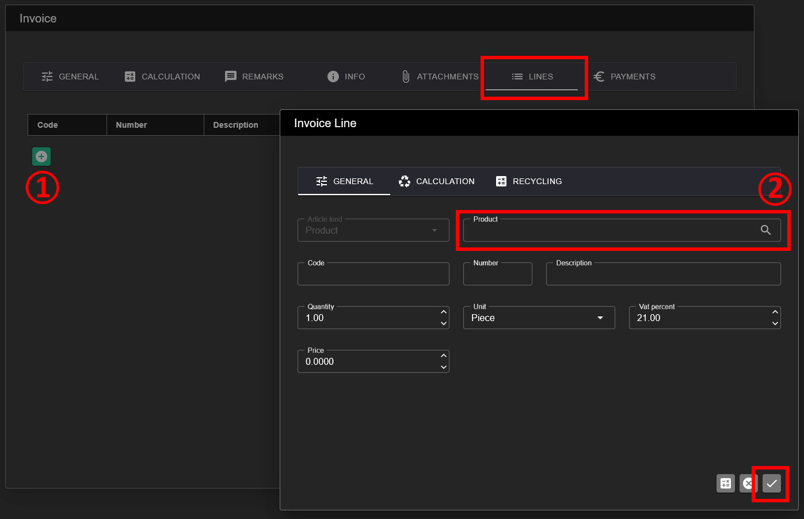
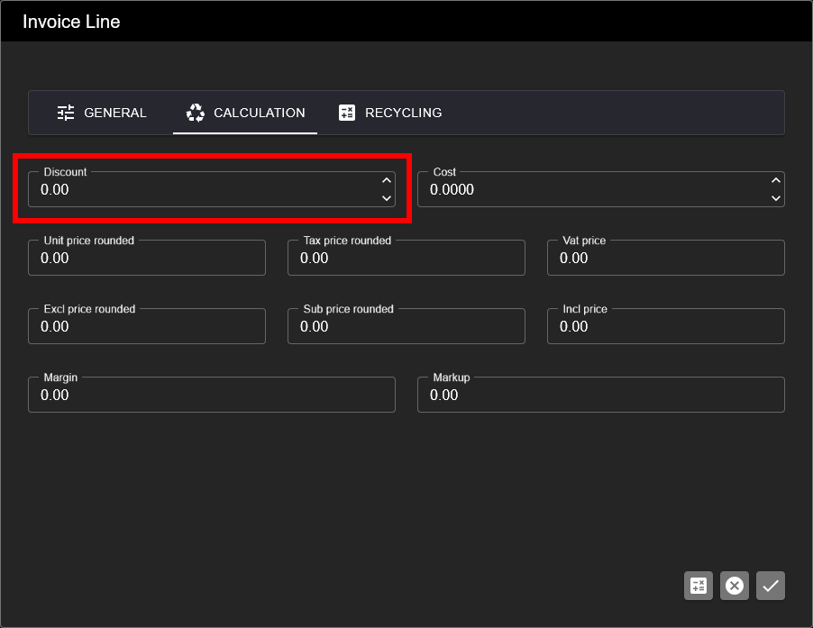

# Document

## 1. Applicatie Activeren

Om de **Document** applicatie te kunnen gebruiken, moet deze eerst geactiveerd worden.

**Stappen:**
1. Ga naar **Organization → [Applications](../Identity/Applications/README.md)**.
2. Activeer de applicatie **Document** voor uw organisatie.
3. Na activatie is het Document-beheer beschikbaar in het menu.

⚠️ De **Document** applicatie wordt meestal gebruikt in combinatie met andere applicaties.

Wij raden aan om ook volgende applicaties te activeren:
- **Relation** (klanten en leveranciers)
- **Catalog** (producten en diensten)

Deze applicaties kunnen in één actie geactiveerd worden via de knop **PEP-IT**.

## 2. Voorbereiding

Vooraleer u documenten aanmaakt, is een eenmalige configuratie vereist via de [Organisatie](../Identity/Menu/README.md)-instellingen.

## 2.1 Nummering Mask

Voor u uw eerste document aanmaakt, stelt u het **nummeringsmasker** in.

**Algemeen formaat (voorbeeld):**
`PYYYYMMDD0000000`

- P = Prefix per documenttype (bv. **SI**, **PI**, **CR**)
- Y = Jaar (YY, YYY, YYYY)
- M = Maand (M, MM)
- D = Dag (D, DD)
- 0 = Nummering (Lengte)

**Voorbeelden van nummeringsmaskers:**

- `SIYYYYMMDD0001` → *Sales Invoice* (verkoopfactuur) met datum en oplopend nummer
- `PIYYYY0001` → *Purchase Invoice* (aankoopfactuur) met jaar en oplopend nummer
- `QYYYYMM0001` → *Quotation* (offerte) met jaar/maand
- `CRYYYY000001` → *Credit Note* (creditnota) met jaar
- `SI0000001` → Doorlopende nummering zonder datum

## 2.2 Report Templates

Met **Report Templates** kan u de lay-out en inhoud van documenten en e-mails aanpassen.

**Stappen:**
1. Klik op **+ Toevoegen** om een nieuw template aan te maken.
2. Kies het type template:
   - DocumentLogo: Logo op afdruk
   - DocumentHeader: Extra Header tekst op afdruk
   - DocumentData: Customù Producten grid velden
   - DocumentFooter: Extra Footer tekst op afdruk
   - DocumentAppendix: Extra volledig blad na raport

   - EmailSubject: de subject voor de e-mail
   - EmailBody: de body voor de e-mail

   - Rappel 1: Rappel Tekst nummer 1
   - Rappel 2: Rappel Tekst nummer 2
   - Rappel 3: Rappel Tekst nummer 3
   - Rappel 4: Rappel Tekst nummer 4

3. Voeg beschikbare velden toe vanuit het document.

## 2.3 Eigen Relatie ‼️

Voeg een **eigen relatie** toe met hetzelfde BTW-nummer als uw organisatie.
De gegevens van deze relatie (zoals bankinformatie) worden automatisch gebruikt op documenten. Zie ook [Relation](../Relation/README.md)

## 3. Document Toevoegen

Na de voorbereiding kan u documenten aanmaken (bv. offertes, facturen, creditnota’s).

## 3.1 Relatie kiezen

1. Kies een bestaande relatie.
2. Indien nodig kan u hier ook een nieuwe relatie toevoegen. Zie ook [Relation](../Relation/README.md)

## 3.2 Lijnen Toevoegen

Voeg documentlijnen toe op basis van producten of diensten uit de catalogus.

Meer informatie:
[Catalog](../Catalog/README.md)

## 4. Afdrukken, E-mailen, Peppol

Een document kan op verschillende manieren verzonden of gedeeld worden.

## 4.1 Afdrukken

Document afdrukken als PDF.

## 4.2 E-mailen

Document verzenden via e-mail met gebruik van e-mailtemplates.

## 4.3 Verzenden via Peppol/Scrada

Document elektronisch verzenden via het Peppol-netwerk. Zie ook [Scrada Outbound](../Scrada/README.md)

## 5. Calculatie

