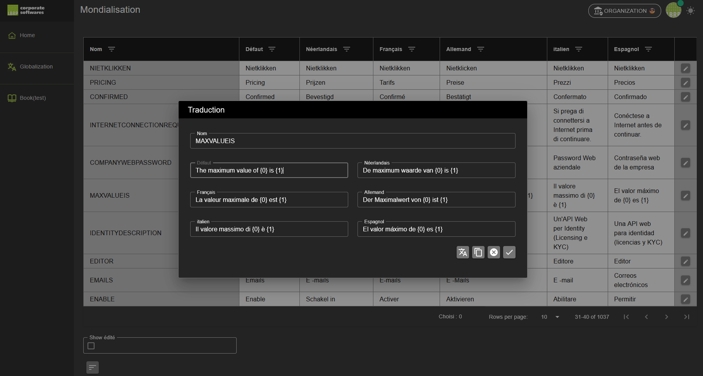

# Globalization

Het **Globalization** onderdeel van het platform laat je toe om alle teksten van de gebruikersinterface te vertalen en beheren in zes ondersteunde talen:

- Engels (standaardtaal)
- Nederlands
- Frans
- Duits
- Italiaans
- Spaans

## 1. Bevoegdheden en Toegang

- **Vertalingen kunnen enkel worden beheerd binnen de beheersorganisatie**.  
  Enkel gebruikers die lid zijn van deze organisatie krijgen toegang tot de vertaalmodule.
  
- **LBRP** heeft de mogelijkheid om leden toe te voegen aan deze beheersorganisatie, zodat zij ook vertalingen kunnen uitvoeren.

- De **beheersorganisatie moet geactiveerd zijn** voordat vertalingen kunnen worden aangepast.

## 2. Toegang tot Globalization

1. Ga via het menu naar **Globalization**.
2. Je ziet een overzichtstabel met alle teksten die worden gebruikt op het platform.  
   - De eerste kolom toont de **naam van het tekstitem**.
   - De overige kolommen tonen de vertalingen per taal.

## 3. Teksten bewerken

1. Klik op de **Bewerken**-knop (✏️) naast de gewenste rij.
2. Een popup verschijnt waarin je de vertalingen voor alle talen kunt bekijken en aanpassen.  
   - De “naam” van het tekstitem is niet aanpasbaar.
   - De teksten in de verschillende talen kun je vrij bijwerken.

### 3.1. Knoppen in de popup

- **Automatisch vertalen**  
  Vult lege vertaalvelden automatisch via Google Translate, op basis van de Engelse standaardtekst.

- **Klonen (Clone)**  
  Kopieert de Engelse standaardtekst naar alle lege vertaalvelden.

- **Annuleren**  
  Sluit de popup zonder wijzigingen op te slaan.

- **OK**  
  Slaat de wijzigingen op en sluit de popup.

## 4. Extra functionaliteit

- **Toon alleen aangepaste teksten**  
  Onderaan de tabel kun je dit vinkje activeren om enkel teksten te tonen die reeds aangepast zijn.  
  Handig voor controle of verder vertaalwerk.

## 5. Beheer en updates

- Bij elke update van de webapplicatie worden gewijzigde teksten in de gebruikersinterface overgenomen.
- Na elke applicatie-update wordt de status van bewerkte of geverifieerde vertalingen gereset, zodat wijzigingen opnieuw nagekeken kunnen worden.
