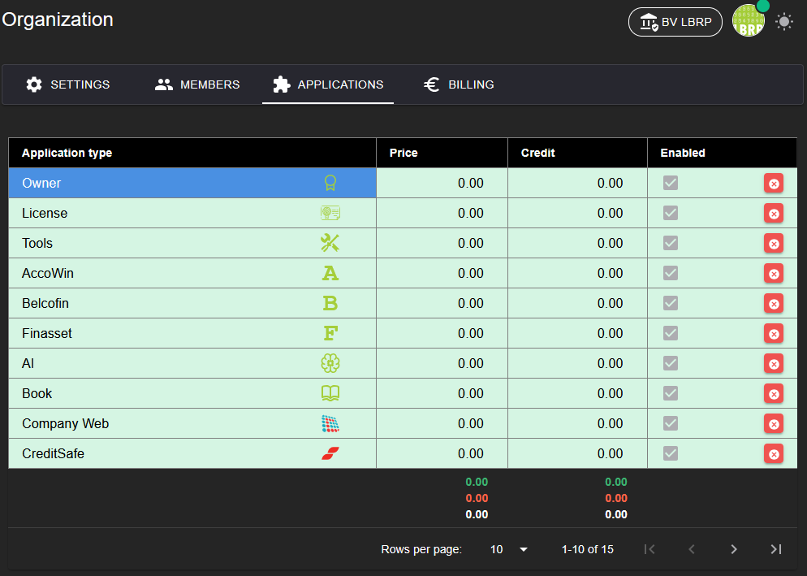

# LBRP Cloud - Identity - Applicaties

## 1. Applicatiebeheer

Op het tabblad **Applicaties** kun je eenvoudig het gebruik van applicaties binnen de organisatie beheren:

1. **Applicaties in- en uitschakelen**
   - Beheer welke applicaties geactiveerd zijn voor de organisatie.
   - Geactiveerde applicaties worden beschikbaar voor de leden, afhankelijk van hun rechten.

2. **Prijs per plan**
   - Elke applicatie heeft een specifieke prijs, afhankelijk van het gekozen plan van de organisatie (**Free**, **Basic**, **Team** of **Enterprise**).
   - Bij het inschakelen van een applicatie wordt de prijs aan het abonnement toegevoegd.

Dit overzicht zorgt ervoor dat je als organisatie controle hebt over de beschikbare functionaliteit en bijbehorende kosten.

