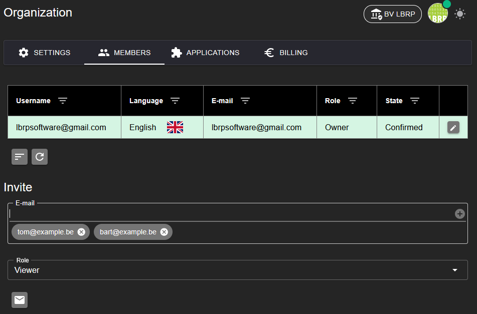
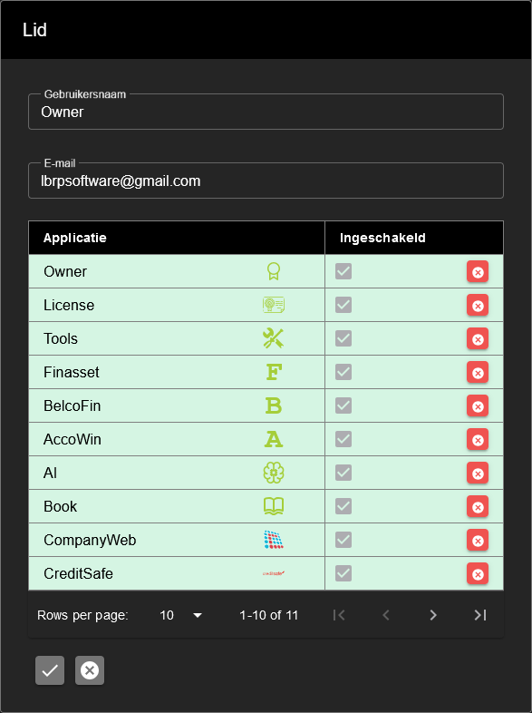

# LBRP Cloud - Identity - Leden

## 1. Ledenbeheer

Op het tabblad **Leden** van een **Organisatie** kun je het volgende doen:

1. **Overzicht van leden**
   - Bekijk een lijst met alle huidige leden van de organisatie, inclusief hun rol en status.

2. **Leden uitnodigen**
   - Nodig nieuwe leden uit door hun **e-mailadres** en de gewenste rol in te vullen.
   - De genodigde ontvangt een e-mail met een uitnodigingslink.
   - Indien de genodigde nog geen gebruiker is, kan deze tijdens het accepteren van de uitnodiging een **wachtwoord instellen**.

3. **Bevestigen door administrator**
   - Nadat de uitnodiging is geaccepteerd, krijgt de genodigde de status **In afwachting**.
   - Een **administrator** moet het lid handmatig bevestigen om toegang te verlenen tot de organisatie.

Dit proces biedt controle en veiligheid bij het beheren van leden binnen de organisatie.

## 2. Rollen en rechten

Binnen een organisatie kan elk lid een specifieke rol toegewezen krijgen. Elke rol bepaalt welke acties een gebruiker mag uitvoeren:

1. **Administrator**
   - Volledige toegang, inclusief gebruikersbeheer en het toewijzen van rollen.

2. **Manager**
   - Toegang tot bepaalde functionaliteiten, afhankelijk van de toegewezen verantwoordelijkheden binnen de organisatie.

3. **Editor**
   - Kan gegevens toevoegen, aanpassen en verwijderen binnen de organisatie.

4. **Viewer**
   - Alleen-lezen toegang; kan gegevens bekijken maar niets wijzigen.

5. **Customer**
   - Beperkte toegang; kan enkel eigen gegevens inzien en beheren.

Met deze rollenstructuur kan een organisatie eenvoudig bepalen wie welke verantwoordelijkheden heeft.

## 3. Toegang tot applicaties

Standaard heeft elk lid binnen een organisatie toegang tot alle geactiveerde applicaties. Indien nodig kan de toegang tot specifieke applicaties per lid worden aangepast:

1. **Standaard toegang**
   - Elk lid krijgt automatisch toegang tot alle beschikbare applicaties in de organisatie.

2. **Toegang beheren**
   - Als administrator kun je per gebruiker de toegang tot een specifieke applicatie intrekken, afhankelijk van de behoeften en verantwoordelijkheden van het lid.

Dit biedt flexibiliteit in het beheren van rechten en zorgt ervoor dat leden alleen toegang hebben tot relevante applicaties.

