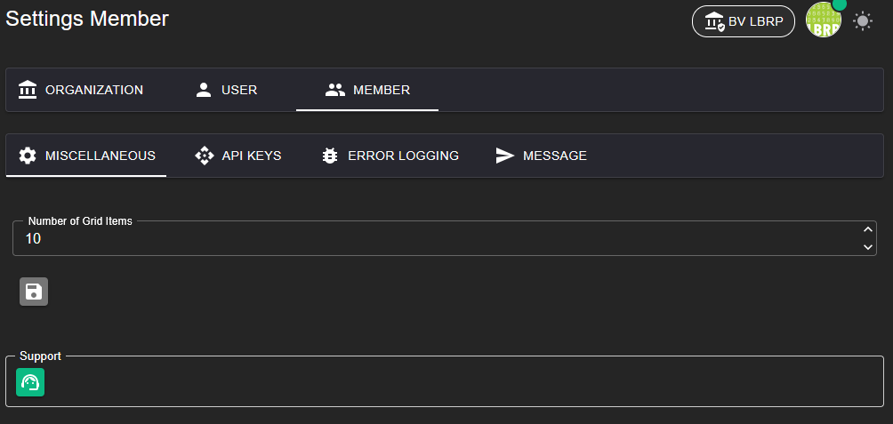

# LBRP Cloud - Identity - Menu

## 1. Hoofdmenu

Het hoofdmenu biedt snelle toegang tot de belangrijkste onderdelen van het systeem:

---

### 1.1 Ingelogde gebruiker

Bekijk de gegevens van de huidige ingelogde gebruiker.

### 1.2 Organisaties

Link naar een overzicht van alle organisaties waarvan je lid bent.

### 1.3 Instellingen

In het **Instellingen**-menu kun je diverse configuraties beheren. Dit scherm is onderverdeeld in drie secties:

#### 1.3.1 Organisatie-instellingen

- Stel de SMTP-server in om e-mails vanuit het systeem te kunnen verzenden.
- Te configureren instellingen:
   - SMTP-serveradres
   - Poortnummer
   - Gebruikersnaam
   - Wachtwoord
   - Beveiligingstype (bijv. SSL/TLS)

- Voeg hier 3rd-party API-keys toe om diensten te gebruiken zoals AI. Deze API-keys zijn toegankelijk voor alle leden van de organisatie.
- Hier kun je ook een eigen LbrpCloud API-key genereren om te gebruiken in andere software.

#### 1.3.2 Gebruikersinstellingen

- Beheer je persoonlijke account:
   - Gebruikersgegevens
   - Avatar veranderen
   - Wachtwoord resetten
   - Taal instellen

- Voeg hier 3rd-party API-keys toe om diensten te gebruiken zoals AI. Deze API-keys zijn enkel toegankelijk voor de gebruiker in alle organisaties waarvan de gebruiker lid is.

#### 1.3.3 Lid-instellingen

- Support aanvragen
- Voeg hier 3rd-party API-keys toe om diensten te gebruiken zoals AI. Deze API-keys zijn enkel toegankelijk voor de gebruiker van de huidige organisatie.
- Foutmeldingen beheren

### 1.4 Helpdesk

Link naar onze helpdesk voor ondersteuning.

### 1.5 Logout

Veilig uitloggen uit het systeem.
