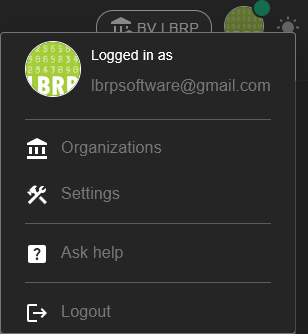
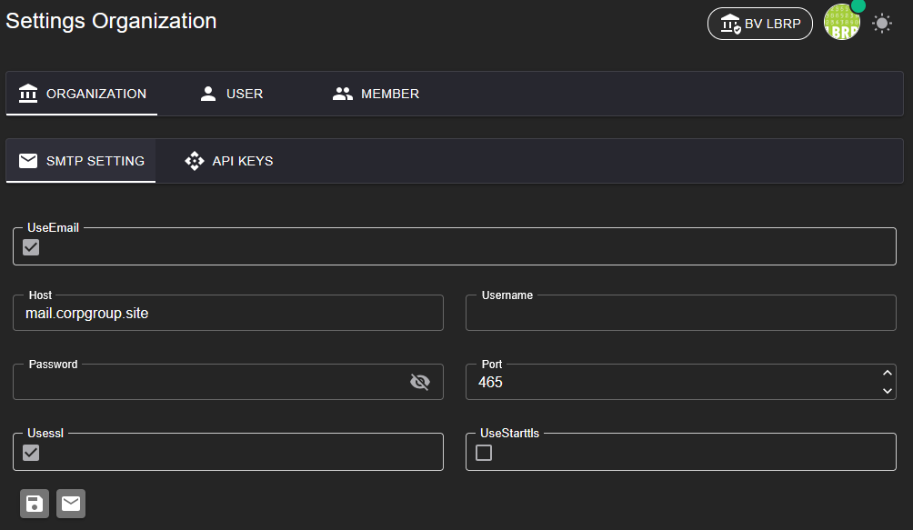

# LBRP Cloud - Identity - Menu

## 1. Hoofdmenu  

Het hoofdmenu biedt snelle toegang tot de belangrijkste onderdelen van het systeem:  

---

### 1.1 Ingelogde Gebruiker

Bekijk de gegevens van de huidige gebruiker.

### 1.2 Organisaties

Link naar een overzicht van alle organisaties waar je lid van bent.  

### 1.3 Actieve Organisatie

Beheer de instellingen van de momenteel geselecteerde organisatie.  

#### 1.3.1 Instellingen  

In het **Instellingen**-menu kun je diverse configuraties beheren, waaronder de e-mailinstellingen:  

- Stel de SMTP-server in om e-mails vanuit het systeem te kunnen verzenden.  

- Te configureren instellingen:  

   - SMTP-serveradres  

   - Poortnummer  

   - Gebruikersnaam  

   - Wachtwoord  

   - Beveiligingstype (bijv. SSL/TLS)

Met deze instellingen zorg je ervoor dat eigen e-mails, correct worden verzonden.

### 1.4 Accountinstellingen

Beheer je persoonlijke account: 

   - Gebruikersgegevens  

   - Avatar veranderen  

   - Wachtwoord resetten  

### 1.5 Foutenlog

Bekijk een overzicht van systeemfouten en logs.  

### 1.6 Helpdesk
   
Link naar onze helpdesk voor ondersteuning.  

### 1.7 Logout
   
Veilig uitloggen uit het systeem.  

