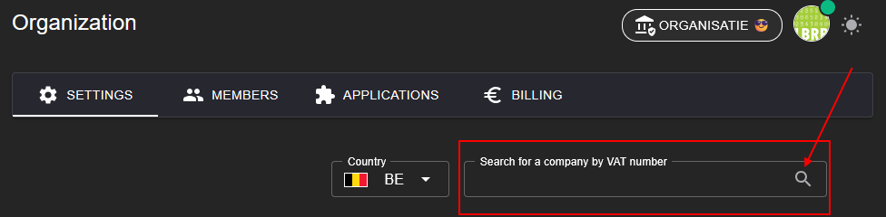

# LBRP Cloud - Identity - Organisaties

## 1. Organisatie en Gebruikersbeheer

Ons systeem werkt op basis van organisaties. Wanneer een gebruiker een account aanmaakt, wordt automatisch een eigen organisatie aangemaakt waarvan hij/zij lid (member) is. Binnen deze organisatie kunnen diverse acties worden uitgevoerd:

1. [**Applicaties toevoegen**](../Applications/README.md)
   - Als eigenaar van een organisatie kun je applicaties toevoegen. Deze applicaties zijn beschikbaar binnen jouw organisatie en kunnen individueel worden geactiveerd.

2. [**Gebruikers uitnodigen**](../Members/README.md)
   - Je kunt andere gebruikers uitnodigen om lid te worden van jouw organisatie. Uitgenodigde gebruikers krijgen toegang tot de applicaties en gegevens binnen jouw organisatie, afgestemd op hun rol en rechten.

3. [**Facturatie**](../Invoices/README.md)
   - U vindt een overzicht van de facturen over het gebruik van de verschillende applicaties in uw organisatie.

Zo biedt het systeem volledige controle en flexibiliteit voor samenwerking binnen de organisatie.

## 2. Organisatie-instellingen

In de [details](https://abfweb.corpgroup.site/owner/organization) van een organisatie kun je de volgende instellingen beheren:

1. **Plan selecteren**
   - Kies een passend abonnement voor de organisatie:
     - **Free**: Basisfunctionaliteiten gratis.
     - **Basic**: Uitgebreide opties voor individuele gebruikers.
     - **Team**: Ontworpen voor teams met gedeelde toegang.
     - **Enterprise**: Voor grote organisaties met geavanceerde behoeften.

2. **Betalingswijze instellen**
   - Kies tussen **Stripe** of **PayPal** voor veilige betalingen.

3. **Organisatiegegevens invullen**
   - Voeg belangrijke gegevens van de organisatie toe, zoals het **adres** of andere relevante details.
   - De eenvoudigste manier om alle gegevens automatisch op te halen is het invullen van het **btw-nummer** in het daarvoor voorziene tekstveld.

      

   - Het selectieveld "Same as Owner" zorgt ervoor dat het e-mailverkeer van de organisatie over hetzelfde adres gaat als het e-mailadres waarmee u zich hebt aangemeld. U kunt dit wijzigen door dit vinkje uit te zetten.
   - Het selectieveld "Invoice - Business" vertelt het systeem dat uw facturatieadres hetzelfde is als uw zeteladres. U kunt dit laten afwijken door dit vinkje uit te zetten en de nodige gegevens in te vullen.

Hiermee zorgt u ervoor dat de organisatie volledig en correct is ingesteld voor gebruik.

